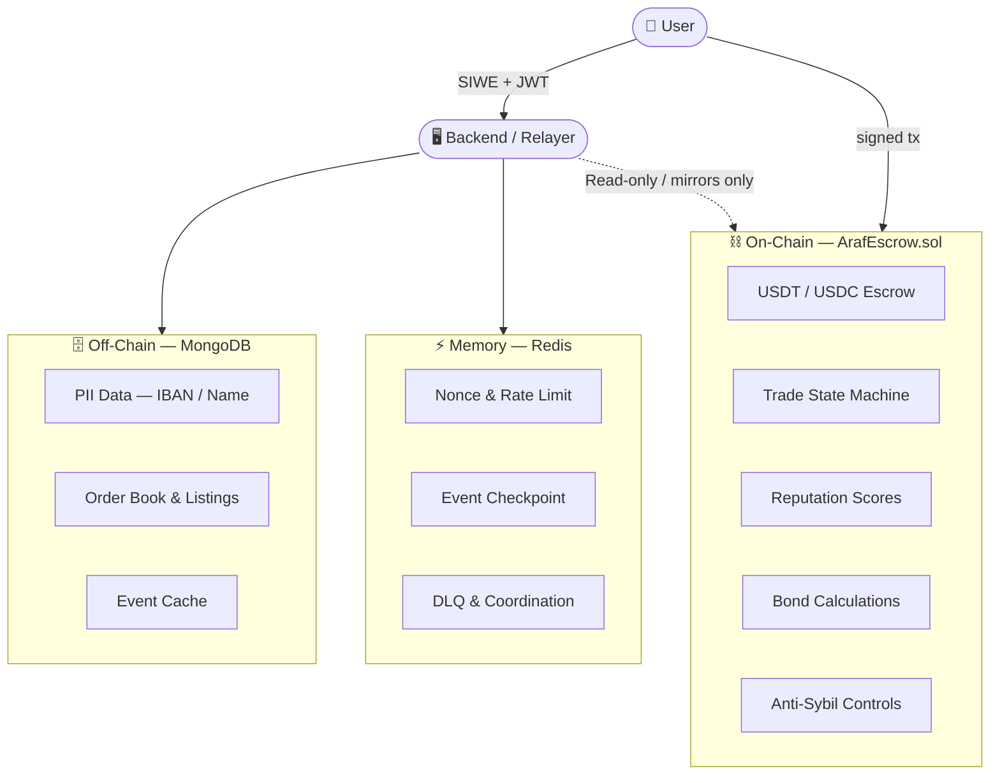
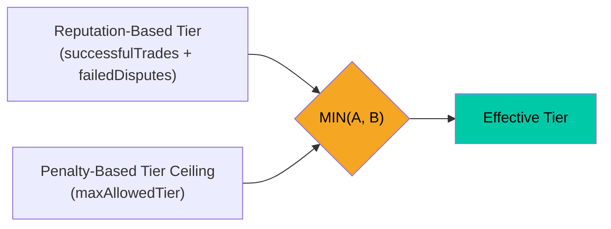
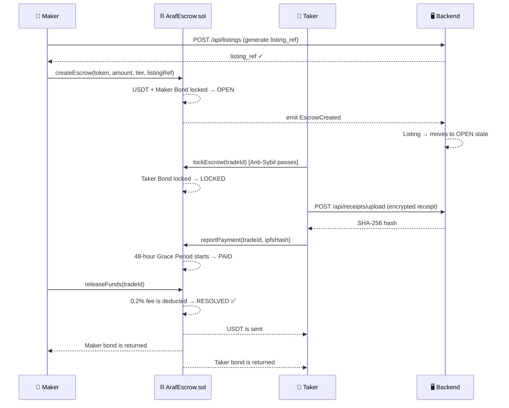
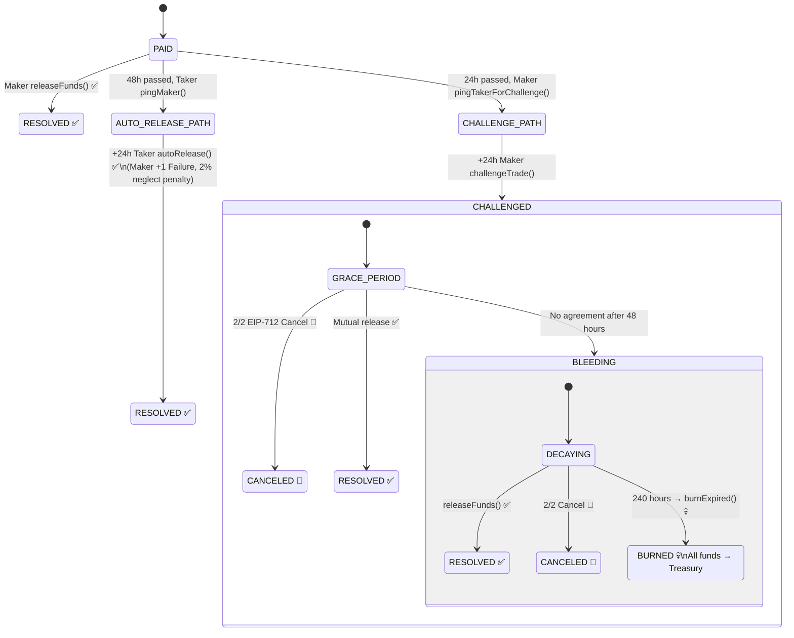
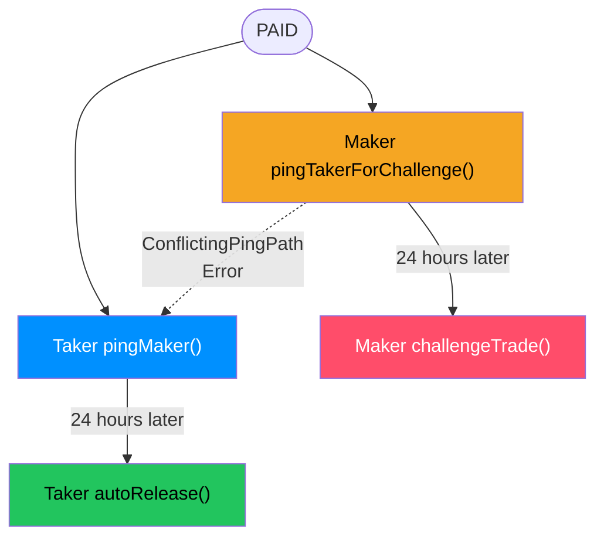
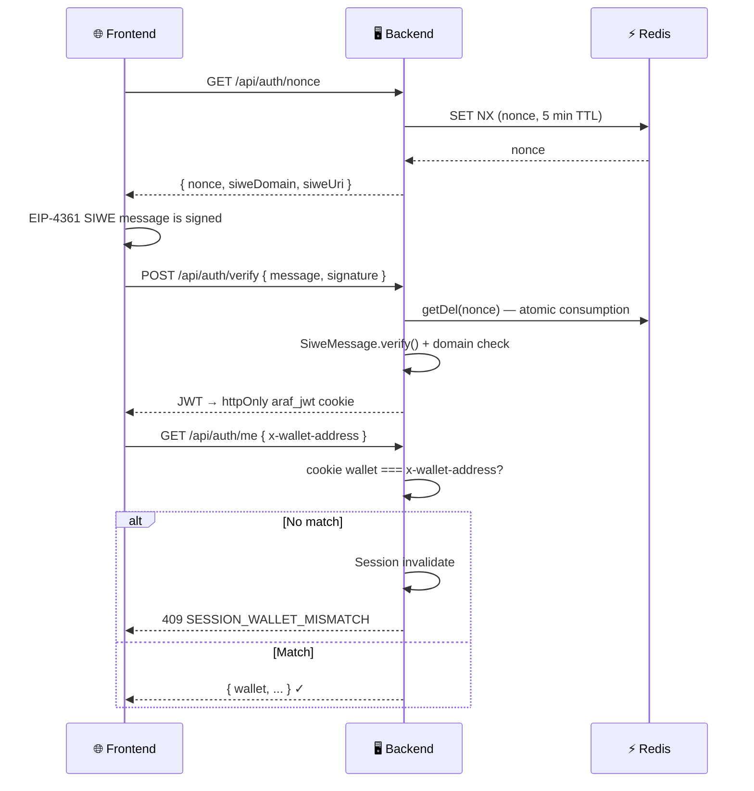
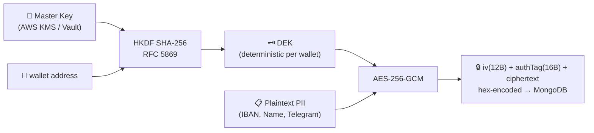
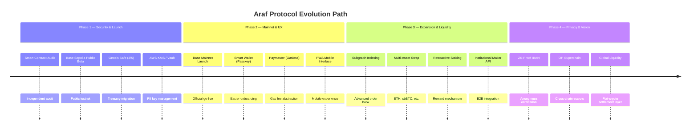
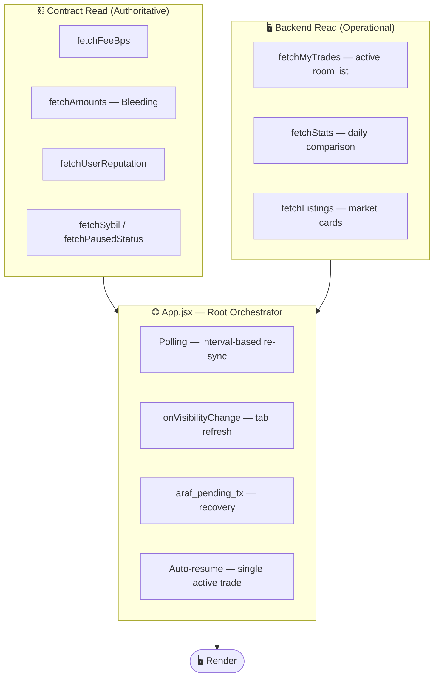

<div align="center">

# 🌀 Araf Protocol
### Canonical Architecture & Technical Reference

[](.)
[-0052FF?style=flat-square&logo=coinbase)](.)
[](.)
[](.)
[](.)
[](.)

---

*A P2P escrow protocol that enables fiat ↔ crypto exchange in a trustless environment, **non-custodial, humanless, and oracle-independent**.*

> **"The system does not judge. It makes dishonesty expensive."**

</div>

---

## 📋 Table of Contents

| # | Section |
|---|---------|
| 1 | [Vision and Core Philosophy](#1-vision-and-core-philosophy) |
| 2 | [Hybrid Architecture: On-Chain and Off-Chain](#2-hybrid-architecture-on-chain-and-off-chain) |
| 3 | [System Participants](#3-system-participants) |
| 4 | [Tier and Bond System](#4-tier-and-bond-system) |
| 5 | [Anti-Sybil Shield](#5-anti-sybil-shield) |
| 6 | [Standard Transaction Flow (Happy Path)](#6-standard-transaction-flow-happy-path) |
| 7 | [Dispute System — Bleeding Escrow](#7-dispute-system--bleeding-escrow) |
| 8 | [Reputation and Penalty System](#8-reputation-and-penalty-system) |
| 9 | [Security Architecture](#9-security-architecture) |
| 10 | [Data Models (MongoDB)](#10-data-models-mongodb) |
| 11 | [Treasury Model](#11-treasury-model) |
| 12 | [Attack Vectors and Known Limitations](#12-attack-vectors-and-known-limitations) |
| 13 | [Finalized Protocol Parameters](#13-finalized-protocol-parameters) |
| 14 | [Future Evolution Path](#14-future-evolution-path) |
| 15 | [Frontend UX Protection Layer](#15-frontend-ux-protection-layer-march-2026) |

---

## 1. Vision and Core Philosophy

Araf Protocol is a P2P escrow system that enables exchange between fiat currencies (TRY / USD / EUR) and crypto assets (USDT / USDC) in a trustless environment, **non-custodial, humanless, and oracle-independent**. There is no moderator, no appeal to an arbitrator, and no customer support. Disputes are resolved autonomously through on-chain timers and economic game theory.

> **"The system does not judge. It makes dishonesty expensive."**

### Core Principles

| Principle | Description |
|-----------|-------------|
| 🔒 **Non-Custodial** | The platform never touches user funds. All assets are locked in a transparent smart contract. |
| 🔮 **Oracle-Independent Dispute Resolution** | No external data source determines the winning side in disputes. Resolution is entirely time-based (Bleeding Escrow). |
| 🤖 **Humanless** | No moderators. No jury. Code and timers decide everything. |
| ☢️ **MAD-Based Security** | Mutually Assured Destruction (MAD): dishonest behavior always becomes more expensive than honest behavior. |
| 🔑 **Non-Custodial Backend Key Model** | The backend does not hold a custody key that controls user funds; it may have an operational automation/relayer signer, but it cannot directly move user funds. |

### Boundary of Oracle Independence

**Areas where oracles are NOT used:**
- ❌ Verification of bank transfers
- ❌ Determining the “rightful side” in disputes
- ❌ Any external data flow that triggers escrow release

**Data that lives off-chain (and why):**
- ✅ PII data (IBAN, Telegram) — **GDPR / KVKK: Right to Be Forgotten**
- ✅ Order book and listings — **Performance: sub-50ms queries**
- ✅ Analytics — **User experience: real-time statistics**

> **Critical distinction:** Oracles are used only for lawful data storage — **never for dispute outcomes.**

---

## 2. Hybrid Architecture: On-Chain and Off-Chain

Araf operates as a **Web2.5 Hybrid System**. Security-critical operations live on-chain; privacy- and performance-critical data lives off-chain.



### Architectural Decision Matrix

| Component | Storage | Technology | Rationale |
|-----------|---------|------------|-----------|
| USDT / USDC Escrow | 🔗 On-Chain | `ArafEscrow.sol` | Immutable, non-custodial |
| Trade State Machine | 🔗 On-Chain | `ArafEscrow.sol` | Bleeding timer is fully autonomous |
| Reputation Scores | 🔗 On-Chain | `ArafEscrow.sol` | Permanent, non-forgeable proof of history |
| Bond Calculations | 🔗 On-Chain | `ArafEscrow.sol` | No backend can manipulate penalties |
| Anti-Sybil Controls | 🔗 On-Chain | `ArafEscrow.sol` | Wallet age, dust, and cooldown rules are enforced on-chain |
| PII Data (IBAN / Name) | 🗄️ Off-Chain | MongoDB + KMS | GDPR / KVKK: Right to Be Forgotten |
| Order Book and Listings | 🗄️ Off-Chain | MongoDB | Sub-50ms queries |
| Event Cache | 🗄️ Off-Chain | MongoDB | Trade state mirror for fast UI |
| Operational Ephemeral State | ⚡ Memory | Redis | Nonce, rate limit, checkpoint, DLQ |

### Technology Stack

| Layer | Technology | Details |
|-------|------------|---------|
| Smart Contract | Solidity + Hardhat | `0.8.24`, `optimizer runs=200`, `viaIR`, `evmVersion=cancun` — Base L2 (`8453`) / Base Sepolia (`84532`) |
| Backend | Node.js + Express | CommonJS, non-custodial relayer |
| Database | MongoDB + Mongoose | v8.x — `maxPoolSize=100`, `socketTimeoutMS=20000`, `serverSelectionTimeoutMS=5000` |
| Cache / Auth | Redis | v4.x — nonces, event checkpoint, DLQ, readiness gate, short-lived coordination |
| Scheduled Jobs | Node.js jobs | Pending listing cleanup, PII/receipt retention cleanup, on-chain reputation decay, daily stats snapshot |
| Encryption | AES-256-GCM + HKDF + KMS/Vault | Envelope encryption, deterministic per-wallet DEK, external key manager in production |
| Authentication | SIWE + JWT (HS256) | EIP-4361, 15-minute validity |
| Frontend | React 18 + Vite + Wagmi | Tailwind CSS, viem, EIP-712 |
| Contract ABI | Auto-generated | `frontend/src/abi/ArafEscrow.json` |

### Runtime Connectivity Policies

Araf’s real runtime behavior is defined not only by technology selection but also by **connection and failure policies**.

- **MongoDB pool policy:** Event replay/worker load and concurrent API traffic may hit Mongo at the same time. For this reason, the connection pool is not kept artificially low; this prevents user requests from failing due to pool saturation and `serverSelectionTimeoutMS`.
- **Timeout alignment:** Mongo `socketTimeoutMS` is kept below the reverse proxy/CDN timeout. The goal is to avoid leaving long-lived “zombie” queries in the background after the client connection has already dropped.
- **Fail-fast DB approach:** If the Mongo connection drops via the `disconnected` event, the process terminates itself. PM2 / Docker / the orchestrator restarts it with a clean process. A clean restart is preferred over partial reconnect.
- **Redis readiness-first approach:** Redis being connected is not enough on its own; the application also checks `isReady`. This prevents Redis-dependent middleware from turning into a single point of failure.
- **Managed Redis / TLS compatibility:** `rediss://` or TLS-mandatory services are supported by local configuration for secure connections. Self-signed certificate bypass exists only for development.

### Zero-Trust Backend Model

```text
✅ The backend holds no custody key for user funds (it may have an operational signer)
✅ The backend cannot release escrow (only users can sign)
✅ The backend cannot bypass the Bleeding Escrow timer (on-chain enforced)
✅ The backend cannot fake reputation scores (verified on-chain)
⚠️ The backend can decrypt PII (mandatory for UX — mitigated with rate limiting + audit logs)
```

`ArafEscrow.sol` is the protocol’s **single authoritative state machine.** The backend, event listener, and Mongo mirror merely index that reality; they cannot change business rules on their own.

What this means in practice:
- `TradeState` transitions are enforced by the contract; the backend only mirrors them.
- Tier limits, bond BPS values, maximum amounts, anti-sybil gates, and decay mathematics come from contract constants.
- The backend provides a UX surface, but it cannot make a flow “valid” if the contract rejects it.
- In architectural disagreements, **contract reality takes precedence**; backend mirror fields are at most cache / display convenience.
- Event names, Mongo mirrors, route responses, and analytical summaries are **auxiliary interpretation layers**; if they conflict with contract storage or state-changing functions, they are not authoritative.

---

## 3. System Participants

| Role | Label | Capabilities | Limitations |
|------|-------|--------------|-------------|
| **Maker** | Seller | Opens listings. Locks USDT + bond. Can release, challenge, and propose cancellation. | Cannot be Taker on their own listing. Bond remains locked until the trade is resolved. |
| **Taker** | Buyer | Sends fiat off-chain. Locks Taker Bond. Can report payment and approve cancellation. | Subject to anti-sybil filters. The ban gate is applied only on taker entry. |
| **Treasury** | Protocol | Receives the 0.2% success fee + decayed/burned funds. | Initial address is set at deployment; owner can update it via `setTreasury()`. The backend cannot change it on its own. |
| **Backend** | Relayer | Stores encrypted PII, indexes the order book, issues JWTs, serves the API. | Holds no custody key; may have an operational signer. Cannot move user funds. Cannot alter on-chain state. |

---

## 4. Tier and Bond System

The 5-level system solves the **“Cold Start” problem**: new wallets cannot access high-volume trades immediately. All bond constants are enforced on-chain and cannot be changed by the backend.

> **Rule:** A user may only open listings at, or place buy orders into, tier levels equal to or lower than their current effective tier.

| Tier | Crypto Limit | Maker Bond | Taker Bond | Cooldown | Access Condition |
|------|--------------|------------|------------|----------|------------------|
| **Tier 0** | Max. 150 USDT | 0% | 0% | 4 hours / trade | Default — all new users |
| **Tier 1** | Max. 1,500 USDT | 8% | 10% | 4 hours / trade | ≥ 15 successful, 15 days active, ≤ 2 failed disputes |
| **Tier 2** | Max. 7,500 USDT | 6% | 8% | Unlimited | ≥ 50 successful, ≤ 5 failed disputes |
| **Tier 3** | Max. 30,000 USDT | 5% | 5% | Unlimited | ≥ 100 successful, ≤ 10 failed disputes |
| **Tier 4** | Unlimited | 2% | 2% | Unlimited | ≥ 200 successful, ≤ 15 failed disputes |

> Limits are calculated **entirely in crypto assets (USDT/USDC)** — fiat exchange rates are not considered when determining limits, in order to prevent rate manipulation.

The contract does not trust frontend or backend assumptions; tier access and bond logic are enforced directly on-chain. In `createEscrow()`, the maker cannot exceed the requested tier; in `lockEscrow()`, the taker’s effective tier must satisfy the relevant trade tier. Maximum escrow amounts for Tiers 0–3 are fixed in the contract; Tier 4 is intentionally left unlimited. The clean reputation discount (`GOOD_REP_DISCOUNT_BPS`) and bad reputation penalty (`BAD_REP_PENALTY_BPS`) are also applied inside the contract to maker/taker bond calculations.

### Effective Tier Calculation



A user’s maximum tradable tier is determined by taking the **lower** of two values:
1. **Reputation-Based Tier:** the level reached according to `successfulTrades` and `failedDisputes`
2. **Penalty-Based Tier Ceiling (`maxAllowedTier`):** the upper bound imposed due to ban/penalty history

**Additional rule:** Even if a user reaches the Tier 1+ threshold through success count, their effective tier cannot rise above 0 until at least **15 days** (`MIN_ACTIVE_PERIOD`) have passed since their first successful trade. In other words, performance alone is not enough; the time component is also enforced by the contract. For example, even if a user appears to be Tier 3 by reputation, if a penalty results in `maxAllowedTier = 1`, they may only trade in Tier 0 and Tier 1.

### Reputation-Based Bond Modifiers

| Condition | Effect |
|-----------|--------|
| 0 failed disputes + at least 1 successful trade | **−1%** bond discount (clean history reward) |
| 1 or more failed disputes | **+3%** bond penalty |

These modifiers are applied on top of the base bond rates for Tiers 1–4; **they do not apply to Tier 0.** This rewards good history with lower friction, while wallets with a dispute history carry higher economic risk.

---

## 5. Anti-Sybil Shield

Four on-chain filters run before every `lockEscrow()` call. The backend **cannot bypass or invalidate** them.

| Filter | Rule | Purpose |
|--------|------|---------|
| 🚫 **Self-Trade Block** | `msg.sender ≠ maker address` | Prevents fake trades on one’s own listings |
| 🕐 **Wallet Age** | Registration ≥ 7 days before first trade | Blocks newly created Sybil wallets |
| 💰 **Dust Limit** | Native balance ≥ `0.001 ether` | Blocks zero-balance disposable wallets |
| ⏱️ **Tier 0 / 1 Cooldown** | Maximum 1 trade per 4 hours | Limits bot-scale spam attacks in low-bond tiers |
| 🔔 **Challenge Ping Cooldown** | After `PAID`, `pingTakerForChallenge` requires a wait of ≥ 24 hours | Prevents erroneous challenges and instant harassment |
| 🔒 **Ban Gate (taker role only)** | `notBanned` is enforced only at `lockEscrow()` entry | Prevents a banned wallet from entering a new trade as buyer; does not by itself freeze maker role or current trade closures |

<details>
<summary>📄 Related Contract Functions</summary>

| Function | Description |
|----------|-------------|
| `registerWallet()` | Allows a wallet to begin the 7-day “wallet aging” process. It is a mandatory prerequisite for the Anti-Sybil check inside `lockEscrow()`. |
| `antiSybilCheck(address)` | An informational `view` helper that returns `aged`, `funded`, and `cooldownOk` fields. It exists for UX and pre-notification; the binding decision is still made inside `lockEscrow()`. |
| `getCooldownRemaining(address)` | Returns the remaining time in the cooldown window. Useful to tell the user “how long do I need to wait?”; it does not itself enforce the cooldown rule. |

</details>

---

## 6. Standard Transaction Flow (Happy Path)



### State Definitions

| State | Trigger | Description |
|-------|---------|-------------|
| `OPEN` | Maker `createEscrow()` | Listing is live. USDT + Maker bond are locked on-chain. |
| `LOCKED` | Taker `lockEscrow()` | Anti-Sybil passed. Taker bond is locked on-chain. |
| `PAID` | Taker `reportPayment()` | IPFS receipt hash was recorded on-chain. The 48-hour timer has started. |
| `RESOLVED` ✅ | Maker `releaseFunds()` | 0.2% fee taken. USDT → Taker. Bonds returned. |
| `CANCELED` 🔄 | 2/2 EIP-712 signature | In `LOCKED`: full refund, no fee. In `PAID` or `CHALLENGED`: 0.2% protocol fee is deducted from remaining amounts, net amounts are refunded. In both cases, no reputation penalty is applied. |
| `BURNED` 💀 | `burnExpired()` after 240 hours | All remaining funds → Treasury. |

### Fee Model

| Side | Deduction | Source |
|------|-----------|--------|
| Taker fee | 0.1% | From the USDT received by the Taker |
| Maker fee | 0.1% | From the Maker’s bond refund |
| **Total** | **0.2%** | On every successfully resolved trade |

### Listing Lifecycle

1. The Maker calls `POST /api/listings`.
2. The backend verifies session wallet consistency and the on-chain `effectiveTier` value.
3. The listing is first created in MongoDB as `PENDING`; `listing_ref` is derived deterministically.
4. The frontend/contract flow emits the `EscrowCreated` event.
5. The event listener moves the relevant record to `OPEN` and makes it visible in the marketplace.
6. If the listing never lands on-chain, a cleanup job sweeps the record to `DELETED` after 12 hours.

This flow keeps the marketplace display fast while leaving authority on-chain; the backend cannot fabricate a “real” open listing on its own.

### Canonical Creation Path and Pause Semantics

The only valid way to create an escrow in the contract is the call `createEscrow(token, amount, tier, listingRef)`. The legacy three-parameter overload now intentionally reverts with `InvalidListingRef()`. This prevents the creation of escrows that are anonymous or detached from the canonical linkage.

Also, the `pause()` state does not freeze the entire system:
- **New** `createEscrow()` and `lockEscrow()` calls stop.
- Closure paths for existing trades such as `releaseFunds`, `autoRelease`, `proposeOrApproveCancel`, and `burnExpired` remain open.

This choice prevents new risk from being taken in emergency mode while also preventing live trades from remaining locked forever and trapping users indefinitely.

---

## 7. Dispute System — Bleeding Escrow

There is no arbitrator in the Araf Protocol. Instead, an **asymmetric time-decay mechanism** is used. The longer one side refuses to cooperate, the more it loses.



### Bleeding Decay Rates

| Asset | Rate | Start | Daily Effect |
|-------|------|-------|--------------|
| **Taker Bond** | 42 BPS / hour | Hour 0 of Bleeding | ~10.1% / day |
| **Maker Bond** | 26 BPS / hour | Hour 0 of Bleeding | ~6.2% / day |
| **Escrowed Crypto** | 34 BPS / hour | Hour **96** of Bleeding | ~8.2% / day |

> **Why hour 96?** A 48-hour grace period + a 96-hour buffer against weekend banking delays. It protects honest parties from immediate loss while preserving urgency.

Bleeding decay is not a single-line item. The contract applies 26 BPS/hour to the **maker bond**, 42 BPS/hour to the **taker bond**, and 34 BPS/hour to the **escrowed crypto**. `totalDecayed` is the sum of these three components.

### Mutually Exclusive Ping Paths



> These two paths exclude each other via the `ConflictingPingPath` error — preventing two contradictory forced-resolution lines from being opened in parallel for the same trade. If the maker has opened the challenge window, the taker cannot start the auto-release ping path for that same trade; if the taker has opened the auto-release path, the maker cannot later switch into the challenge ping path.

### Mutual Cancel (EIP-712)

Both parties may propose a mutual exit in `LOCKED`, `PAID`, or `CHALLENGED` state.

**Important contract reality:** The current contract does not provide a batch path in which two signatures are collected off-chain by the backend and then submitted by a third-party relayer. Each side must separately confirm on-chain using its own account. The backend only serves as a coordination and UX facilitator.

Signature type: `CancelProposal(uint256 tradeId, address proposer, uint256 nonce, uint256 deadline)`

> `sigNonces` counters are **global per wallet** — a signature stored off-chain may become stale after another trade action.

The economic outcome is determined inside the contract via `_executeCancel()`:
- the decayed (`decayed`) portion goes to the Treasury first,
- in `PAID` / `CHALLENGED` states, standard protocol fees are applied,
- the remaining net amounts are refunded,
- no additional reputation penalty is written.

<details>
<summary>📄 Related Contract Functions</summary>

| Function | Description |
|----------|-------------|
| `pingTakerForChallenge(tradeId)` | Mandatory prerequisite for `challengeTrade()`. |
| `challengeTrade(tradeId)` | Starts the Bleeding Escrow phase by challenging after 24 hours. |
| `pingMaker(tradeId)` | Sends a signal to the Maker after the 48-hour grace period. Prerequisite for `autoRelease()`. |
| `autoRelease(tradeId)` | Allows the Taker to release funds unilaterally after 24 hours. |
| `proposeOrApproveCancel(...)` | Proposes or approves a mutual cancel using an EIP-712 signature. |
| `burnExpired(tradeId)` | Transfers all funds to the Treasury after 10 days of bleeding. **Permissionless** — anyone may call it. |
| `getCurrentAmounts(tradeId)` | Returns the current economic state directly from the contract after Bleeding. |

</details>

---

## 8. Reputation and Penalty System

### Reputation Update Logic

| Outcome | Maker | Taker |
|---------|-------|-------|
| Closed without dispute (RESOLVED) | +1 Successful | +1 Successful |
| Maker challenged → then released | +1 Failed | +1 Successful |
| `autoRelease` — Maker remained inactive for 48 hours | +1 Failed | +1 Successful |
| BURNED (10-day timeout) | +1 Failed | +1 Failed |

### Ban Escalation

**Trigger:** The first ban starts at the threshold `failedDisputes >= 2`. Once the threshold is crossed, **every new failure** triggers punishment again; the model is not “once every two failures,” but rather follows a logic where the `consecutiveBans` counter increases again with each additional failure.

> The ban is applied **only to the Taker** — the `notBanned` modifier exists only on `lockEscrow()`. That means a banned wallet cannot enter a new trade as a buyer, but opening listings as a maker or closing existing trades is not automatically blocked by this modifier.

| Ban Count | Duration | Tier Effect |
|-----------|----------|-------------|
| 1st ban | 30 days | No tier change |
| 2nd ban | 60 days | `maxAllowedTier −1` |
| 3rd ban | 120 days | `maxAllowedTier −1` |
| Nth ban | `30 × 2^(N−1)` days (max. 365) | `maxAllowedTier −1` on every ban (floor: Tier 0) |

> **Tier Ceiling Enforcement:** If the requested tier in `createEscrow()` exceeds the user’s `maxAllowedTier`, the transaction reverts. For example, if a Tier 3 user receives their second ban, `maxAllowedTier` drops to 2, and they can no longer open Tier 3 or Tier 4 listings.

### Clean Slate Rule (`decayReputation`)

After 180 days:
- `consecutiveBans` resets to zero
- the `hasTierPenalty` flag is cleared
- `maxAllowedTier` is restored to 4

It is a **permissionless maintenance call** — the user, the backend relayer, or any third party may call it.

> `decayReputation()` resets only `consecutiveBans` and the tier ceiling penalty; `failedDisputes` and the historical `bannedUntil` trace remain.

### Authoritative Reputation Note

The binding source of reputation is the contract’s `reputation` mapping. Backend fields such as `reputation_cache`, `reputation_history`, `banned_until`, and similar values exist only for mirroring / analytics / display purposes; by themselves they are not an enforcement source.

---

## 9. Security Architecture

### 9.1 Authentication Flow (SIWE + JWT)



**Core security decisions:**

| Decision | Description |
|----------|-------------|
| **Cookie-only auth** | The auth JWT is written only to the httpOnly `araf_jwt` cookie; Bearer fallback is disabled for normal auth. |
| **Nonce atomicity** | After a `SET NX` race, the losing side re-reads the nonce that already exists in Redis — no drift occurs. |
| **Route-level wallet authority** | `requireSessionWalletMatch` matches the `x-wallet-address` header against the session wallet inside the cookie; the header alone is not an auth source. |
| **Session mismatch behavior** | On mismatch, the session is actively terminated; cookies are cleared, the refresh token family is invalidated, and `409 SESSION_WALLET_MISMATCH` is returned. |
| **Refresh token family** | On a reuse attempt, **all families** belonging to that wallet are shut down. |
| **JWT blacklist fail-mode** | Default is **fail-closed** in production, **fail-open** in development. |
| **JWT secret requirement** | Minimum length, placeholder ban, and Shannon entropy check — if insufficient, the service does not start. |
| **PII token separation** | PII access is separated from the normal auth cookie and handled with a short-lived, trade-scoped bearer token. |

> The frontend does not assume a signed session is passively valid; it verifies `/api/auth/me` against the connected wallet context. If the connected wallet and the backend session wallet diverge, the local session is cleared and the user is forced to sign again.

### 9.2 PII Encryption (Envelope Encryption)



| Feature | Value |
|---------|-------|
| Algorithm | AES-256-GCM (authenticated encryption) |
| Key Derivation | Node.js native `crypto.hkdf()` — HKDF (SHA-256, RFC 5869) |
| Salt Policy | Wallet-dependent deterministic salt derivation — fixed for the same wallet, different across wallets |
| DEK Scope | Deterministic per wallet — not stored, re-derived on demand |
| Ciphertext Format | `iv(12B) + authTag(16B) + ciphertext` hex-encoded |
| Master Key Source | Development: `.env` / Production: **AWS KMS** or **HashiCorp Vault** |
| Production Protection | `KMS_PROVIDER=env` is intentionally blocked when `NODE_ENV=production` |
| Master Key Cache | Short-lived in-memory cache to reduce KMS/Vault call cost; cleared on shutdown/rotation |
| IBAN Access Flow | Auth JWT → PII token (15 min, trade-scoped) → live trade status check → decryption |

> Plaintext PII is never written to persistent storage. The route layer acts only as a validation/normalization surface; persistent records contain only encrypted fields.

### 9.3 Rate Limiting

| Endpoint Group | Limit | Window | Key |
|----------------|-------|--------|-----|
| PII / IBAN | 3 requests | 10 minutes | IP + Wallet |
| Auth (SIWE) | 10 requests | 1 minute | IP |
| Listings (read) | 100 requests | 1 minute | IP |
| Listings (write) | 5 requests | 1 hour | Wallet |
| Trades | 30 requests | 1 minute | Wallet |
| Feedback | 3 requests | 1 hour | Wallet |
| Client error log | Limited / truncated payload | Short window | IP |

> On the auth surface, an **in-memory fallback limiter** activates and returns `429` when Redis is unavailable. Other surfaces follow a general fail-open behavior; however, health, readiness, and bootstrap checks additionally protect service safety.

<details>
<summary>📄 Event Listener Reliability (9.4)</summary>

- **State machine:** Worker `booting → connected → replaying → live → reconnecting → stopped`
- **Safe Checkpoint:** Only blocks for which all events have been successfully acked are checkpointed
- **DLQ:** Failed events are kept in the Redis list `worker:dlq`; exponential backoff (max. 30 min)
- **Poison Event Policy:** Not auto-deleted — remains visible for manual inspection
- **Authoritative Linkage:** `EscrowCreated` is matched only through canonical `listing_ref` — zero ref is a critical integrity violation, with no heuristic fallback
- **Atomic Binding:** `Listing.onchain_escrow_id` is bound only via atomic update
- **Atomic Finalization:** `EscrowReleased` and `EscrowBurned` flows run through a Mongo transaction
- **Mirror warning:** `EscrowReleased` and `EscrowCanceled` event names do not by themselves carry full economic context; backend analytics must interpret state and call context together.

</details>

<details>
<summary>📄 Bootstrap, Middleware, Health, and Shutdown Orchestration (9.5)</summary>

**Bootstrap order:**
```text
load .env → connect MongoDB → connect Redis → load on-chain config
→ start event worker → install schedulers → mount HTTP routes
```

**Core middleware chain:** `helmet` + `cors(credentials=true)` + `express.json(50kb)` + `cookieParser` + `express-mongo-sanitize`

**Health / readiness principles:**
- Redis is evaluated not only by connection status but also through `isReady`-like readiness logic.
- If the Mongo connection falls into `disconnected`, the process shuts down under a fail-fast approach; a clean restart is preferred.
- `SIWE_DOMAIN`, `SIWE_URI`, CORS, and core env security checks are applied fail-fast.

**Safe crash logging principles:**
- Client-side crash logs are sent best-effort to the backend after PII scrubbing.
- If `VITE_API_URL` is undefined, the client in production does not leak logs to the wrong fallback target.
- Log payload is truncated; `componentStack` and route context are diagnostic but bounded.

**Shutdown order:**
```text
server.close() → stop worker → close Mongo → Redis quit()
→ zero master key cache → clear timers → force-exit timeout
```

**Fail-fast startup rules:**
- In production, `SIWE_DOMAIN=localhost` → does not start
- Empty/`*` CORS origins → do not start
- If `SIWE_URI` is not `https` → does not start
- Insecure KMS/env combinations in production → do not start

</details>

---

## 10. Data Models (MongoDB)

> **Critical principle:** On-chain fields represent authoritative reality. Fields such as `reputation_cache`, `banned_until`, and `crypto_amount_num` are **mirrors for speed and display only** — they are not used by themselves for authorization or economic enforcement.

### 10.1 Users

| Field | Type | Description |
|------|------|-------------|
| `wallet_address` | String (unique) | Lowercase Ethereum address — primary identity |
| `pii_data.bankOwner_enc` | String | AES-256-GCM encrypted bank account owner name |
| `pii_data.iban_enc` | String | AES-256-GCM encrypted IBAN |
| `pii_data.telegram_enc` | String | AES-256-GCM encrypted Telegram username |
| `reputation_cache.total_trades` | Number | Mirror of total successfully completed trade count |
| `reputation_cache.failed_disputes` | Number | Mirror of failed dispute count |
| `reputation_cache.success_rate` | Number | UI-calculated success rate |
| `reputation_cache.failure_score` | Number | Weighted failure score |
| `reputation_history` | Array | Failed dispute history with decreasing effect over time |
| `is_banned` / `banned_until` | Boolean / Date | Mirror of on-chain ban state |
| `consecutive_bans` | Number | Mirror of on-chain consecutive ban count |
| `max_allowed_tier` | Number | Mirror of penalty-based tier ceiling |
| `last_login` | Date | TTL: auto-delete after 2 years of inactivity (GDPR) |

**Model notes**
- `toPublicProfile()` returns only explicitly selected public fields via an allowlist/fail-safe approach.
- `checkBanExpiry()` permanently corrects the mirror via `save()` if the ban duration has passed; it does not only flip an in-memory flag.
- `reputation_cache` and ban fields exist for fast UI rendering; when final authority is needed, the source is on-chain data.

### 10.2 Listings

| Field | Type | Description |
|------|------|-------------|
| `maker_address` | String | Address of the listing creator |
| `crypto_asset` | `USDT` \| `USDC` | Asset being sold |
| `fiat_currency` | `TRY` \| `USD` \| `EUR` | Requested fiat currency |
| `exchange_rate` | Number | Rate per 1 unit of crypto |
| `limits.min` / `limits.max` | Number | Fiat amount range per trade |
| `tier_rules.required_tier` | 0–4 | Minimum tier required to take this listing |
| `tier_rules.maker_bond_pct` | Number | Maker bond percentage |
| `tier_rules.taker_bond_pct` | Number | Taker bond percentage |
| `status` | `PENDING\|OPEN\|PAUSED\|COMPLETED\|DELETED` | `PENDING` = not yet written on-chain |
| `onchain_escrow_id` | Number \| null | On-chain `tradeId` once escrow is created |
| `listing_ref` | String | 64-byte hex reference; sparse+unique |
| `token_address` | String | ERC-20 contract address on Base |

**Model notes**
- The rule `limits.max > limits.min` is enforced at the model level.
- `PENDING` is not a permanent business state; it is the synchronization window between frontend/backend and on-chain.
- Records that remain `PENDING` for a long time with `onchain_escrow_id = null` may be swept to `DELETED` by a cleanup job.
- `GET /api/listings` returns only `OPEN` records; pagination runs with deterministic ordering.
- If the backend cannot validate the on-chain `effectiveTier` while creating a listing, it does not safely fall back to Tier 0; it rejects the request.

### 10.3 Trades

| Field Group | Core Fields | Notes |
|------------|-------------|-------|
| Identity | `onchain_escrow_id`, `listing_id`, `maker_address`, `taker_address` | `onchain_escrow_id` = source of truth |
| Financial | `crypto_amount` **(String, authoritative)**, `crypto_amount_num` (Number, cache), `fiat_amount`, `exchange_rate`, `total_decayed` **(String)**, `total_decayed_num` (Number, cache) | `*_num` fields are for analytics/UI only |
| Status | `status` | `OPEN\|LOCKED\|PAID\|CHALLENGED\|RESOLVED\|CANCELED\|BURNED` |
| Timers | `locked_at`, `paid_at`, `challenged_at`, `resolved_at`, `last_decay_at`, `pinged_at`, `challenge_pinged_at` | Mirror the dispute and decay timeline |
| Evidence | `evidence.ipfs_receipt_hash`, `evidence.receipt_encrypted`, `evidence.receipt_timestamp`, `evidence.receipt_delete_at` | Hash is the on-chain reference; payload is encrypted in the backend |
| PII Snapshot | `pii_snapshot.*` | Frozen view of the counterparty’s data at LOCKED time — reduces bait-and-switch risk |
| Cancel Proposal | `cancel_proposal.*` | Collected signatures and deadline for mutual cancellation |
| Chargeback Acknowledgment | `chargeback_ack.*` | Maker’s legal acknowledgment record before `releaseFunds` |
| Tier | `tier` (0–4) | Tier at the time the trade was opened |

> For financial precision, `crypto_amount` and `total_decayed` are stored as **String** — BigInt-safe authoritative values.

**Model notes**
- Receipt data is not an actual public IPFS payload; even though the historical name is preserved, it is stored backend-side as AES-256-GCM encrypted data.
- `pii_snapshot` freezes the counterparty information at LOCKED time.
- Fields such as `isInGracePeriod` and `isInBleedingPhase` are runtime calculation conveniences, not query sources.
- Trade read endpoints should return narrowed, safe projections instead of the full document.

### 10.4 Feedback

| Field | Type | Description |
|------|------|-------------|
| `wallet_address` | String | Wallet that submitted the feedback |
| `rating` | 1–5 | Required star rating |
| `comment` | String | Comment up to 1000 characters |
| `category` | `bug` \| `suggestion` \| `ui/ux` \| `other` | Route-validation-synchronized category |
| `created_at` | Date | Record date |

**Model notes**
- The feedback model is lightweight and operational; it does not create protocol authority.
- `POST /api/feedback` is behind auth and rate limits; anonymous feedback is not accepted.
- `created_at` has a 1-year TTL.

### 10.5 Daily Statistics

| Field | Type | Description |
|------|------|-------------|
| `date` | `YYYY-MM-DD` String | Unique daily key |
| `total_volume_usdt` | Number | Total volume of resolved trades |
| `completed_trades` | Number | Total completed trade count at daily snapshot time |
| `active_listings` | Number | Number of open listings at snapshot time |
| `burned_bonds_usdt` | Number | Total decayed/burned amount |
| `avg_trade_hours` | Number \| null | Average resolution duration (hours) |
| `created_at` | Date | Time the snapshot was created |

**Model notes**
- `date` is the unique key; a second snapshot on the same day does not create a new row.
- `/api/stats` uses this collection to produce 30-day trend and comparison data without scanning the trades collection on every request.
- This surface exists for fast display and analytics; it is not a one-to-one live mirror of contract storage.

---

## 11. Treasury Model

| Revenue Source | Rate | Condition |
|----------------|------|-----------|
| Success fee | 0.2% (0.1% from each side) | Every `RESOLVED` trade |
| Taker bond decay | 42 BPS / hour | `CHALLENGED` + Bleeding phase |
| Maker bond decay | 26 BPS / hour | `CHALLENGED` + Bleeding phase |
| Escrowed crypto decay | 34 BPS / hour | After hour 96 of Bleeding |
| BURNED result | 100% of remaining funds | No settlement within 240 hours |

### Related Contract Functions

| Function | Description |
|----------|-------------|
| `setTreasury(address)` | Callable only by owner; updates the treasury address where protocol fees and decay/burn revenue will flow. |
| `setSupportedToken(address, bool)` | Manages the supported ERC-20 list; determines which tokens the create/lock surface is open for. |
| `pause()` / `unpause()` | Stops or re-opens only new create/lock flows; does not lock the closure functions of existing trades. |

> The treasury address is supplied at deployment, but it is not immutable; it can be updated by the owner. Therefore, the economic-flow trust model cannot rely only on an assumption of a fixed deploy-time address.

---

## 12. Attack Vectors and Known Limitations

<details>
<summary>✅ Mitigated Vectors</summary>

| Attack | Risk | Mitigation |
|--------|------|------------|
| Self-trading | High | On-chain `msg.sender ≠ maker` |
| Backend key theft | Critical | Zero private-key architecture — relayer only |
| JWT compromise | High | 15 min validity + cookie-only auth + strict wallet authority check |
| PII data leak | Critical | AES-256-GCM + HKDF + rate limit (3 / 10 min) + retention cleanup |
| `.env` master key in production | Critical | `KMS_PROVIDER=env` is blocked in production |
| Receipt evidence overwrite | Critical | Atomic `findOneAndUpdate` + `evidence.receipt_encrypted: null` filter |
| Rate manipulation | Critical | Tier limits are enforced on-chain via absolute crypto amount |
| Redis single point of failure | High | Fail-open (general) + in-memory fallback limiter (auth) + readiness-first approach |
| DLQ event loss | High | Re-drive worker + poison event metrics + archiving |
| Zero `listingRef` | Critical | Zero ref = critical integrity violation; no heuristic fallback |
| Silent live-checkpoint data loss | Critical | `seen/acked/unsafe` block tracking |
| SIWE nonce race | High | `SET NX` + atomic re-read + `getDel` consumption |
| Weak JWT secret | Critical | Min. length + placeholder ban + entropy check + startup fail-fast |
| Challenge spam (Tier 0/1) | High | 4-hour cooldown + dust limit + wallet age |
| Wrong network / missing contract address write | Medium/High | Frontend preflight guard + contract-side enforcement |

</details>

<details>
<summary>⚠️ Open Notes (Unresolved / Requires Monitoring)</summary>

| Attack / Risk | Risk | Note |
|---------------|------|------|
| Fake receipt upload | High | Bond penalty is deterrent but full mitigation is difficult |
| Chargeback (TRY reversal) | Medium | IP hash + audit log exist, but cannot be fully prevented |
| Backend interpretation layer overtaking contract authority | Critical | Regular contract-authoritative review is required |
| Mutual cancel narrative being mistaken for a batch model | High | Each side must call `proposeOrApproveCancel()` from its own account; off-chain signature coordination is not authority |
| `EscrowReleased` / `EscrowCanceled` event names being assumed singular | Medium | The same event name is used across different closure paths |
| Underestimating the owner governance surface | High | `setTreasury`, `setSupportedToken`, and `pause` directly affect economic flow |
| Assuming `getReputation()` output covers full state | Medium | Additional reads are required for `hasTierPenalty`, `maxAllowedTier`, `consecutiveBans` |
| Frontend EIP-712 domain drift risk | High | The hook defines the domain statically; if the contract changes, signatures become invalid |
| Assuming a banned wallet is fully excluded from the protocol | Medium | The ban gate is enforced only on taker-side `lockEscrow()` entry |
| Assuming `decayReputation()` is full reputation amnesty | High | It resets only `consecutiveBans` and the tier ceiling penalty; the historical trace remains |
| Assuming off-chain stored mutual-cancel signatures are always valid | Medium | `sigNonces` are global per wallet; another cancel flow may stale the signature |
| Assuming `burnExpired()` can be called only by the parties | Medium | Once the timer expires, permissionless finalization is possible |
| Assuming the treasury address is immutable | Medium | Owner can update it via `setTreasury()` |
| Assuming the supported token set is static | Medium | `supportedTokens` can be changed by the owner at runtime |
| Assuming terms modal / toast / banners are enforcement | Medium | These are UX guidance layers; the decision authority is the contract and backend guards |

</details>

---

## 13. Finalized Protocol Parameters

> All values below are deployed as Solidity `public constant` values — **they cannot be changed by the backend.** If the contract address / RPC is missing, the system enters `CONFIG_UNAVAILABLE` state and relevant routes return `503`.

| Parameter | Value | Contract Constant |
|-----------|-------|-------------------|
| Network | Base (Chain ID 8453) / Base Sepolia (84532) | — |
| Protocol fee | 0.2% (0.1% from each side) | `TAKER_FEE_BPS = 10`, `MAKER_FEE_BPS = 10` |
| Grace period | 48 hours | `GRACE_PERIOD` |
| Escrowed crypto decay start | 96 hours after Bleeding starts | `USDT_DECAY_START` |
| Maximum bleeding duration | 240 hours (10 days) | `MAX_BLEEDING` |
| Taker bond decay rate | 42 BPS / hour | `TAKER_BOND_DECAY_BPS_H` |
| Maker bond decay rate | 26 BPS / hour | `MAKER_BOND_DECAY_BPS_H` |
| Escrowed crypto decay rate | 34 BPS / hour | `CRYPTO_DECAY_BPS_H` |
| Minimum wallet age | 7 days | `WALLET_AGE_MIN` |
| Dust limit | `0.001 ether` | `DUST_LIMIT` |
| Minimum active period | 15 days | `MIN_ACTIVE_PERIOD` |
| Tier 0 max amount | 150 USDT/USDC | `TIER_MAX_AMOUNT_TIER0` |
| Tier 1 max amount | 1,500 USDT/USDC | `TIER_MAX_AMOUNT_TIER1` |
| Tier 2 max amount | 7,500 USDT/USDC | `TIER_MAX_AMOUNT_TIER2` |
| Tier 3 max amount | 30,000 USDT/USDC | `TIER_MAX_AMOUNT_TIER3` |
| Tier 4 max amount | Unlimited | `_getTierMaxAmount(4) -> 0` |
| Tier 0 / 1 cooldown | 4 hours / trade | `TIER0_TRADE_COOLDOWN`, `TIER1_TRADE_COOLDOWN` |
| Auto-release neglect penalty | 2% from both bonds | `AUTO_RELEASE_PENALTY_BPS = 200` |
| Mutual cancel deadline cap | 7 days | `MAX_CANCEL_DEADLINE` |
| EIP-712 domain | ArafEscrow / version 1 | `EIP712("ArafEscrow", "1")` |
| Clean reputation discount | −1% | `GOOD_REP_DISCOUNT_BPS = 100` |
| Bad reputation penalty | +3% | `BAD_REP_PENALTY_BPS = 300` |
| Ban trigger | 2+ failed disputes | `_updateReputation()` |
| 1st ban duration | 30 days | Escalation: `30 × 2^(N−1)` days |
| Maximum ban duration | 365 days | Upper bound in contract |
| Initial treasury address | Supplied at deployment, owner-updatable | `treasury` + `setTreasury()` |
| Supported token list | Not static, owner-managed | `supportedTokens` + `setSupportedToken()` |

**Build profile:** `Solidity 0.8.24 + optimizer(runs=200) + viaIR + evmVersion=cancun`

### Build and Network Toolchain Assumptions

- The official build pipeline must remain faithful to the profile above; silent changes to `viaIR` or `evmVersion` settings may break verification and bytecode expectations.
- Local development network uses `31337` for `hardhat` / `localhost`.
- Basescan verification is part of the toolchain; it is not an independent security guarantee, but rather a way to make the bytecode reviewable.

### Deployment and Setup Security

- In production, real token addresses must be supplied through env; if missing or zero-address, deployment hard fails.
- After `setSupportedToken(token, true)`, ownership transfer must not be completed before the value is re-read and verified on-chain.
- ABI copying and frontend env auto-write are developer ergonomics; they are not the core of the trust model.
- The order of token support verification and ownership transfer, however, is directly part of the trust model.

---

## 14. Future Evolution Path

The evolution of the Araf Protocol progresses in the following four major phases, in parallel with technical maturity and ecosystem growth:



---

## 15. Frontend UX Protection Layer (March 2026)

> **The critical principle remains preserved: the contract is always the decision authority; the frontend only guides.**

This layer has been updated in a way that steers users away from high-cost error flows without introducing arbitration.

### App.jsx Data Flow



### Core Features

| Feature | Description |
|---------|-------------|
| 🔒 **PIIDisplay** | IBAN is hidden by default. No fetch without user action. `AbortController` race-condition protection. Trade-scoped PII token flow is used; reveal state is not persisted in cache. |
| 📡 **useArafContract** | 3 preflight guards before every write: `walletClient` + `VITE_ESCROW_ADDRESS` + network validation. Approval, receipt waiting, and `araf_pending_tx` recovery trace are orchestrated in this layer. |
| ⏱️ **useCountdown** | Background drift protection via the Page Visibility API. Initial `isFinished` state is computed against the target time — no flicker. Countdown manages visibility only; it does not grant authority. |
| 🔑 **Signed Session Guard** | `isConnected + authenticatedWallet === connectedWallet` — wallet connection alone does not grant authority. Session/wallet mismatch is treated as a security event. |
| 💾 **Pending Tx Recovery** | `araf_pending_tx` is preserved in localStorage. On page refresh, receipt is checked and the trace is cleared; on-chain visibility is not lost completely. |
| 🔄 **Auto-resume** | If there is a single active trade, the app returns to the trade room context — this does not guarantee finality, it is a UX convenience. |
| 🛡️ **ErrorBoundary** | Render errors are sent to the backend after PII scrubbing (IBAN/card/phone pattern cleanup). Crash logging is best-effort; leakage to the wrong fallback target is prevented. |
| 💬 **Feedback Modal** | Star + category are mandatory, minimum description length is enforced; a failed API call does not show a false success toast. |
| 🧭 **Bootstrap / Provider Layer** | `WagmiProvider → QueryClientProvider → ErrorBoundary → App` chain defines the boundary of wallet access, cache, and render isolation. |
| 🏪 **Market / Trade Room Guard Rails** | In listing create/start-trade/release/challenge/auto-release flows, signed session, wrong-network, pause, tier, allowance, and anti-sybil visibility operate together; these are guidance layers, not enforcement. |

### Additional Application-Layer Notes

- The home page is not only a landing screen; it is also an informational layer that establishes onboarding, FAQ, and the mental model of the arbitrator-free system.
- The footer carries public protocol identity and env-based social link routing.
- `main.jsx` installs the wallet/provider/query layer at the shared root; network priority and connector surface are defined there.
- Some metrics on market cards may be placeholders; they do not replace contract authority.
- Critical trade room actions are supported not only by local state, but also by fast re-sync (`fetchMyTrades`) and re-construction of the view.
- The profile center may combine both off-chain PII management and the on-chain wallet registration action within the same user surface.
- Banner, terms modal, and toast surfaces provide high-visibility guard rails; they do not replace contract enforcement.

### Architectural Outcome

```text
✅ The on-chain state machine did not change
✅ No arbitration or backend discretion was added
✅ PII remains hidden by default — reveal/hide/clipboard flow is constrained with defensive UX
✅ Frontend countdown logic synchronizes on-chain time windows — it does not grant authority
✅ Frontend crashes are scrubbed and sent best-effort to a centralized log surface
✅ Frontend contract access narrows wrong-network / missing contract address / missing allowance errors
✅ Pending transaction trace is not lost on page refresh
✅ The app root layer behaves like a live frontend runtime orchestrator
✅ UX improvement = lower operational friction, lower support burden
```

### Why the Hybrid Model Is Honest

**What we decentralized (critical parts):**
- ✅ Fund custody — non-custodial smart contract
- ✅ Dispute resolution — time-based, no human judgment
- ✅ Reputation integrity — immutable on-chain records
- ✅ Anti-Sybil enforcement — on-chain controls

**What we centralized (privacy / performance):**
- ⚠️ PII storage — requires GDPR-compliant deletion capability
- ⚠️ Order book indexing — sub-second queries for UX
- ⚠️ Rate limit / nonce / checkpoint coordination — short-lived operational state

**What the backend never controls:**

| ❌ Fund custody | ❌ Dispute outcomes | ❌ Reputation scores | ❌ Trade state transitions |
|---|---|---|---|

<div align="center">

*Araf Protocol — "The system does not judge. It makes dishonesty expensive."*

[](https://base.org)
[](https://soliditylang.org)
[](https://mongodb.com)
[](https://redis.io)

</div>
