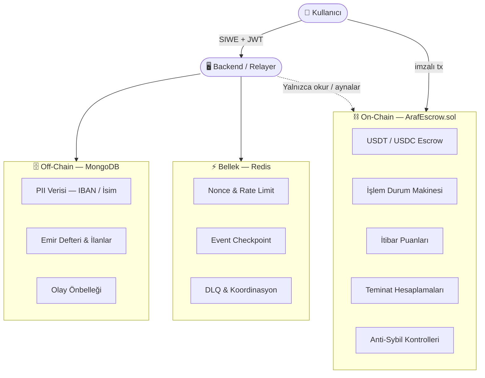
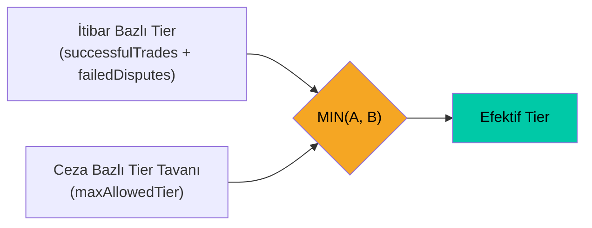
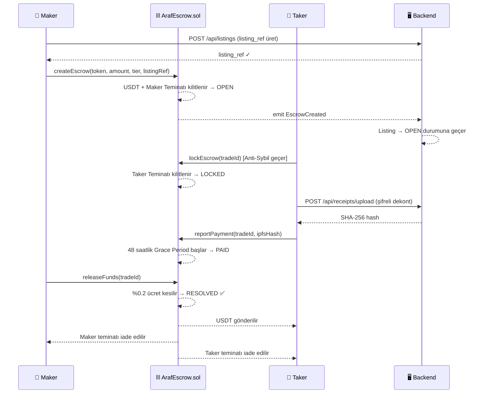
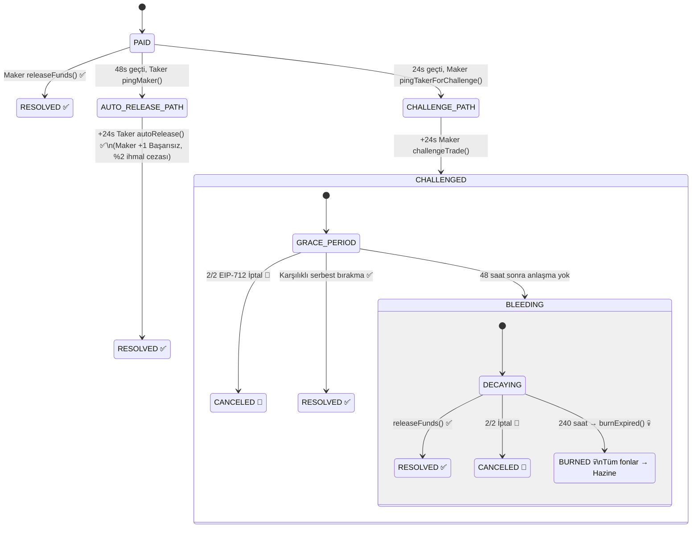
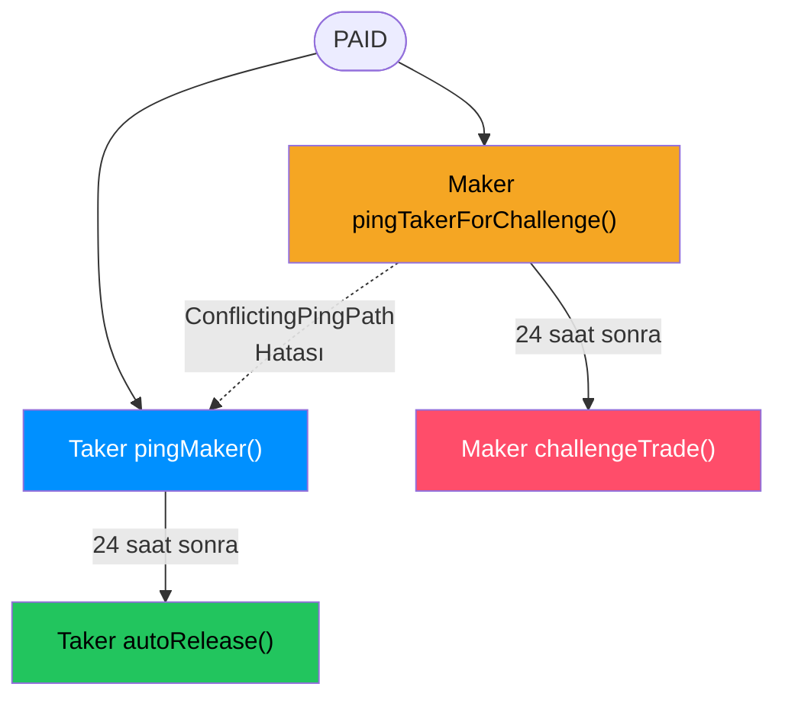
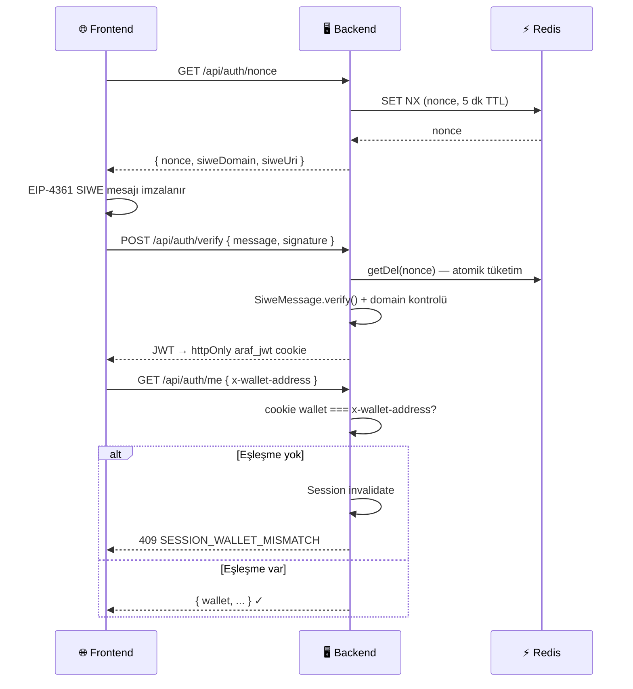
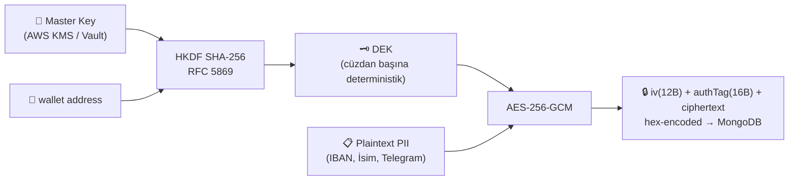
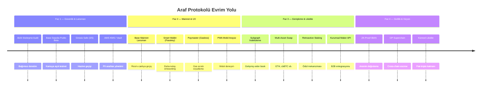
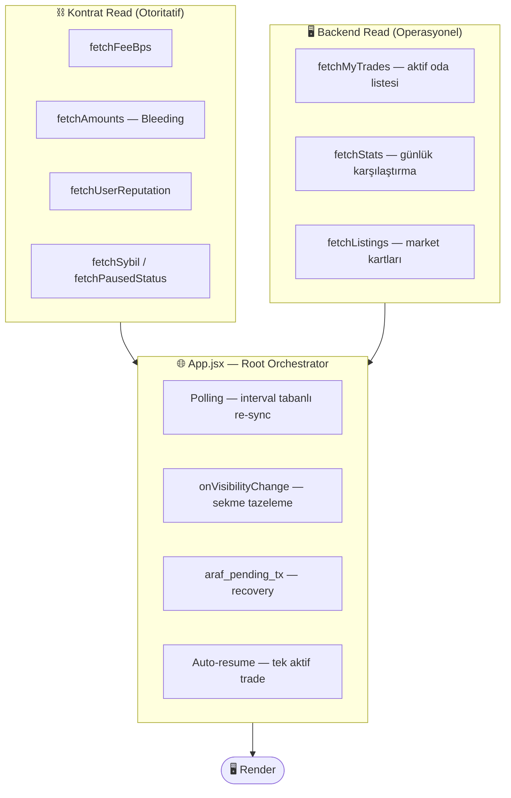

<div align="center">

# 🌀 Araf Protokolü
### Kanonik Mimari & Teknik Referans

[](.)
[-0052FF?style=flat-square&logo=coinbase)](.)
[](.)
[](.)
[](.)
[](.)

---

*Fiat ↔ Kripto takasını güvensiz ortamda mümkün kılan, **emanet tutmayan, insansız ve oracle-bağımsız** P2P escrow protokolü.*

> **"Sistem yargılamaz. Dürüstsüzlüğü pahalıya mal eder."**

</div>

---

## 📋 İçindekiler

| # | Bölüm |
|---|-------|
| 1 | [Vizyon ve Temel Felsefe](#1-vizyon-ve-temel-felsefe) |
| 2 | [Hibrit Mimari: On-Chain ve Off-Chain](#2-hibrit-mimari-on-chain-ve-off-chain) |
| 3 | [Sistem Katılımcıları](#3-sistem-katılımcıları) |
| 4 | [Tier ve Teminat Sistemi](#4-tier-ve-teminat-sistemi) |
| 5 | [Anti-Sybil Kalkanı](#5-anti-sybil-kalkanı) |
| 6 | [Standart İşlem Akışı (Happy Path)](#6-standart-işlem-akışı-happy-path) |
| 7 | [Uyuşmazlık Sistemi — Bleeding Escrow](#7-uyuşmazlık-sistemi--bleeding-escrow) |
| 8 | [İtibar ve Ceza Sistemi](#8-i̇tibar-ve-ceza-sistemi) |
| 9 | [Güvenlik Mimarisi](#9-güvenlik-mimarisi) |
| 10 | [Veri Modelleri (MongoDB)](#10-veri-modelleri-mongodb) |
| 11 | [Hazine Modeli](#11-hazine-modeli) |
| 12 | [Saldırı Vektörleri ve Bilinen Sınırlamalar](#12-saldırı-vektörleri-ve-bilinen-sınırlamalar) |
| 13 | [Kesinleşmiş Protokol Parametreleri](#13-kesinleşmiş-protokol-parametreleri) |
| 14 | [Gelecek Evrim Yolu](#14-gelecek-evrim-yolu) |
| 15 | [Frontend UX Koruma Katmanı](#15-frontend-ux-koruma-katmanı-mart-2026) |

---

## 1. Vizyon ve Temel Felsefe

Araf Protokolü; fiat para birimi (TRY / USD / EUR) ile kripto varlıklar (USDT / USDC) arasında güvensiz ortamda takas yapmayı mümkün kılan P2P escrow sistemidir. Moderatör yok, hakeme başvuru yok, müşteri hizmetleri yok. Uyuşmazlıklar on-chain zamanlayıcılar ve ekonomik oyun teorisi ile özerk olarak çözülür.

### Temel İlkeler

| İlke | Açıklama |
|------|----------|
| 🔒 **Emanet Tutmayan (Non-Custodial)** | Platform kullanıcı fonlarına hiçbir zaman el sürmez. Tüm varlıklar şeffaf bir akıllı sözleşmede kilitlenir. |
| 🔮 **Oracle-Bağımsız Uyuşmazlık Çözümü** | Hiçbir dış veri kaynağı anlaşmazlıklarda kazananı belirlemez. Çözüm tamamen zaman bazlıdır (Bleeding Escrow). |
| 🤖 **İnsansız** | Moderatör yok. Jüri yok. Kod ve zamanlayıcılar her şeye karar verir. |
| ☢️ **MAD Tabanlı Güvenlik** | Karşılıklı Garantili Yıkım (MAD): dürüstsüz davranış her zaman dürüst davranıştan daha pahalıya mal olur. |
| 🔑 **Non-custodial Backend Anahtar Modeli** | Backend kullanıcı fonlarını kontrol eden custody anahtarı tutmaz; yalnızca operasyonel relayer signer olabilir. |

### Oracle-Bağımsızlık Sınırı

**Oracle KULLANILMAYAN alanlar:**
- ❌ Banka transferlerinin doğrulanması
- ❌ Uyuşmazlıklarda "haklı taraf" kararı
- ❌ Escrow serbest bırakmayı tetikleyen herhangi bir dış veri akışı

**Off-chain yaşayan veriler (ve nedeni):**
- ✅ PII verisi (IBAN, Telegram) — **GDPR / KVKK: Unutulma Hakkı**
- ✅ Emir defteri ve ilanlar — **Performans: 50ms altı sorgu**
- ✅ Analitik — **Kullanıcı deneyimi: gerçek zamanlı istatistikler**

> **Kritik ayrım:** Oracle'lar yalnızca yasal veri depolama için kullanılır — **asla uyuşmazlık sonuçları için değil.**

---

## 2. Hibrit Mimari: On-Chain ve Off-Chain

Araf **Web2.5 Hibrit Sistem** olarak çalışır. Güvenlik açısından kritik operasyonlar on-chain'de; gizlilik ve performans açısından kritik veriler off-chain'de yaşar.



### Mimari Karar Matrisi

| Bileşen | Depolama | Teknoloji | Gerekçe |
|---------|----------|-----------|---------|
| USDT / USDC Escrow | 🔗 On-Chain | `ArafEscrow.sol` | Değiştirilemez, emanet tutmayan |
| İşlem Durum Makinesi | 🔗 On-Chain | `ArafEscrow.sol` | Bleeding zamanlayıcısı tamamen özerk |
| İtibar Puanları | 🔗 On-Chain | `ArafEscrow.sol` | Kalıcı, sahte olunamaz geçmiş kanıtı |
| PII Verisi (IBAN / İsim) | 🗄️ Off-Chain | MongoDB + KMS | GDPR / KVKK: Unutulma Hakkı |
| Emir Defteri ve İlanlar | 🗄️ Off-Chain | MongoDB | 50ms altı sorgular |
| Operasyonel Geçici Durum | ⚡ Bellek | Redis | Nonce, rate limit, checkpoint, DLQ |

### Teknoloji Yığını

| Katman | Teknoloji | Detaylar |
|--------|-----------|---------|
| Akıllı Sözleşme | Solidity + Hardhat | `0.8.24`, `optimizer runs=200`, `viaIR`, `evmVersion=cancun` |
| Backend | Node.js + Express | CommonJS, non-custodial relayer |
| Veritabanı | MongoDB + Mongoose | v8.x — `maxPoolSize=100`, `socketTimeoutMS=20000` |
| Önbellek / Auth | Redis | v4.x — nonce'lar, event checkpoint, DLQ, readiness gate |
| Şifreleme | AES-256-GCM + HKDF + KMS/Vault | Zarf şifreleme, cüzdan başına deterministik DEK |
| Kimlik Doğrulama | SIWE + JWT (HS256) | EIP-4361, 15 dakika geçerlilik |
| Frontend | React 18 + Vite + Wagmi | Tailwind CSS, viem, EIP-712 |

### Sıfır Güven Backend Modeli

```
✅ Backend'de kullanıcı fonları için custody anahtarı yoktur
✅ Backend escrow serbest bırakamaz (yalnızca kullanıcılar imzalayabilir)
✅ Backend Bleeding Escrow zamanlayıcısını atlayamaz (on-chain zorunlu)
✅ Backend itibar puanlarını sahte gösteremez (on-chain doğrulanır)
⚠️ Backend PII'yı şifre çözebilir (UX için zorunlu — hız sınırlama + denetim logları ile azaltılmış)
```

> `ArafEscrow.sol`, protokolün **tek otoritatif durum makinesidir.** Mimari uyuşmazlıklarda **kontrat gerçekliği esas alınır.**

---

## 3. Sistem Katılımcıları

| Rol | Etiket | Yetenekler | Kısıtlamalar |
|-----|--------|------------|--------------|
| **Maker** | Satıcı | İlan açar. USDT + Teminat kilitler. Serbest bırakabilir, itiraz edebilir, iptal önerebilir. | Kendi ilanında Taker olamaz. Teminat işlem çözülene kadar kilitli. |
| **Taker** | Alıcı | Fiat'ı off-chain gönderir. Taker Teminatı kilitler. Ödeme bildirebilir, iptal onaylayabilir. | Anti-Sybil filtrelerine tabidir. Ban kapısı yalnız taker girişinde uygulanır. |
| **Hazine** | Protokol | %0.2 başarı ücreti + eriyip/yanan fonları alır. | Owner `setTreasury()` ile güncelleyebilir; backend tek başına değiştiremez. |
| **Backend** | Relayer | Şifreli PII depolar, emir defterini indeksler, JWT yayınlar, API sunar. | Custody anahtarı yoktur. On-chain durumu değiştiremez. |

---

## 4. Tier ve Teminat Sistemi

5 kademeli sistem **"Soğuk Başlangıç" sorununu** çözer: yeni cüzdanlar yüksek hacimli işlemlere anında erişemez. Tüm teminat sabitleri on-chain zorunlu kılınmıştır.

> **Kural:** Bir kullanıcı, yalnızca mevcut efektif tier seviyesine eşit veya daha düşük seviyedeki ilanları açabilir veya bu ilanlara alım emri verebilir.

| Tier | Kripto Limiti | Maker Teminatı | Taker Teminatı | Cooldown | Erişim Koşulu |
|------|--------------|----------------|----------------|----------|---------------|
| **Tier 0** | Maks. 150 USDT | %0 | %0 | 4 saat / işlem | Varsayılan — tüm yeni kullanıcılar |
| **Tier 1** | Maks. 1.500 USDT | %8 | %10 | 4 saat / işlem | ≥ 15 başarılı, 15 gün aktiflik, ≤ 2 başarısız uyuşmazlık |
| **Tier 2** | Maks. 7.500 USDT | %6 | %8 | Sınırsız | ≥ 50 başarılı, ≤ 5 başarısız uyuşmazlık |
| **Tier 3** | Maks. 30.000 USDT | %5 | %5 | Sınırsız | ≥ 100 başarılı, ≤ 10 başarısız uyuşmazlık |
| **Tier 4** | Limitsiz | %2 | %2 | Sınırsız | ≥ 200 başarılı, ≤ 15 başarısız uyuşmazlık |

> Limitler **tamamen kripto varlık (USDT/USDC) üzerinden** hesaplanır — Kur Manipülasyonunu önlemek için fiat kurları limit belirlemede dikkate alınmaz.

### Efektif Tier Hesaplaması



**Ek kural:** Kullanıcı başarı sayısıyla Tier 1+ eşiğine ulaşmış olsa bile, ilk başarılı işleminin üzerinden en az **15 gün** (`MIN_ACTIVE_PERIOD`) geçmeden efektif tier'ı 0'ın üstüne çıkamaz.

### İtibar Temelli Teminat Düzenleyicileri

| Koşul | Etki |
|-------|------|
| 0 başarısız uyuşmazlık + en az 1 başarılı işlem | **−%1** teminat indirimi (temiz geçmiş ödülü) |
| 1 veya daha fazla başarısız uyuşmazlık | **+%3** teminat cezası |

---

## 5. Anti-Sybil Kalkanı

Her `lockEscrow()` çağrısından önce dört on-chain filtresi çalışır. Backend bunları **atlayamaz veya geçersiz kılamaz.**

| Filtre | Kural | Amaç |
|--------|-------|-------|
| 🚫 **Kendi Kendine İşlem Engeli** | `msg.sender ≠ maker adresi` | Kendi ilanlarında sahte işlemi engeller |
| 🕐 **Cüzdan Yaşı** | Kayıt ≥ ilk işlemden 7 gün önce | Yeni oluşturulan Sybil cüzdanlarını engeller |
| 💰 **Dust Limiti** | Yerel bakiye ≥ `0.001 ether` | Sıfır bakiyeli tek kullanımlık cüzdanları engeller |
| ⏱️ **Tier 0 / 1 Cooldown** | Maksimum 4 saatte 1 işlem | Bot ölçekli spam saldırısını sınırlar |
| 🔔 **Challenge Ping Cooldown** | PAID sonrası `pingTakerForChallenge` için ≥ 24 saat | Hatalı itirazları ve anlık tacizi önler |
| 🔒 **Ban Kapısı (yalnız taker rolü)** | `notBanned` sadece `lockEscrow()` girişinde | Yasaklı cüzdanın alıcı rolünde yeni trade'e girmesini engeller |

<details>
<summary>📄 İlgili Kontrat Fonksiyonları</summary>

| Fonksiyon | Açıklama |
|-----------|----------|
| `registerWallet()` | 7 günlük "cüzdan yaşlandırma" sürecini başlatır. `lockEscrow` için zorunlu ön koşul. |
| `antiSybilCheck(address)` | `aged`, `funded` ve `cooldownOk` alanlarını döndüren UX helper'ı. Bağlayıcı karar `lockEscrow()` içindedir. |
| `getCooldownRemaining(address)` | Cooldown kalan süresini döndürür. Cooldown kuralını kendisi uygulamaz. |

</details>

---

## 6. Standart İşlem Akışı (Happy Path)



### Durum Tanımları

| Durum | Tetikleyen | Açıklama |
|-------|-----------|---------|
| `OPEN` | Maker `createEscrow()` | İlan yayında. USDT + Maker teminatı on-chain kilitli. |
| `LOCKED` | Taker `lockEscrow()` | Anti-Sybil geçti. Taker teminatı on-chain kilitli. |
| `PAID` | Taker `reportPayment()` | IPFS makbuz hash'i on-chain kaydedildi. 48 saatlik zamanlayıcı başladı. |
| `RESOLVED` ✅ | Maker `releaseFunds()` | %0.2 ücret alındı. USDT → Taker. Teminatlar iade edildi. |
| `CANCELED` 🔄 | 2/2 EIP-712 imzası | LOCKED'da: tam iade, ücret yok. PAID/CHALLENGED'da: net tutar üzerinden %0.2. İtibar cezası uygulanmaz. |
| `BURNED` 💀 | 240 saat sonra `burnExpired()` | Tüm kalan fonlar → Hazine. |

### Ücret Modeli

| Taraf | Kesinti | Kaynak |
|-------|---------|--------|
| Taker ücreti | %0,1 | Taker'ın aldığı USDT'den |
| Maker ücreti | %0,1 | Maker'ın teminat iadesinden |
| **Toplam** | **%0,2** | Başarıyla çözülen her işlemde |

---

## 7. Uyuşmazlık Sistemi — Bleeding Escrow

Araf Protokolünde hakem yoktur. Bunun yerine, **asimetrik zaman çürümesi mekanizması** kullanılır. Bir taraf ne kadar uzun süre iş birliği yapmayı reddederse, o kadar çok kaybeder.



### Kanama Çürüme Oranları

| Varlık | Oran | Başlangıç | Günlük Etki |
|--------|------|----------|------------|
| **Taker Teminatı** | 42 BPS / saat | Kanama'nın 0. saati | ~%10,1 / gün |
| **Maker Teminatı** | 26 BPS / saat | Kanama'nın 0. saati | ~%6,2 / gün |
| **Escrowed Kripto** | 34 BPS / saat | Kanama'nın **96. saati** | ~%8,2 / gün |

> **Neden 96. saat?** 48 saatlik grace period + hafta sonu banka gecikmelerine karşı 96 saatlik tampon. Dürüst tarafları anında zarar görmekten korurken aciliyeti sürdürür.

### Karşılıklı Dışlayıcı Ping Yolları



> Bu iki yol `ConflictingPingPath` hatasıyla birbirini dışlar — aynı trade için iki çelişkili zorlayıcı çözüm hattının paralel açılmasını önler.

### Müşterek İptal (EIP-712)

Her iki taraf da `LOCKED`, `PAID` veya `CHALLENGED` durumunda karşılıklı çıkış önerebilir.

**Önemli kontrat gerçeği:** Mevcut kontrat, iki imzayı backend'de toplayıp üçüncü bir relayer'ın submit ettiği batch yol **sunmaz**. Her taraf kendi hesabıyla ayrı on-chain onay verir. Backend yalnızca koordinasyon ve UX kolaylaştırıcı rol üstlenir.

İmza tipi: `CancelProposal(uint256 tradeId, address proposer, uint256 nonce, uint256 deadline)`

> `sigNonces` sayaçları **cüzdan başına globaldir** — off-chain saklanan imza, başka bir trade işlemi sonrası bayatlayabilir.

<details>
<summary>📄 İlgili Kontrat Fonksiyonları</summary>

| Fonksiyon | Açıklama |
|-----------|----------|
| `pingTakerForChallenge(tradeId)` | `challengeTrade` için zorunlu ön koşul. |
| `challengeTrade(tradeId)` | 24 saat sonra itiraz ederek Bleeding Escrow fazını başlatır. |
| `pingMaker(tradeId)` | 48 saatlik GRACE_PERIOD sonrası Maker'a sinyal gönderir. `autoRelease` için ön koşul. |
| `autoRelease(tradeId)` | Taker'ın 24 saat sonra fonları tek taraflı serbest bırakmasını sağlar. |
| `proposeOrApproveCancel(...)` | EIP-712 imzasıyla müşterek iptal teklif eder veya onaylar. |
| `burnExpired(tradeId)` | 10 günlük kanama sonrası tüm fonları Hazine'ye aktarır. **Permissionless** — herhangi biri çağırabilir. |
| `getCurrentAmounts(tradeId)` | Bleeding sonrası anlık ekonomik durumu doğrudan kontrattan verir. |

</details>

---

## 8. İtibar ve Ceza Sistemi

### İtibar Güncelleme Mantığı

| Sonuç | Maker | Taker |
|-------|-------|-------|
| Uyuşmazlıksız kapanış (RESOLVED) | +1 Başarılı | +1 Başarılı |
| Maker itiraz etti → sonra serbest bıraktı | +1 Başarısız | +1 Başarılı |
| `autoRelease` — Maker 48 saat pasif kaldı | +1 Başarısız | +1 Başarılı |
| BURNED (10 günlük timeout) | +1 Başarısız | +1 Başarısız |

### Yasak Eskalasyonu

**Tetikleyici:** İlk ban `failedDisputes >= 2` eşiğinde başlar. Eşik aşıldıktan sonra **her yeni başarısızlıkta** yeniden cezalandırma uygulanır.

> Yasak **yalnızca Taker'a** uygulanır — `notBanned` modifier'ı sadece `lockEscrow()` üzerinde durur.

| Yasak Sayısı | Süre | Tier Etkisi |
|-------------|------|------------|
| 1. yasak | 30 gün | Tier değişimi yok |
| 2. yasak | 60 gün | `maxAllowedTier −1` |
| 3. yasak | 120 gün | `maxAllowedTier −1` |
| N. yasak | `30 × 2^(N−1)` gün (maks. 365) | Her yasakta `maxAllowedTier −1` (alt sınır: Tier 0) |

### Temiz Sayfa Kuralı (`decayReputation`)

180 gün sonra:
- `consecutiveBans` sıfırlanır
- `hasTierPenalty` bayrağı kaldırılır
- `maxAllowedTier` tekrar 4'e çekilir

**Permissionless bakım çağrısıdır** — kullanıcının kendisi, backend relayer'ı veya herhangi bir üçüncü taraf çağırabilir.

> `decayReputation()` yalnız `consecutiveBans` ve tier ceiling cezasını sıfırlar; `failedDisputes` ve tarihsel `bannedUntil` izi kalır.

---

## 9. Güvenlik Mimarisi

### 9.1 Kimlik Doğrulama Akışı (SIWE + JWT)



**Temel güvenlik kararları:**

| Karar | Açıklama |
|-------|----------|
| **Cookie-only auth** | Auth JWT yalnızca httpOnly `araf_jwt` cookie'sine yazılır; normal auth için Bearer fallback kapalıdır. |
| **Nonce atomikliği** | `SET NX` yarışı sonrası başarısız taraf Redis'te yaşayan nonce'ı re-read eder — drift olmaz. |
| **Refresh token family** | Reuse denemesinde ilgili wallet'ın **tüm aileleri** kapatılır. |
| **JWT blacklist fail-mode** | Production'da varsayılan **fail-closed**, geliştirmede **fail-open**. |
| **JWT secret zorunluluğu** | Minimum uzunluk, placeholder yasağı ve Shannon entropy kontrolü — eksikse servis başlamaz. |

### 9.2 PII Şifreleme (Zarf Şifreleme)



| Özellik | Değer |
|---------|-------|
| Algoritma | AES-256-GCM (doğrulanmış şifreleme) |
| Anahtar Türetme | Node.js native `crypto.hkdf()` — HKDF (SHA-256, RFC 5869) |
| DEK Kapsamı | Cüzdan başına deterministik — depolanmaz, ihtiyaç anında yeniden türetilir |
| Master Key Kaynağı | Development: `.env` / Production: **AWS KMS** veya **HashiCorp Vault** |
| Production Koruması | `NODE_ENV=production` iken `KMS_PROVIDER=env` bilinçli olarak engellenir |
| IBAN Erişim Akışı | Auth JWT → PII token (15 dk, trade-scoped) → anlık trade statü kontrolü → şifre çözme |

### 9.3 Hız Sınırlama

| Endpoint Grubu | Limit | Pencere | Anahtar |
|----------------|-------|---------|---------|
| PII / IBAN | 3 istek | 10 dakika | IP + Cüzdan |
| Auth (SIWE) | 10 istek | 1 dakika | IP |
| İlanlar (okuma) | 100 istek | 1 dakika | IP |
| İlanlar (yazma) | 5 istek | 1 saat | Cüzdan |
| İşlemler | 30 istek | 1 dakika | Cüzdan |
| Geri Bildirim | 3 istek | 1 saat | Cüzdan |

> Auth yüzeyi Redis yokken **in-memory fallback limiter** devreye girer — `429` döner. Diğer yüzeyler genel fail-open davranır.

<details>
<summary>📄 Olay Dinleyici Güvenilirliği (9.4)</summary>

- **Durum makinesi:** Worker `booting → connected → replaying → live → reconnecting → stopped`
- **Safe Checkpoint:** Yalnızca tüm event'leri başarıyla ack'lenmiş bloklar checkpoint'e alınır
- **DLQ:** Başarısız olaylar `worker:dlq` Redis listesinde tutulur; exponential backoff (maks. 30 dk)
- **Poison Event Politikası:** Otomatik silinmez — manuel inceleme için görünür kalır
- **Authoritative Linkage:** `EscrowCreated` yalnızca kanonik `listing_ref` üzerinden eşleştirilir — zero ref = kritik bütünlük ihlali, heuristik fallback yok
- **Atomik Bağlama:** `Listing.onchain_escrow_id` yalnızca atomik update ile bağlanır
- **Atomik Sonlandırma:** `EscrowReleased` ve `EscrowBurned` akışları Mongo transaction ile yürür

</details>

<details>
<summary>📄 Bootstrap, Middleware ve Shutdown Orkestrasyonu (9.5)</summary>

**Bootstrap sırası:**
```
.env yükle → MongoDB bağlan → Redis bağlan → On-chain config yükle
→ Event worker başlat → Scheduler'ları kur → HTTP route'larını mount et
```

**Temel middleware zinciri:** `helmet` + `cors(credentials=true)` + `express.json(50kb)` + `cookieParser` + `express-mongo-sanitize`

**Shutdown sırası:**
```
server.close() → worker kapat → Mongo kapat → Redis quit()
→ master key cache sıfırla → zamanlayıcılar temizle → force-exit timeout
```

**Fail-fast startup kuralları:**
- Production'da `SIWE_DOMAIN=localhost` → başlamaz
- Boş/`*` CORS origin'leri → başlamaz
- `SIWE_URI` `https` değilse → başlamaz

</details>

---

## 10. Veri Modelleri (MongoDB)

> **Kritik ilke:** On-chain alanlar otoritatif gerçekliği temsil eder. `reputation_cache`, `banned_until`, `crypto_amount_num` gibi alanlar **yalnızca hız ve görüntüleme amaçlı aynalardır** — yetkilendirme veya ekonomik enforcement için tek başına kullanılmaz.

### 10.1 Kullanıcılar

| Alan | Tür | Açıklama |
|------|-----|----------|
| `wallet_address` | String (unique) | Küçük harfli Ethereum adresi — birincil kimlik |
| `pii_data.bankOwner_enc` | String | AES-256-GCM şifreli banka sahibi adı |
| `pii_data.iban_enc` | String | AES-256-GCM şifreli IBAN |
| `pii_data.telegram_enc` | String | AES-256-GCM şifreli Telegram kullanıcı adı |
| `reputation_cache.*` | Number | On-chain itibar aynası — enforcement için değil |
| `is_banned` / `banned_until` | Boolean / Date | On-chain yasak durumu aynası |
| `max_allowed_tier` | Number | Ceza kaynaklı tier tavanı aynası |
| `last_login` | Date | TTL: 2 yıl hareketsizlik → otomatik silme (GDPR) |

### 10.2 İlanlar

| Alan | Tür | Açıklama |
|------|-----|----------|
| `maker_address` | String | İlan oluşturucunun adresi |
| `crypto_asset` | `USDT` \| `USDC` | Satılan varlık |
| `exchange_rate` | Number | 1 kripto birimi başına oran |
| `tier_rules.required_tier` | 0–4 | Bu ilanı almak için gereken minimum tier |
| `status` | `PENDING\|OPEN\|PAUSED\|COMPLETED\|DELETED` | `PENDING` = henüz on-chain'e yazılmamış |
| `listing_ref` | String | 64-byte hex referans; sparse+unique |

### 10.3 İşlemler

| Alan Grubu | Temel Alanlar | Notlar |
|-----------|---------------|--------|
| Kimlik | `onchain_escrow_id`, `listing_id`, `maker_address`, `taker_address` | `onchain_escrow_id` = gerçeğin kaynağı |
| Finansal | `crypto_amount` **(String, authoritative)**, `crypto_amount_num` (Number, cache) | `*_num` alanları yalnızca analytics/UI içindir |
| Durum | `status` | `OPEN\|LOCKED\|PAID\|CHALLENGED\|RESOLVED\|CANCELED\|BURNED` |
| Kanıt | `evidence.ipfs_receipt_hash`, `evidence.receipt_encrypted` | Hash on-chain referansı; payload backend'de şifreli |
| PII Snapshot | `pii_snapshot.*` | LOCKED anında karşı taraf verisinin sabitlenmiş görünümü — bait-and-switch riskini azaltır |

> Finansal doğruluk için `crypto_amount` ve `total_decayed` **String** tutulur — BigInt-safe otoritatif değerlerdir.

---

## 11. Hazine Modeli

| Gelir Kaynağı | Oran | Koşul |
|--------------|------|-------|
| Başarı ücreti | %0,2 (her iki taraftan %0,1) | Her `RESOLVED` işlem |
| Taker teminat çürümesi | 42 BPS / saat | `CHALLENGED` + Kanama aşaması |
| Maker teminat çürümesi | 26 BPS / saat | `CHALLENGED` + Kanama aşaması |
| Escrowed kripto çürümesi | 34 BPS / saat | Kanama'nın 96. saatinden sonra |
| BURNED sonucu | Kalan fonların %100'ü | 240 saat içinde uzlaşma olmaması |

---

## 12. Saldırı Vektörleri ve Bilinen Sınırlamalar

<details>
<summary>✅ Giderilen Vektörler</summary>

| Saldırı | Risk | Azaltma |
|---------|------|---------|
| Kendi kendine işlem | Yüksek | On-chain `msg.sender ≠ maker` |
| Backend anahtar hırsızlığı | Kritik | Sıfır özel anahtar mimarisi — yalnızca relayer |
| JWT ele geçirme | Yüksek | 15 dk geçerlilik + cookie-only auth + strict wallet authority check |
| PII veri sızıntısı | Kritik | AES-256-GCM + HKDF + hız sınırı (3 / 10 dk) + retention cleanup |
| Production'da `.env` master key | Kritik | `KMS_PROVIDER=env` üretimde bloklanır |
| Dekont kanıtı üzerine yazma | Kritik | Atomik `findOneAndUpdate` + `evidence.receipt_encrypted: null` filtresi |
| Kur Manipülasyonu | Kritik | Tier limitleri mutlak kripto miktarı üzerinden on-chain zorunlu |
| Redis tek nokta hatası | Yüksek | Fail-open (genel) + in-memory fallback limiter (auth) |
| DLQ event kaybı | Yüksek | Re-drive worker + poison event metrikleri + arşivleme |
| Zero listingRef | Kritik | Zero ref = kritik bütünlük ihlali; heuristik fallback yok |
| Canlı checkpoint sessiz veri kaybı | Kritik | `seen/acked/unsafe` blok takibi |
| SIWE nonce yarışı | Yüksek | `SET NX` + atomik re-read |
| Zayıf JWT secret | Kritik | Min. uzunluk + placeholder yasağı + entropy kontrolü + startup fail-fast |
| Challenge spam (Tier 0/1) | Yüksek | 4 saatlik cooldown + dust limiti + cüzdan yaşı |

</details>

<details>
<summary>⚠️ Açık Notlar (Giderilmemiş / İzleme Gerektirir)</summary>

| Saldırı / Risk | Risk | Not |
|---------------|------|-----|
| Sahte makbuz yükleme | Yüksek | Teminat cezası caydırıcı ama tam giderme zor |
| Chargeback (TRY geri alımı) | Orta | IP hash + audit log var ama tam önlenemez |
| Backend yorum katmanının kontrat otoritesinin önüne geçmesi | Kritik | Düzenli contract-authoritative review gerekli |
| Mutual cancel anlatısının batch-model sanılması | Yüksek | Her taraf kendi hesabıyla `proposeOrApproveCancel()` çağırmalı |
| `EscrowReleased`/`EscrowCanceled` event adlarının tekil sanılması | Orta | Aynı event adı farklı kapanış yollarında kullanılır |
| Owner governance yüzeyinin küçümsenmesi | Yüksek | `setTreasury`, `setSupportedToken`, `pause` doğrudan ekonomik akış üzerinde etkilidir |
| `getReputation()` çıktısının tam state kapsaması | Orta | `hasTierPenalty`, `maxAllowedTier` için ek okuma gerekir |
| Frontend EIP-712 domain drift riski | Yüksek | Hook domain'ini sabit tanımlar; kontrat değişirse imzalar geçersizleşir |

</details>

---

## 13. Kesinleşmiş Protokol Parametreleri

> Aşağıdaki tüm değerler Solidity `public constant` olarak deploy edilmiştir — **backend tarafından değiştirilemez.** Kontrat adresi / RPC eksikse sistem `CONFIG_UNAVAILABLE` durumuna geçer ve ilgili route'lar `503` döndürür.

| Parametre | Değer | Sözleşme Sabiti |
|-----------|-------|-----------------|
| Ağ | Base (Chain ID 8453) | — |
| Protokol ücreti | %0,2 (her taraftan %0,1) | `TAKER_FEE_BPS = 10`, `MAKER_FEE_BPS = 10` |
| Grace period | 48 saat | `GRACE_PERIOD` |
| Escrowed crypto decay başlangıcı | Kanama'dan 96 saat sonra | `USDT_DECAY_START` |
| Maksimum kanama süresi | 240 saat (10 gün) | `MAX_BLEEDING` |
| Taker teminat çürüme hızı | 42 BPS / saat | `TAKER_BOND_DECAY_BPS_H` |
| Maker teminat çürüme hızı | 26 BPS / saat | `MAKER_BOND_DECAY_BPS_H` |
| Escrowed kripto çürüme hızı | 34 BPS / saat | `CRYPTO_DECAY_BPS_H` |
| Minimum cüzdan yaşı | 7 gün | `WALLET_AGE_MIN` |
| Dust limiti | 0.001 ether | `DUST_LIMIT` |
| Minimum aktif süre | 15 gün | `MIN_ACTIVE_PERIOD` |
| Tier 0 / 1 cooldown | 4 saat / işlem | `TIER0_TRADE_COOLDOWN`, `TIER1_TRADE_COOLDOWN` |
| Auto-release ihmal cezası | Her iki teminattan %2 | `AUTO_RELEASE_PENALTY_BPS = 200` |
| Karşılıklı iptal son tarih tavanı | 7 gün | `MAX_CANCEL_DEADLINE` |
| EIP-712 domain | ArafEscrow / version 1 | `EIP712("ArafEscrow", "1")` |
| Temiz itibar indirimi | −%1 | `GOOD_REP_DISCOUNT_BPS = 100` |
| Kötü itibar cezası | +%3 | `BAD_REP_PENALTY_BPS = 300` |
| Yasak tetikleyici | 2+ başarısız uyuşmazlık | `_updateReputation()` |
| 1. yasak süresi | 30 gün | Eskalasyon: `30 × 2^(N−1)` gün |
| Maksimum yasak süresi | 365 gün | Sözleşmede üst sınır |

**Derleme profili:** `Solidity 0.8.24 + optimizer(runs=200) + viaIR + evmVersion=cancun`

---

## 14. Gelecek Evrim Yolu



---

## 15. Frontend UX Koruma Katmanı (Mart 2026)

> **Kritik ilke korunur: karar mercii daima kontrattır, frontend yalnızca yönlendirir.**

Bu katman; hakemlik yapmadan, kullanıcıyı yüksek maliyetli hata akışlarından uzaklaştıracak biçimde güncellenmiştir.

### App.jsx Veri Akışı



### Temel Özellikler

| Özellik | Açıklama |
|---------|----------|
| 🔒 **PIIDisplay** | IBAN varsayılan gizli. Kullanıcı aksiyonu olmadan fetch yok. `AbortController` ile race condition koruması. |
| 📡 **useArafContract** | Her write'tan önce 3 preflight guard: `walletClient` + `VITE_ESCROW_ADDRESS` + ağ doğrulaması. |
| ⏱️ **useCountdown** | Page Visibility API ile arka plan drift koruması. İlk `isFinished` state'i hedef tarihe göre hesaplanır — flicker yok. |
| 🔑 **Signed Session Guard** | `isConnected + authenticatedWallet === connectedWallet` — cüzdan bağlı olmak tek başına yetki vermez. |
| 💾 **Pending Tx Recovery** | `araf_pending_tx` localStorage'da korunur. Sayfa yenilemesinde receipt kontrol edilir, iz temizlenir. |
| 🔄 **Auto-resume** | Tek aktif trade varsa trade room bağlamına geri dönülür — kesinleşme garantisi vermez, UX kolaylığıdır. |
| 🛡️ **ErrorBoundary** | Render hataları PII-scrubbed (IBAN/kart/telefon pattern temizliği) olarak backend'e gönderilir. |

### Mimari Sonuç

```
✅ On-chain state machine değişmedi
✅ Hakemlik ve backend takdiri eklenmedi
✅ PII varsayılan gizli kalır — reveal/hide/clipboard akışı savunmacı UX ile sınırlandırılır
✅ Frontend countdown mantığı on-chain zaman pencerelerini senkronize eder — yetki vermez
✅ Pending transaction izi sayfa yenilemesinde kaybolmaz
✅ App kök katmanı, canlı bir frontend runtime orchestrator gibi davranır
✅ UX iyileştirmesi = daha düşük operasyonel sürtünme, daha az destek yükü
```

---

## Hibrit Neden Dürüsttür

**Merkeziyetsizleştirdiğimiz (kritik kısımlar):**
- ✅ Fon emaneti — non-custodial akıllı sözleşme
- ✅ Uyuşmazlık çözümü — zaman bazlı, insan kararı yok
- ✅ İtibar bütünlüğü — değiştirilemez on-chain kayıtlar
- ✅ Anti-Sybil zorunluluğu — on-chain kontroller

**Merkezileştirdiğimiz (gizlilik / performans):**
- ⚠️ PII depolama — GDPR, silme yeteneği gerektiriyor
- ⚠️ Emir defteri indeksleme — UX için saniye altı sorgular
- ⚠️ Rate limit / nonce koordinasyonu — kısa ömürlü operasyonel state

**Backend asla kontrol etmez:**

| ❌ Fon emaneti | ❌ Uyuşmazlık sonuçları | ❌ İtibar puanları | ❌ İşlem durum geçişleri |
|---|---|---|---|

---

<div align="center">

*Araf Protokolü — "Sistem yargılamaz. Dürüstsüzlüğü pahalıya mal eder."*

[](https://base.org)
[](https://soliditylang.org)
[](https://mongodb.com)
[](https://redis.io)

</div>
