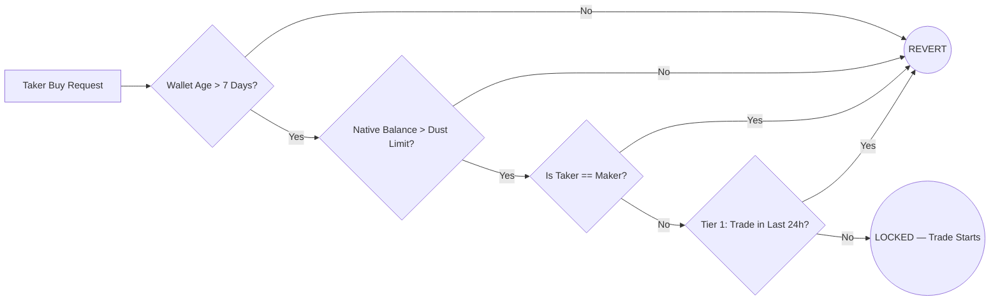
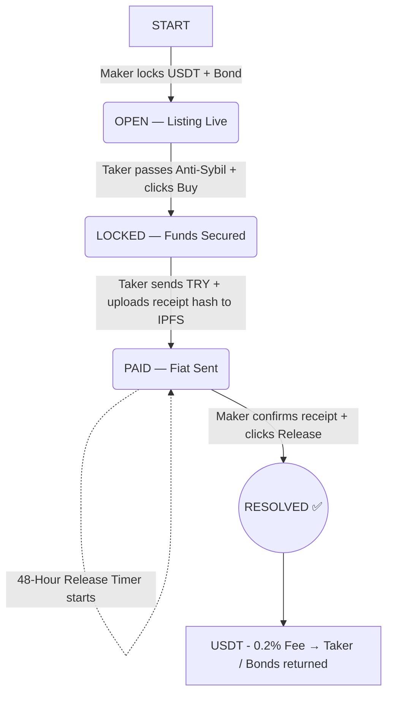

---

```markdown
# 🌀 Araf Protocol — Canonical Architecture Document

> **Version:** 1.2 (Volume & Security Optimized)
> **Status:** Architecture Finalized — Awaiting Smart Contract Implementation
> **Network:** Base (Layer 2)
> **Last Updated:** 2026

---

## 📌 Table of Contents

1. [Vision & Core Philosophy](#1-vision--core-philosophy)
2. [System Participants](#2-system-participants)
3. [Tier & Bond System](#3-tier--bond-system)
4. [Anti-Sybil Shield](#4-anti-sybil-shield)
5. [Standard Trade Flow (Happy Path)](#5-standard-trade-flow-happy-path)
6. [Dispute System — Bleeding Escrow & Collaborative Cancel](#6-dispute-system--bleeding-escrow--collaborative-cancel)
7. [Reputation, Scoring & Penalties](#7-reputation-scoring--penalties)
8. [Treasury Model](#8-treasury-model)
9. [Attack Vectors & Known Limitations](#9-attack-vectors--known-limitations)
10. [Finalized Protocol Parameters](#10-finalized-protocol-parameters)

---

## 1. Vision & Core Philosophy

Araf Protocol is a **non-custodial, humanless, oracle-free** peer-to-peer escrow system enabling trustless exchange between fiat currency (TRY) and crypto assets (USDT).

### Core Principles

| Principle | Description |
|---|---|
| **Non-Custodial** | The platform never holds user funds. Everything is locked in transparent on-chain smart contracts. |
| **Oracle-Free** | The system has no access to bank data, external APIs, or real-world payment verification. |
| **Humanless** | No moderators, arbitrators, or jury systems. All resolution is automated by code and timers. |
| **MAD-Based Security** | Security relies on Mutually Assured Destruction game theory — dishonest behavior always results in financial loss. |
| **Code is Law** | Operational cost is zero. No customer service. No dispute moderators. |

---

## 2. System Participants

| Role | Label | Description |
|---|---|---|
| **Maker** (Satıcı) | Seller | Opens the listing. Locks USDT + collateral bond into the contract. |
| **Taker** (Alıcı) | Buyer | Sends fiat (TRY) off-chain. Triggers escrow release. |
| **Treasury** | Protocol | Receives protocol fees (0.2%) and burned/decayed funds from failed disputes. |

---

## 3. Tier & Bond System

Optimized for high-volume traders while maintaining strict entry barriers for new wallets to solve the "Cold Start" problem safely.

| Tier | Criteria | Trade Limit (TRY) | Maker Bond | Taker Bond | Trade Frequency |
|---|---|---|---|---|---|
| **Tier 1** | 0–3 Completed Trades | 500 – **5,000 ₺** | %18 | **%0** | **Max 1 per 24h** |
| **Tier 2** | 3+ Successful Trades | 5,001 – **50,000 ₺** | %15 | %12 | **Unlimited** |
| **Tier 3** | High-Volume Traders | **50,001 ₺ +** | %10 | %8 | **Unlimited** |

> **Note:** Tier 1 Taker's 0% bond is protected exclusively by the on-chain Anti-Sybil Shield and the 24h cooldown to prevent mass-griefing. Tier 2 and 3 have no volume limits.

### Bond Modifiers (Reputation-Based)

| Condition | Bond Adjustment |
|---|---|
| 0 failed disputes | **−3%** discount |
| 1 failed dispute | **+5%** penalty |

---

## 4. Anti-Sybil Shield

Four on-chain filters protect the system from bot networks, griefing attacks, and self-trading at zero cost.



| Filter | Rule | Purpose |
| --- | --- | --- |
| **Self-Trade Prevention** | `msg.sender != maker` | Blocks users from acting as taker on their own listings |
| **Wallet Age** | > 7 days old | Blocks freshly created sybil wallets |
| **Dust Limit** | Must hold ~$2 in native gas token | Blocks zero-balance throwaway wallets |
| **Cooldown** | Max 1 trade per 24h (Tier 1) | Limits bot-scale spam attacks |

---

## 5. Standard Trade Flow (Happy Path)



### State Definitions

| State | Triggered By | Description |
| --- | --- | --- |
| `OPEN` | Maker | Listing is live. USDT + Maker bond locked. |
| `LOCKED` | Taker | Trade started. Taker bond locked. Anti-Sybil passed. |
| `PAID` | Taker | Fiat sent off-chain. IPFS receipt hash recorded on-chain. 48h timer starts. |
| `RESOLVED` | Maker or Contract | Successful close. **0.2% Success Fee** deducted. Funds distributed. |
| `CANCELED` | Collaborative | Trade voided via 2/2 multisig. USDT returns to Maker. Bonds fully refunded. No fee charged. |

---

## 6. Dispute System — Bleeding Escrow & Collaborative Cancel

This is the canonical dispute resolution model. It is **time-based, oracle-free, and psychologically coercive** by design. The contract cannot see the bank. Instead of pretending to judge, it makes dishonesty and stubbornness **mathematically expensive**.

### Full State Machine

```text
PAID
  │
  ├──[Maker clicks Release]──────────────────────────── RESOLVED ✅
  │
  └──[Maker clicks Challenge]
            │
          GRACE PERIOD (48h)
          ├── No financial penalty
          ├── Both parties negotiate off-chain
          │
          ├──[Collaborative Cancel (2/2 Signatures)]
          │    Maker "Propose Cancel" + Taker "Approve" ─── CANCELED 🔄
          │    (USDT returned to Maker, Bonds fully refunded)
          │
          ├──[Mutual Release]──────────────────────────── RESOLVED ✅
          │
          └──[No Agreement after 48h] (One party refuses/ignores)
                      │
                  BLEEDING ⏳
                  ├── Asymmetric daily decay begins
                  ├── Challenge-opener's bond decays faster
                  │
                  ├──[Maker clicks Release]──────────────── RESOLVED ✅ (remaining funds)
                  ├──[Collaborative Cancel (2/2)]────────── CANCELED 🔄 (remaining funds)
                  └──[10 Days pass — No agreement]
                            │
                          BURNED 💀
                          (All remaining funds → Treasury)


```

### The Collaborative Cancel Mechanism 🤝

To prevent unilateral griefing or blackmail, cancellations **must** be agreed upon by both parties (2/2 signatures).

* If one party proposes a cancel and the other ignores or rejects it, the system enters/continues the Bleeding phase.
* No extra penalty is applied for rejecting a cancel, as entering the Bleeding phase itself is the punishment.

### Bleeding Decay Rates (Balanced)

| Asset | Challenge Opener | Other Party | Starts |
| --- | --- | --- | --- |
| **Bond** | **−15% / day** | −10% / day | Day 1 of Bleeding (Hour 48) |
| **USDT** | −4% / day (shared) | −4% / day (shared) | **Day 4 of Bleeding** (Hour 120) |

> **Why USDT starts on Day 4:** Grace period (48h) + buffer days for weekend bank delays. This protects honest parties from immediate loss while still creating urgency.

### Seller Griefing — How the System Responds

`Scenario: Seller received TRY but opens challenge to delay/extract.`

* **Day 1–3:** Seller waits. Bond heavily reduced. USDT is safe.
* **Day 4:** USDT starts decaying. TRY is in hand, but USDT is evaporating.
* **Day 5:** Rational exit point. Seller releases to save remaining USDT + bond.
* **Result:** Seller lost more bond (15%/day) than the Taker. Griefing is mathematically unprofitable.

---

## 7. Reputation, Scoring & Penalties

Simple, wallet-native reputation. No tokens, no accounts, no complex levels.

### Update Logic

| Outcome | Winning Party | Losing Party |
| --- | --- | --- |
| Dispute-free close | +1 Successful | +1 Successful |
| Dispute → resolved | +1 Successful | +1 Failed |
| BURNED | +1 Failed | +1 Failed |

### The 30-Day Ban (Blacklist)

If a wallet accumulates **2 or more `failedDisputes**`, it receives an automatic **30-day suspension** from acting as a Taker.

* The user can still act as a Maker (since they lock a 15-18% bond, assuming full risk).
* After 30 days, the restriction is automatically lifted by the smart contract.

---

## 8. Treasury Model

Funds enter the treasury from three sources to act as **Protocol Revenue**:

| Source | Amount |
| --- | --- |
| **Success Fee** | **0.2%** of USDT from every successfully resolved trade |
| Bleeding decay (bonds) | 10–15% per day from active bleeding escrows |
| Bleeding decay (USDT) | 4% per day from both parties (after Day 4) |
| BURNED outcomes | 100% of remaining funds |

*Treasury funds are securely held to fund protocol operations, and to create an **Insurance Fund** for Tier 3 Makers who prove off-chain chargeback fraud.*

---

## 9. Attack Vectors & Known Limitations

| Attack | Risk | Mitigation | Status |
| --- | --- | --- | --- |
| **Fake receipt upload** | High | IPFS hash = proof of upload, not payment. Challenge timer + bond risk discourages false claims. | ⚠️ Partial |
| **Seller griefing** | Medium | Asymmetric bond decay (Opener loses faster) | ✅ Addressed |
| **Chargeback (bank reversal)** | Medium | Off-chain risk. Outside smart contract scope. Mitigated by Insurance Fund for T3. | ⚠️ Partial |
| **Sybil reputation farming** | Low | Min. tx amount + Unique counterparty weighting slows coordination. | ✅ Addressed |
| **Challenge timer spam (Tier 1)** | High | 24h cooldown + Dust filter + wallet age filter | ✅ Addressed |
| **Self-Trading (Wash Trade)** | High | On-chain `msg.sender != maker` check. | ✅ Addressed |
| **Unilateral Cancel Griefing** | High | Collaborative Cancel (2/2 signatures required) | ✅ Addressed |

---

## 10. Finalized Protocol Parameters

The core design decisions have been finalized for the V1.2 Smart Contract deployment:

1. **Network:** **Base (Layer 2)** — Chosen for low gas fees, Ethereum-level security, and high USDT liquidity.
2. **Treasury Destination:** Protocol Revenue (Araf Treasury Contract).
3. **Protocol Fee:** **0.2%** on successful trades.
4. **USDT Decay Split:** Symmetrical (4% / 4%) starting on **Day 4**.
5. **Grace Period Length:** Strictly **48 Hours**.
6. **Blacklist Mechanism:** 30-Day time-limited ban (Taker-only restriction).

---

*Araf Protocol — "The system does not judge. It makes dishonesty expensive."*

```

```
