

# 🌀 Araf Protocol
### Canonical Architecture & Technical Reference — V3 Order-First

[-0052FF?style=flat-square&logo=coinbase)](.)

---

*An order-first, child-trade escrow protocol for oracle-free, non-custodial P2P fiat ↔ crypto exchange.*

> **"Contract decides. Off-chain only mirrors, coordinates, and accelerates."**

---

## 📋 Table of Contents

| # | Section |
|---|---|
| 1 | [Executive canonical model](#1-executive-canonical-model) |
| 2 | [Hybrid architecture and technology stack](#2-hybrid-architecture-and-technology-stack) |
| 3 | [On-chain public surface](#3-on-chain-public-surface-arafescrowsol) |
| 4 | [Parent order vs child trade state model](#4-parent-order-vs-child-trade-state-model) |
| 5 | [Sell flow, buy flow, and role mapping](#5-sell-flow-buy-flow-and-role-mapping) |
| 6 | [Anti-sybil enforcement semantics](#6-anti-sybil-enforcement-semantics-v3) |
| 7 | [Dispute / Bleeding Escrow technical flow](#7-dispute--bleeding-escrow-technical-flow) |
| 8 | [Reputation / bans / clean-slate](#8-reputation--bans--clean-slate) |
| 9 | [Finalized parameters vs mutable config](#9-finalized-parameters-vs-mutable-config) |
| 10 | [Runtime connectivity and operational policies](#10-runtime-connectivity-and-operational-policies) |
| 11 | [Event worker / replay / mirror reliability](#11-event-worker--replay--mirror-reliability) |
| 12 | [Security architecture and trust boundaries](#12-security-architecture-and-trust-boundaries) |
| 13 | [Data models](#13-data-models-mongo-read-model-layer) |
| 14 | [Backend route surface and coordination semantics](#14-backend-route-surface-and-coordination-semantics) |
| 15 | [Frontend UX guardrail layer](#15-frontend-ux-guardrail-layer) |
| 16 | [Attack vectors and known limitations](#16-attack-vectors-and-known-limitations) |
| 17 | [Legacy concepts](#17-legacy-concepts-historical--deprecated--non-canonical) |
| 18 | [Final role of this document](#18-final-role-of-this-document) |

---

## 1. Executive canonical model

In Araf V3, the public market primitive is no longer listing-first; it is **parent-order first**.

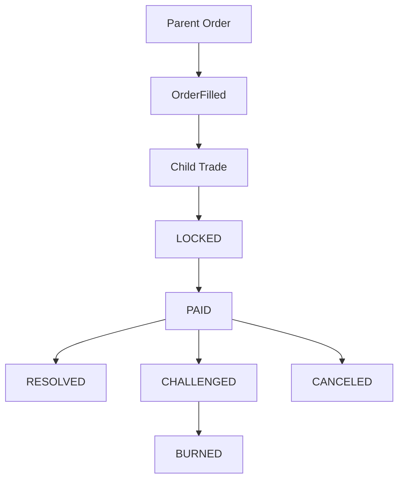

- **Parent Order** = public market/order layer
- **Child Trade** = actual escrow lifecycle (economic state machine)
- **Contract** = single authoritative state machine
- **Backend** = mirror + coordination + operational read layer
- **Frontend** = UX guardrail + contract access layer

### 1.1 Authority boundaries
- Final state transitions and economic payouts are contract-enforced.
- Backend is not an arbiter; it mirrors state and provides coordination surfaces.
- Frontend is not enforcement; it is a guardrail/orchestration layer.

### 1.2 Practical V3 consequence
- Market-facing primitive = parent order.
- Escrow/dispute/release/cancel/burn semantics live at child-trade level.
- Child-trade identity authority comes from `OrderFilled + getTrade(tradeId)`.

---

## 2. Hybrid architecture and technology stack

Araf must satisfy both hard security and practical operations. This yields a Web2.5 model: on-chain authority + off-chain operational acceleration.

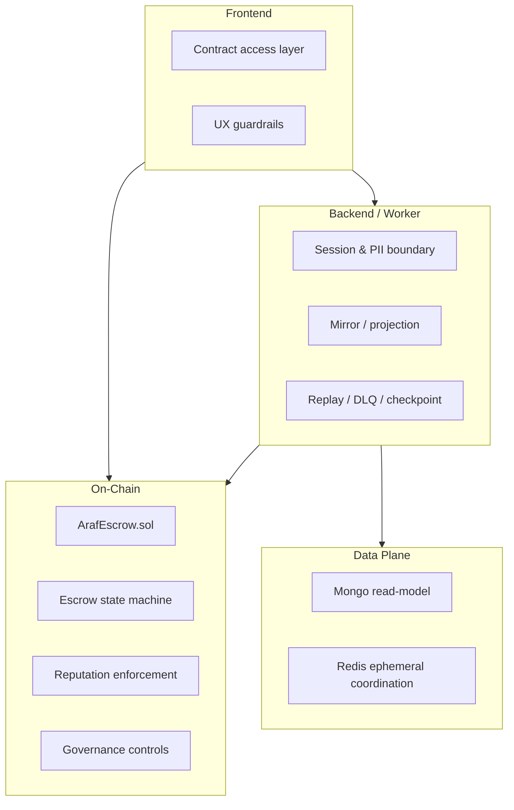

### 2.1 Why hybrid?
Araf must satisfy both hard security and practical operations:
- **On-chain:** custody, state transitions, economics, reputation enforcement
- **Off-chain (Mongo):** read model, performance, PII and operational metadata
- **Redis:** checkpoints, readiness, rate limiting, short-lived coordination

This yields a Web2.5 model: on-chain authority + off-chain operational acceleration.

### 2.2 Layer matrix

| Layer | Primary responsibility | Authority level | Technology |
|---|---|---|---|
| Contract | Escrow state machine, payouts, dispute economics, governance controls | **Authoritative** | Solidity / Base |
| Backend API | Session/security boundaries, projection, coordination | Non-authoritative | Node.js + Express |
| Event Worker | Event mirror, replay, checkpoint/DLQ handling | Non-authoritative | ethers + Mongo + Redis |
| Mongo | Read model / operational cache | Non-authoritative | MongoDB + Mongoose |
| Redis | Ephemeral coordination / runtime safety signals | Non-authoritative | Redis |
| Frontend | Contract write/read orchestration + UX guardrails | Non-authoritative | React + Wagmi + viem |

### 2.3 Non-custodial backend model
- Backend does not hold user-fund custody authority.
- Backend cannot fabricate release/challenge/cancel outcomes against contract rules.
- Backend strength lies in coordination, observability, and secure PII boundaries.

---

## 3. On-chain public surface (`ArafEscrow.sol`)

The contract is the single authoritative V3 state machine surface. The following function groups define live protocol behavior.

| Surface | Functions | Architectural meaning |
|---|---|---|
| Parent-order write surface | `createSellOrder`, `fillSellOrder`, `cancelSellOrder`, `createBuyOrder`, `fillBuyOrder`, `cancelBuyOrder` | Public market and fill primitive |
| Child-trade lifecycle write surface | `reportPayment`, `releaseFunds`, `challengeTrade`, `autoRelease`, `burnExpired`, `proposeOrApproveCancel` | Real escrow lifecycle and economic state transitions |
| Liveness / auxiliary write surface | `registerWallet`, `pingMaker`, `pingTakerForChallenge`, `decayReputation` | Entry gate, liveness, and clean-slate maintenance |
| Governance / mutable admin surface | `setTreasury`, `setFeeConfig`, `setCooldownConfig`, `setTokenConfig`, `pause`, `unpause` | Runtime policy and governance control surface |
| Read surface | `getOrder`, `getTrade`, `getReputation`, `getFeeConfig`, `getCooldownConfig`, `getCurrentAmounts`, `antiSybilCheck`, `getCooldownRemaining`, `getFirstSuccessfulTradeAt` | Verification, observability, and runtime read surface |

### 3.1 Parent-order write surface
- `createSellOrder`
- `fillSellOrder`
- `cancelSellOrder`
- `createBuyOrder`
- `fillBuyOrder`
- `cancelBuyOrder`

### 3.2 Child-trade lifecycle write surface
- `reportPayment`
- `releaseFunds`
- `challengeTrade`
- `autoRelease`
- `burnExpired`
- `proposeOrApproveCancel`

### 3.3 Liveness / auxiliary write surface
- `registerWallet`
- `pingMaker`
- `pingTakerForChallenge`
- `decayReputation`

### 3.4 Governance / mutable admin surface
- `setTreasury`
- `setFeeConfig`
- `setCooldownConfig`
- `setTokenConfig`
- `pause` / `unpause`

### 3.5 Read surface
- `getOrder`, `getTrade`, `getReputation`
- `getFeeConfig`, `getCooldownConfig`
- `getCurrentAmounts`
- `antiSybilCheck`, `getCooldownRemaining`, `getFirstSuccessfulTradeAt`

---

## 4. Parent order vs child trade state model

Parent orders carry market visibility; child trades carry the actual escrow lifecycle.

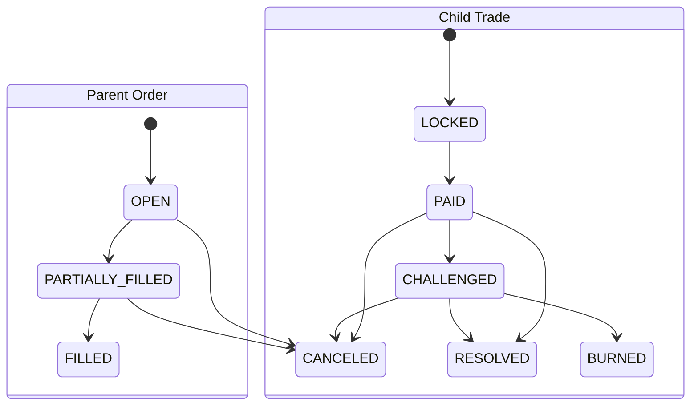

### 4.1 Parent-order states
- `OPEN`
- `PARTIALLY_FILLED`
- `FILLED`
- `CANCELED`

Parent orders carry market visibility and fillability, not escrow dispute semantics.

### 4.2 Child-trade states
- `OPEN` (not practically used in pure V3 fill path)
- `LOCKED`
- `PAID`
- `CHALLENGED`
- `RESOLVED`
- `CANCELED`
- `BURNED`

### 4.3 Fill-time child-trade creation
Both `fillSellOrder` and `fillBuyOrder` spawn child trades directly in `LOCKED` state in the same transaction.

### 4.4 Identity relationship
- Parent identity: `orderId`
- Child identity: `tradeId` (`onchain_escrow_id` mirror)
- Link authority: `OrderFilled(orderId, tradeId, ...)` + `getTrade(tradeId)`

---

## 5. Sell flow, buy flow, and role mapping

V3 role mapping is side-dependent, so the owner/maker/taker relationship must be stated explicitly.

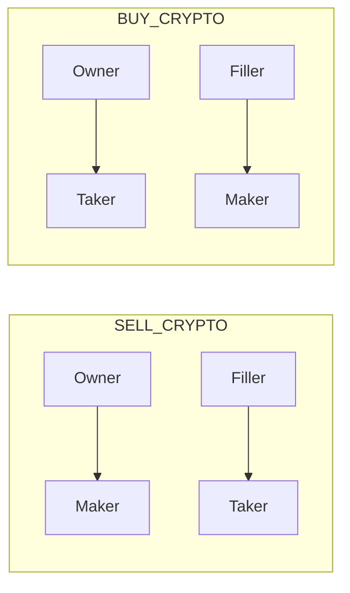

### 5.1 Sell-order flow
1. Owner calls `createSellOrder`
2. Filler calls `fillSellOrder` (taker gate enforced)
3. Child trade enters `LOCKED`
4. Taker calls `reportPayment`
5. Maker resolves with `releaseFunds` or dispute/cancel paths

### 5.2 Buy-order flow
1. Owner calls `createBuyOrder` (owner is eventual taker; gate enforced at create-time)
2. Filler calls `fillBuyOrder`
3. Owner (taker) is re-checked at fill-time
4. Child trade enters `LOCKED`
5. `reportPayment` then resolution/dispute/cancel paths

### 5.3 Side-dependent role mapping
No universal “maker=seller, taker=buyer” rule:
- `SELL_CRYPTO`: owner→maker, filler→taker
- `BUY_CRYPTO`: owner→taker, filler→maker

---

## 6. Anti-sybil enforcement semantics (V3)

Canonical gate helper: `_enforceTakerEntry(wallet, tier)`

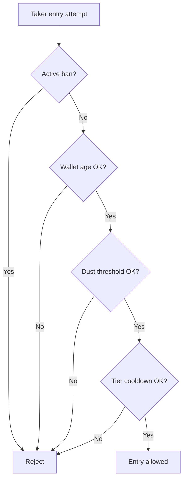

Gate components:
- active ban gate (`bannedUntil`)
- wallet age (`WALLET_AGE_MIN`)
- native dust threshold (`DUST_LIMIT`)
- tier cooldown (`tier0TradeCooldown`, `tier1TradeCooldown`)

V3 enforcement points:
- `fillSellOrder` (filler/taker)
- `createBuyOrder` (owner/eventual taker)
- `fillBuyOrder` (owner/taker re-check)

So anti-sybil is no longer lockEscrow-centered legacy; it is child-trade-entry centered in V3.

---

## 7. Dispute / Bleeding Escrow technical flow

This section describes the real V3 economic state machine. After `PAID`, normal close, dispute, liveness, cancel, and burn paths all operate at child-trade level.

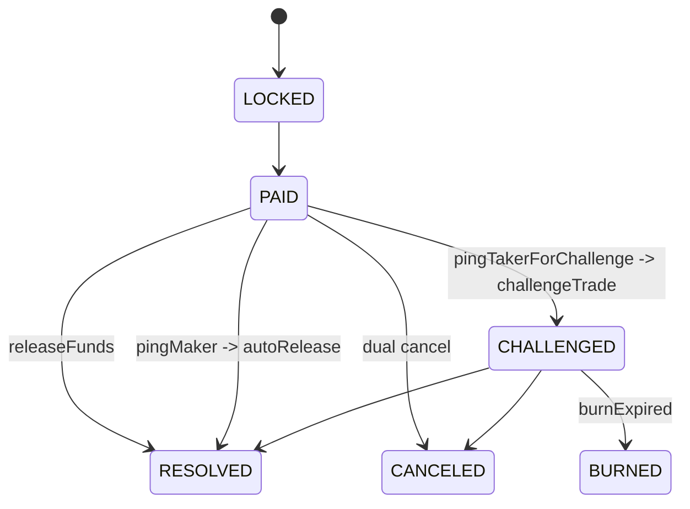

### 7.1 Resolution paths after `PAID`
- **Normal close:** maker `releaseFunds`
- **Dispute path:** maker `pingTakerForChallenge` → wait window → `challengeTrade`
- **Liveness path:** taker `pingMaker` → wait window → `autoRelease`
- **Mutual cancel:** dual-signature `proposeOrApproveCancel`
- **Terminal burn:** `burnExpired` after challenge timeout

### 7.2 Bleeding components
- maker bond decay
- taker bond decay
- post-threshold crypto-side decay

`getCurrentAmounts(tradeId)` exposes authoritative real-time economics.

### 7.3 Challenge and liveness ping semantics
- Ping paths are mutually exclusive (conflict guard).
- Required wait windows are enforced by state guards.

### 7.4 Burn semantics
- `burnExpired` finalizes stale challenged trades once max window elapses.
- Remaining value is routed to treasury according to contract rules.

### 7.5 Cancel semantics
- `proposeOrApproveCancel` validates EIP-712 signature + nonce + deadline on-chain.
- Cancel finalization requires both party approvals.

📄 Technical notes

- maker bond decay  
- taker bond decay  
- post-threshold crypto-side decay  
- `getCurrentAmounts(tradeId)` exposes authoritative real-time economics.  
- Ping paths are mutually exclusive (conflict guard).  
- Required wait windows are enforced by state guards.  
- `burnExpired` finalizes stale challenged trades once max window elapses.  
- Remaining value is routed to treasury according to contract rules.  
- `proposeOrApproveCancel` validates EIP-712 signature + nonce + deadline on-chain.  
- Cancel finalization requires both party approvals.

---

## 8. Reputation / bans / clean-slate

The reputation model in V3 combines tier progression, ban discipline, and a clean-slate maintenance trigger.

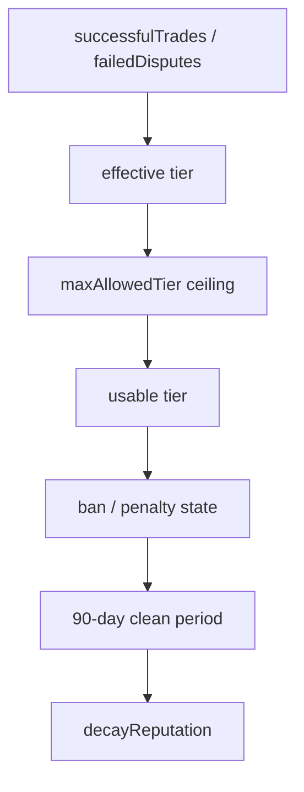

### 8.1 Reputation fields
- `successfulTrades`
- `failedDisputes`
- `bannedUntil`
- `consecutiveBans`

### 8.2 Tier impact
- Success/failure history affects effective tier.
- Penalty ceilings (`maxAllowedTier`) may apply.
- `MIN_ACTIVE_PERIOD` enforces time-based progression discipline.

### 8.3 Clean-slate rule
- `decayReputation` requires clean-period completion.
- Current clean period: **90 days**.
- Not full amnesty: `failedDisputes` history is not erased.

---

## 9. Finalized parameters vs mutable config

This section separates immutable parameters from runtime surfaces that the owner can still adjust.

### 9.0 Parameter-classification table

| Class | Parameters | Notes |
|---|---|---|
| Immutable/public constants | `TIER_MAX_AMOUNT_*`, `*_DECAY_BPS_H`, `WALLET_AGE_MIN`, `DUST_LIMIT`, `MAX_BLEEDING`, `MIN_ACTIVE_PERIOD`, `AUTO_RELEASE_PENALTY_BPS`, `MAX_CANCEL_DEADLINE`, `GOOD_REP_DISCOUNT_BPS`, `BAD_REP_PENALTY_BPS` | Not mutable via owner runtime calls. |
| Mutable runtime config | `takerFeeBps`, `makerFeeBps`, `tier0TradeCooldown`, `tier1TradeCooldown` | Adjustable through owner governance surface. |
| Direction-aware token runtime policy | `tokenConfigs[token] => {supported, allowSellOrders, allowBuyOrders}` | Token support is managed per order direction. |

### 9.1 Immutable/public-constant class
- tier max amount constants (`TIER_MAX_AMOUNT_*`)
- decay constants (`*_DECAY_BPS_H`)
- wallet age / dust / bleeding / active period limits
- auto-release penalty
- max cancel deadline
- reputation discount/penalty BPS

### 9.2 Mutable runtime config class
- `takerFeeBps`
- `makerFeeBps`
- `tier0TradeCooldown`
- `tier1TradeCooldown`
- direction-aware token config via `setTokenConfig`

### 9.3 Fee snapshot semantics
- Snapshot is captured at order creation.
- Child trade inherits parent snapshots.
- Later `setFeeConfig` changes do not retroactively rewrite active-trade economics.

### 9.4 Toolchain / deployment assumptions
- Deploy flow starts with `constructor(treasury)` and token direction config.
- Post-deploy token-direction policy should be verified on-chain via `tokenConfigs(token)`.
- Production guidance assumes owner governance key is managed by multisig to reduce key risk.

---

## 10. Runtime connectivity and operational policies

Backend behavior is defined not only by chosen technologies, but also by bootstrap, readiness, and shutdown discipline.

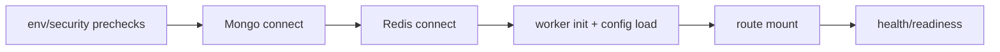

### 10.1 Backend bootstrap ordering
1. env/security prechecks
2. Mongo connect
3. Redis connect
4. worker init + protocol config load
5. route mount
6. health/readiness activation

### 10.2 Readiness-first operations
- Liveness (`/health`) answers “is process alive?”.
- Readiness (`/ready`) answers “are dependencies actually ready?”.
- Traffic gating should follow readiness, not liveness alone.

### 10.3 Fail-fast / fail-open choices
- Critical dependency failures follow fail-fast patterns (DB/worker integrity).
- Security boundaries prefer fail-closed semantics (auth/session/PII).

### 10.4 Timeout/connectivity policy
- Mongo uses tuned `maxPoolSize`, `socketTimeoutMS`, and `serverSelectionTimeoutMS` values for combined worker+API load.
- Mongo disconnect path favors fail-fast restart to reduce stale/partial-connection drift.
- Redis `isReady` is explicitly treated as distinct from mere connectivity.
- Redis TLS (`rediss://`) and managed-service assumptions are part of runtime configuration behavior.

### 10.5 Graceful shutdown ordering
- stop new requests
- stop worker
- clear scheduler timers
- close Mongo/Redis
- controlled process exit

### 10.6 Scheduler and cleanup jobs
- reputation decay trigger job
- stats snapshot job
- receipt + PII retention cleanup
- user bank-risk metadata cleanup
- DLQ processing

### 10.7 Operational meaning of health vs ready
- `/health`: process liveness only.
- `/ready`: dependency + config + worker lag/replay safety gate.
- During replay/high lag, liveness may be true while readiness is intentionally false.

---

## 11. Event worker / replay / mirror reliability

The worker reads authoritative chain state and projects an operational mirror into Mongo, without becoming authority itself.

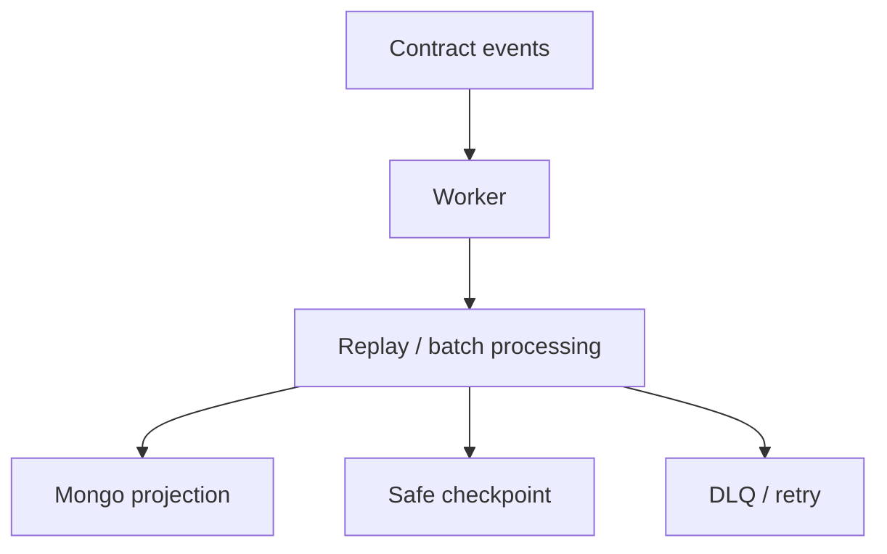

### 11.1 Worker state model
Worker consumes contract events and updates Mongo without becoming authority.

### 11.2 Checkpoint approach
- last processed block
- last safe checkpoint
- replay-safe startup logic

### 11.3 Replay and batch processing
- block-batch processing
- idempotent mirror intent
- state-regression guards to prevent backward drift

### 11.3.1 Last-safe-block semantics
- Worker tracks not only last seen block, but also last safe checkpoint block.
- Readiness includes lag between provider head and worker safe checkpoint.
- This prevents “appears alive but silently behind” operational blind spots.

### 11.4 DLQ and poison-event visibility
- unprocessable events go to DLQ
- retry/backoff applies
- operational logs preserve observability of failure modes

### 11.5 Identity normalization
- on-chain IDs stored with numeric-string discipline
- explicit lookup strategy prevents parent/child identity confusion

### 11.6 OrderFilled + getTrade linkage
Child-trade authority is mirrored through explicit event + getter linkage rather than heuristics.

### 11.7 Mirror-authority warning
- Event worker does not define protocol rules; it only projects authoritative chain state.
- If Mongo mirror fields and contract storage diverge, contract state is authoritative.

---

## 12. Security architecture and trust boundaries

This section centralizes auth, session, PII, and client telemetry boundaries.

### 12.1 Auth model (SIWE + JWT + cookie session)

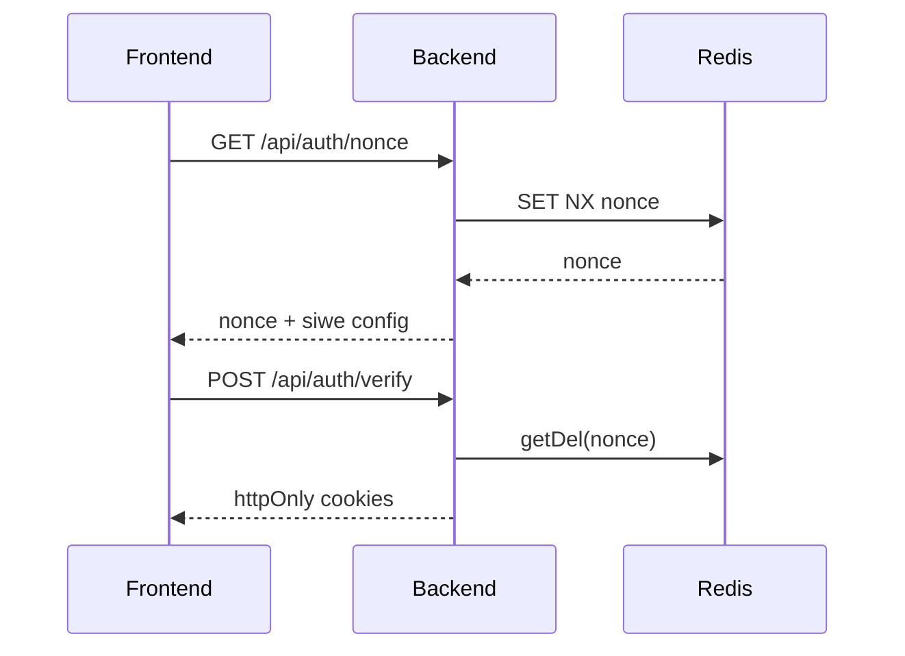

#### 12.1.1 Nonce lifecycle (TTL + consume)
- Nonce is stored in Redis per wallet (`nonce:<wallet>`), with default **5-minute** TTL.
- Under race conditions, Redis is authoritative: if `SET NX` fails, local nonce is not returned; the live Redis nonce is re-read.
- During SIWE verify, nonce is consumed via `getDel`, shrinking replay window.
- SIWE domain/URI checks are enforced at request time (host/origin matching is strict in production).

#### 12.1.2 Session token lifecycle
- Auth JWT cookie (`araf_jwt`) is short-lived by default (configurable; default 15m).
- Refresh cookie (`araf_refresh`) is longer-lived (default 7 days) and path-scoped to `/api/auth`.
- The model remains httpOnly + sameSite=lax + credentials:include; bearer header is not normal auth authority.

### 12.2 Cookie-only boundary and session-wallet mismatch behavior

| Control step | What is validated | Mismatch result |
|---|---|---|
| `requireAuth` | Cookie JWT validity + blacklist status | 401 / 403 |
| `requireSessionWalletMatch` | `x-wallet-address` == cookie-auth wallet | 409 + session invalidation |
| Session invalidation | JWT blacklist + refresh revoke + cookie clear | Session terminated safely |

> Boundary note: `x-wallet-address` is never an auth source by itself; it is only a cookie-session consistency check.

### 12.3 Refresh-token family invalidation
- On logout and session-wallet mismatch events, refresh family revocation is applied.
- Goal is to invalidate not only the current access context but also refresh-lineage reuse.
- This is “session family termination”, not just “single request denial”.

### 12.4 PII access boundary (trade-scoped token + live-state checks)

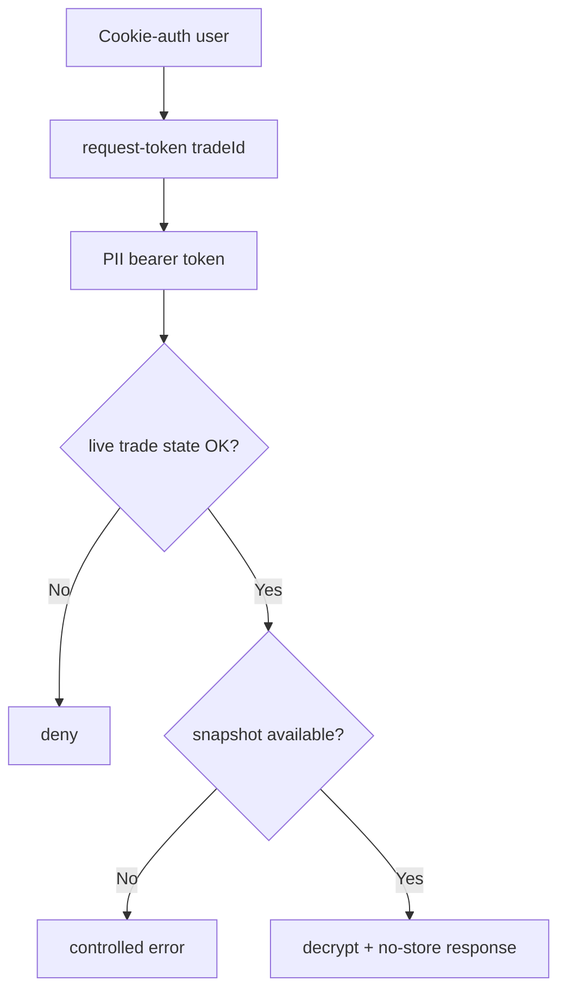

- PII token is scoped to one `tradeId`, not parent order scope.
- `requirePIIToken` enforces token type=`pii`, tradeId match, and token-wallet == cookie-session-wallet.
- Token alone is insufficient; route handlers re-check live trade state (`LOCKED/PAID/CHALLENGED` window).
- Snapshot-first policy: if payout snapshot is missing, endpoint returns controlled error; current-profile fallback is disabled.
- Sensitive PII responses set `Cache-Control: no-store` / `Pragma: no-cache`.

### 12.5 Encryption model
- PII and receipt payload fields are persisted encrypted via AES-256-GCM.
- Key derivation/governance follows HKDF + KMS/Vault-oriented design.
- Plaintext is not persisted; contract receives only hash traces for receipt proof linking.

### 12.6 Rate-limit classes and fallback behavior
- Limiter classes are separated by surface: auth, nonce, market read, orders/trades read-write, PII, feedback, logs.
- Sensitive surfaces (auth/PII) use in-memory fallback protection when Redis is unavailable (minimizing fail-open posture).
- Public/read surfaces may allow controlled fail-open choices for availability, without relaxing auth/PII boundaries.

### 12.7 Client-error logging boundary (scrub semantics)
- Frontend telemetry is accepted only via `/api/logs/client-error`.
- Message/stack text is scrubbed by regex redaction for IBAN-like values, wallet addresses, emails, bearer/JWT-like tokens.
- Size limits + rate limits support both data minimization and abuse resistance.

### 12.8 Trust-boundary summary
- Contract = economic/state authority.
- Backend = auth/session/PII coordination + read-model projection.
- Frontend = runtime guardrail and user feedback layer.
- Off-chain data = operational utility, not protocol authority.

---

## 13. Data models (Mongo read-model layer)

> Mongo is not canonical protocol authority; it is still critical for read performance and operational observability.

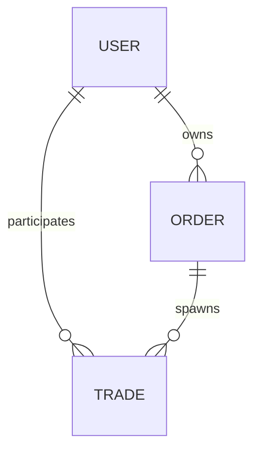

## 13.1 User model (field-aware)

### Identity and payout-profile structure
- `wallet_address` is the primary user identity (lowercase EVM address).
- `payout_profile` is rail-aware:
  - `rail`, `country`
  - `contact.{channel, value_enc}`
  - `payout_details_enc`
  - `fingerprint.{hash, version, last_changed_at}`
  - `updated_at`

### Encryption and public-projection boundary
- `contact.value_enc` and `payout_details_enc` are encrypted at rest; plaintext is not persisted.
- `toPublicProfile()` uses an allowlist strategy to return only safe fields.
- `bank_change_history` and payout details are excluded from public profile surface.

### Bank-profile risk metadata (non-authoritative)
- `profileVersion`
- `lastBankChangeAt`
- `bankChangeCount7d`
- `bankChangeCount30d`
- `bank_change_history` (internal rolling-window support)
- These are anti-fraud/risk signals, not contract enforcement authority.

### Reputation/ban mirror boundary
- `reputation_cache` and ban mirrors (`is_banned`, `banned_until`, `consecutive_bans`, `max_allowed_tier`) support query/UI convenience.
- If mirror state diverges from chain state, on-chain data remains authoritative.
- Reputation extension includes `partialSettlementCount` as an event-taxonomy counter.
- `partialSettlementCount` is not a penalty by itself and does not imply user failure.

## 13.2 Order model (field-aware)

### Identity + lifecycle fields
- `onchain_order_id` (numeric-string identity)
- `owner_address`, `side`, `status`, `tier`, `token_address`

### Financial/snapshot fields
- `amounts.{total_amount, remaining_amount, min_fill_amount}` + `*_num` caches
- `reserves.{remaining_maker_bond_reserve, remaining_taker_bond_reserve}` + `*_num` caches
- `fee_snapshot.{taker_fee_bps, maker_fee_bps}`

### Reference/timer/helper stats fields
- `refs.order_ref` (event-trace and idempotent linkage aid)
- `timers.{created_at_onchain, last_filled_at, canceled_at}`
- `stats.*` (`child_trade_count`, `active/resolved/canceled/burned` breakdown, `total_filled_amount`)

### Mirror boundary
- Remaining/reserve values are not backend-calculated authority; they are worker projections mirrored from contract truth.

## 13.3 Trade model (field-aware)

### Identity and canonical linkage
- `onchain_escrow_id` (primary child-trade identity)
- `parent_order_id`
- `parent_order_side`
- `trade_origin` (`ORDER_CHILD` / `DIRECT_ESCROW`)
- `canonical_refs.{listing_ref, order_ref}`

### Fill and fee linkage
- `fill_metadata.{fill_amount, filler_address, remaining_amount_after_fill}` (+ numeric caches)
- `fee_snapshot.{taker_fee_bps, maker_fee_bps}`

### BigInt-safe financial strategy
- Authoritative financial fields are string-based:
  - `financials.crypto_amount`
  - `financials.maker_bond`
  - `financials.taker_bond`
  - `financials.total_decayed`
- `*_num` caches are for UI/aggregation convenience only; not enforcement inputs.

### PII / receipt / payout snapshot fields
- `evidence.ipfs_receipt_hash`
- `evidence.receipt_encrypted`
- `evidence.receipt_timestamp`
- `evidence.receipt_delete_at`
- `payout_snapshot.{maker,taker,...}` carries lock-time risk context like `profile_version_at_lock`, `bank_change_count_*_at_lock`, `fingerprint_hash_at_lock`.

### Cancel / chargeback audit fields
- `cancel_proposal.{proposed_by, proposed_at, approved_by, maker_signed, taker_signed, maker_signature, taker_signature, deadline}`
- `chargeback_ack.{acknowledged, acknowledged_by, acknowledged_at, ip_hash}`
- `settlement_proposal` mirrors party-signed partial-settlement lifecycle:
  - `NONE -> PROPOSED -> REJECTED/WITHDRAWN/EXPIRED/FINALIZED`
  - proposer is one trade party; accept/reject requires counterparty action
  - backend stores mirror/audit context only; contract remains settlement authority

### Retention and terminal-TTL separation
- Trade document lifecycle uses terminal-state TTL policy.
- Receipt/snapshot payload minimization uses separate cleanup fields (`receipt_delete_at`, `snapshot_delete_at`) and jobs.
- This separation distinguishes “document lifecycle TTL” from “sensitive payload retention”.

## 13.4 Feedback / stats snapshot layer
- Feedback is a separate operational/user-signal surface.
- Stats/snapshot layer (daily aggregates, dashboard counters) supports observability and decisions, not protocol authority.
- Read-model snapshots do not replace contract state; they improve operator visibility.

---

## 14. Backend route surface and coordination semantics

The V3 backend surface does not manufacture authority; routes apply projection, coordination, and security boundaries.

| Route group | Surface | Meaning |
|---|---|---|
| Orders | parent-order read/config surfaces, owner-scoped child-trade listing route | market read-model and owner visibility |
| Trades | active/history/by-escrow reads, cancel-signature coordination, chargeback-ack audit surface | child-trade operations and audit helpers |
| Auth | nonce/verify/refresh/logout/me/profile | session and wallet-bound auth boundary |
| PII | `/my`, `taker-name`, request-token, trade-scoped retrieval | snapshot-first, role-bound sensitive-data access |
| Receipts | file validation + encryption + hash storage | receipt-carrying surface for taker while `LOCKED` |
| Logs / stats / feedback | client error logs, protocol stats, feedback intake | observability and product feedback |

### 14.1 Orders routes
- parent-order read/config surfaces
- owner-scoped child-trade listing route

### 14.2 Trades routes
- active/history/by-escrow reads
- cancel-signature coordination
- chargeback-ack audit surface
- settlement-proposal preview + mirror reads are informational and non-authoritative
- backend role: preview, event mirror, read-model, audit/observability
- backend cannot: determine outcome, override release/cancel/burn/payout, write reputation authority, or transfer funds

### 14.2.1 Payment risk boundary
- `PaymentRiskLevel` is a rail-level complexity signal for UI/read-model use.
- It is not a user trust/reputation score and not an on-chain authority source.

### 14.3 Auth routes
- nonce/verify/refresh/logout/me/profile
- session-wallet mismatch guard behavior

### 14.4 PII routes
- `/my`, `taker-name`, request-token, trade-scoped retrieval
- snapshot-first and role-bound access

### 14.5 Receipts routes
- file validation + encryption + hash storage
- restricted to taker while `LOCKED`

### 14.6 Logs/stats/feedback
- client error logs
- protocol stats read surface
- feedback intake endpoint

---

## 15. Frontend UX guardrail layer

Frontend is not enforcement, but it is critical as a runtime orchestration and fail-fast UX guardrail layer.

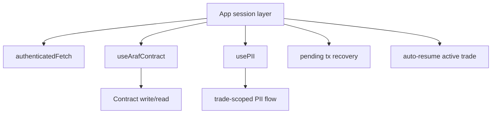

### 15.1 Runtime orchestration: `useArafContract`
- Write preflight checks enforce:
  - wallet client availability
  - valid contract address (`VITE_ESCROW_ADDRESS`)
  - supported chain
- After tx send, receipt is awaited; pending tx hash is persisted in `localStorage(araf_pending_tx)`.
- Fill paths decode `OrderFilled` to extract `tradeId`; frontend does not fabricate trade identity.

### 15.2 Runtime orchestration: `usePII`
- PII flow is two-step:
  1) `pii/request-token/:tradeId`
  2) `pii/:tradeId` (Bearer + cookie session together)
- API path canonicalization is enforced via `buildApiUrl(...)`.
- `authenticatedFetch` centralizes me/refresh-aware behavior.
- Every new PII request aborts previous inflight request with `AbortController`; stale responses cannot overwrite state.
- Sensitive PII state is cleared on unmount/trade switch.

### 15.3 Session-mismatch and recovery UX
- On 409 (`SESSION_WALLET_MISMATCH`), `authenticatedFetch` performs backend logout + local session cleanup.
- On 401, refresh (`auth/refresh`) is attempted; if refresh fails, user is routed back to sign-in flow.
- If connected wallet diverges from authenticated wallet, fail-fast logout/re-entry is applied.

### 15.4 Wrong-network / wrong-address fail-fast
- Unsupported chain blocks contract write calls before tx submission.
- Invalid/zero contract address blocks execution early.
- Goal is clear early failure instead of silent off-chain drift.

### 15.5 Provider/bootstrap notes
- App session layer checks pending tx recovery at startup; stale/invalid hashes are cleaned.
- Same layer can auto-resume the single active trade and route user back to trade room.

### 15.6 Enforcement boundary
Frontend does not replace contract enforcement; it is a guardrail/orchestration layer.

---

## 16. Attack vectors and known limitations

### 16.1 Mitigated / reduced risks
- **Backend authority confusion (partially reduced):** documentation + route projection boundaries + worker mirror warnings narrow the chance that backend is treated as adjudicator.
- **Session/account confusion:** cookie-wallet ↔ header-wallet mismatch now triggers request denial + refresh-family revoke + cookie clear chain.
- **PII overexposure:** trade-scoped token + role/state/session triple checks + snapshot-first + no-store response semantics.
- **API-path drift:** canonical path helper usage reduces silent endpoint mismatch risks.
- **Wrong-network tx risk (UX layer):** chain/address preflight guards fail fast before write submission.

### 16.2 Remaining / open risks
- **Governance key risk:** mutable fee/cooldown/token-direction surfaces remain owner-controlled and require multisig/ops discipline.
- **Fake receipt / off-chain payment ambiguity:** encrypted receipt + hash trace raises fraud cost but cannot cryptographically prove fiat transfer truth.
- **Chargeback reality:** banking reversals/disputes can make off-chain finality differ from on-chain expectations.
- **Off-chain signature staleness:** cancel-signature domain/nonce/deadline checks help, but user-side stale-sign UX risk remains.
- **Backend mirror interpreted as authority:** operators/integrators may still mistake Mongo/cache as source of truth.
- **Frontend wrong-network/wrong-address configuration risk:** guardrails do not fully eliminate deployment/env misconfiguration risk.
- **Operator/documentation misunderstanding risk:** legacy mental models (“listing-first”, “backend is arbiter”) can still cause operational errors.

### 16.3 Conscious limitations (oracle-free model)
- Oracle-free design intentionally does not prove fiat transfer truth fully on-chain.
- The system applies economic pressure + time-decay incentives, not absolute subjective arbitration.
- This reduces centralized oracle dependence but does not eliminate social/operational dispute risk.

---

## 17. Legacy concepts (historical / deprecated / non-canonical)

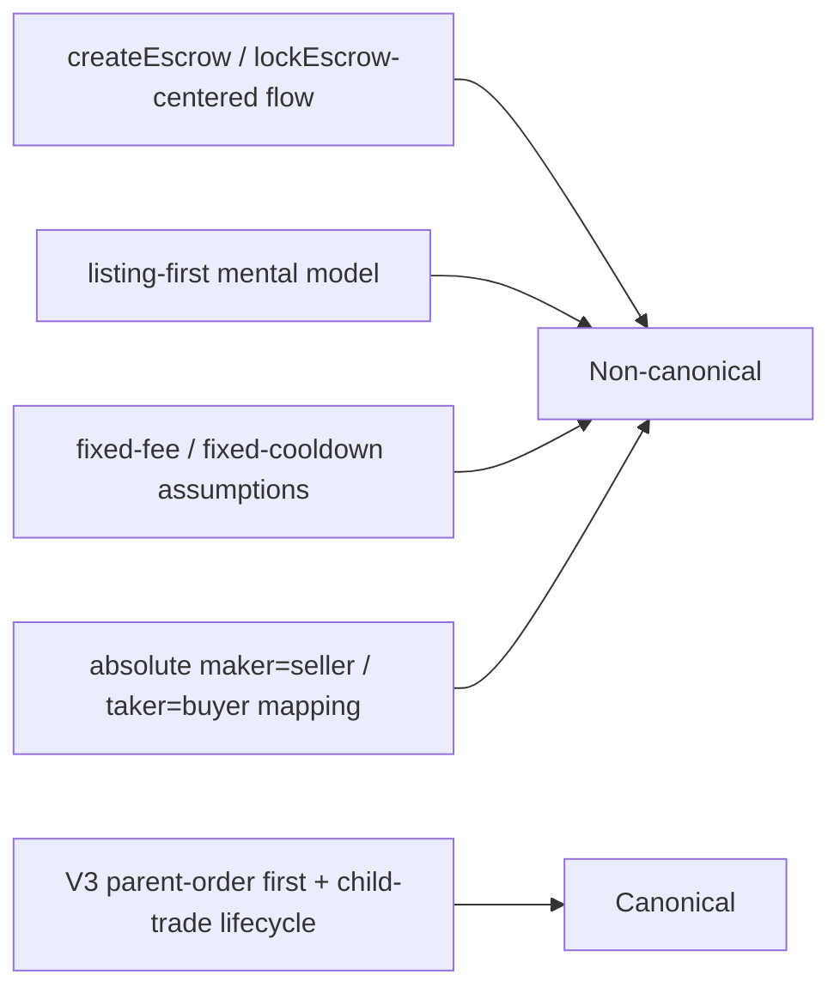

The following are not part of live V3 canonical behavior:
- createEscrow/lockEscrow-centered flow
- listing-first market primitive assumption
- fixed-fee/fixed-cooldown assumptions
- absolute maker=seller / taker=buyer mapping
- old single-dimension token-support language

Legacy references should be treated as historical context only; operational decisions must follow source-of-truth code and this V3 reference.

---

## 18. Final role of this document

This architecture document deliberately serves both:
1. an executive V3 canonical model
2. a deep technical reference (security, data models, runtime reliability, guardrails, attack surface)

So it is neither a shallow summary nor a stale legacy dump; it is a modern, operationally mature V3 architecture reference.

*Araf Protocol — V3 Order-First canonical docs*

