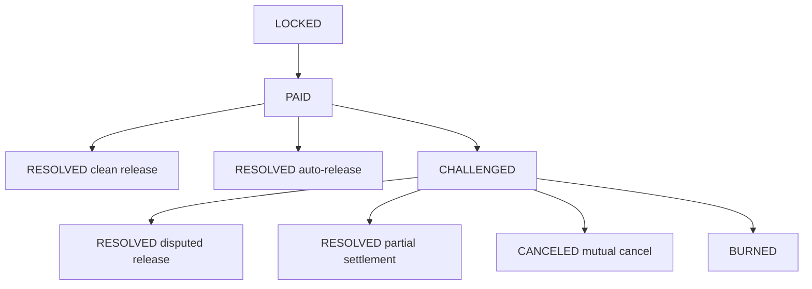
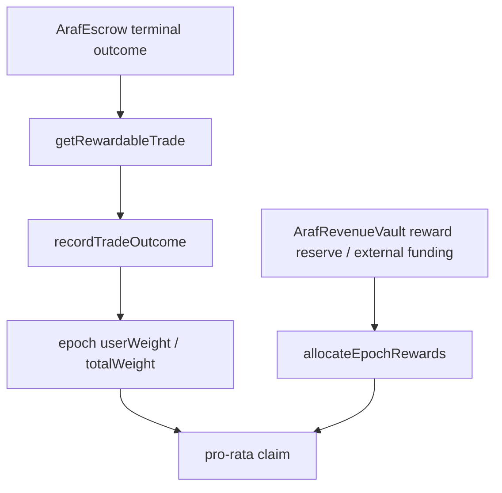

# Araf V3 Architectural Incentive Layer — Dispute, Bleeding Escrow, and Proof of Peace

> This document is an architectural addendum to the canonical `ARCHITECTURE.md` reference. Its purpose is to align Araf’s product/philosophy language with the technical state machine and reward authority boundaries.

## 1. Canonical architecture thesis

Araf is not a court, oracle, moderator, or backend arbitrator.

Araf’s architectural role is:

> **To make unresolved conflict economically expensive and fast clean resolution economically more valuable, without proving off-chain fiat truth.**

The architecture therefore contains two complementary incentive layers:

| Layer | Purpose | Technical surface |
|---|---|---|
| Negative incentive | Price bad strategy, stubbornness, and delay | bonds, bleeding, `challengeTrade`, `burnExpired`, zero reward weight |
| Positive incentive | Reward fast and clean resolution | `ArafRewards`, epoch weight, pro-rata claim |

Canonical phrasing:

> **Araf does not judge fiat truth. It prices behavior.**

## 2. Role of the dispute architecture

The dispute system operates at `child trade` level. Parent orders provide market visibility; real economic risk starts in the child trade.

The dispute architecture communicates:

- Once taker reports payment, maker cannot remain silent without consequence.
- If maker claims non-payment, the trade moves into the challenge surface.
- Challenge is not a judgment of truth; it is economic-pressure mode.
- Parties can exit through release, partial settlement, or mutual cancel.
- If deadlock continues, bleeding/burn does not preserve value; it prices unresolved conflict.

## 3. Role of Proof of Peace architecture

Proof of Peace Rewards are the positive-incentive side of the dispute system.

Rewards are **not cashback**. They are not a fixed fee rebate or guaranteed yield. Eligibility is generated only from `ArafEscrow` terminal outcome data.

Architectural rule:

> **Backend, admin, and sponsor cannot choose recipients, weights, or multipliers.**

## 4. Outcome → reward posture table

| Terminal outcome | Reward posture | Architectural reason |
|---|---|---|
| Fast clean release | Highest positive weight | Incentivizes the best cooperative equilibrium |
| Slower clean release | Lower positive weight | Prices delay as opportunity cost |
| Partial settlement | Low positive weight | Rewards dispute de-escalation without making dispute farming attractive |
| Auto-release | Zero weight | Maker inactivity is not rewarded |
| Mutual cancel | Zero weight | Prevents cancel-loop farming |
| Disputed release | Zero weight | Prevents challenge-then-release farming |
| Burn | Zero weight | Deadlock must never be rewardable |

## 5. Architectural authority boundaries

| Component | Authority | Non-authority |
|---|---|---|
| `ArafEscrow` | State transitions, terminal outcomes, payout math | Proving off-chain fiat truth |
| `ArafRevenueVault` | Revenue reserve accounting, reward/treasury split | Choosing reward recipients |
| `ArafRewards` | Outcome-derived weight, epoch pool, claim math | Producing off-chain dispute judgment |
| Backend | Mirror, read model, coordination, PII boundary | Economic outcome, reward eligibility, recipient, multiplier |
| Frontend | UX guardrail, timing guidance, contract access | Contract outcome override |

## 6. Wash-trading / Sybil posture

The reward system does not fully eliminate wash-trading risk; it aims to make synthetic volume economically unattractive.

Current architectural defenses:

- Tier 0 is not reward eligible.
- Same-wallet self-trade is blocked at the escrow layer.
- Taker entry depends on wallet age, dust threshold, cooldown, ban, and tier checks.
- Rewards are not fixed per-trade payouts; they are pro-rata against the epoch pool.
- Sponsors/funders cannot choose recipients or multipliers.

Operational rule:

> **Expected reward must remain below the full cost and risk of synthetic volume.**

## 7. Product and architecture language standard

Preferred language:

> **Proof of Peace is a peace premium: users who resolve trades quickly and cleanly earn pro-rata weight in future reward epochs.**

Avoid:

- Rewards are cashback.
- Every completed trade earns a fixed rebate.
- The protocol proves who was right.
- Araf eliminates chargeback risk.
- Opening disputes can be profitable for rewards.

Canonical closing phrase:

> **Bleeding Escrow makes bad strategy expensive. Proof of Peace makes fast clean resolution more valuable. Araf does not judge truth; it prices behavior.**
