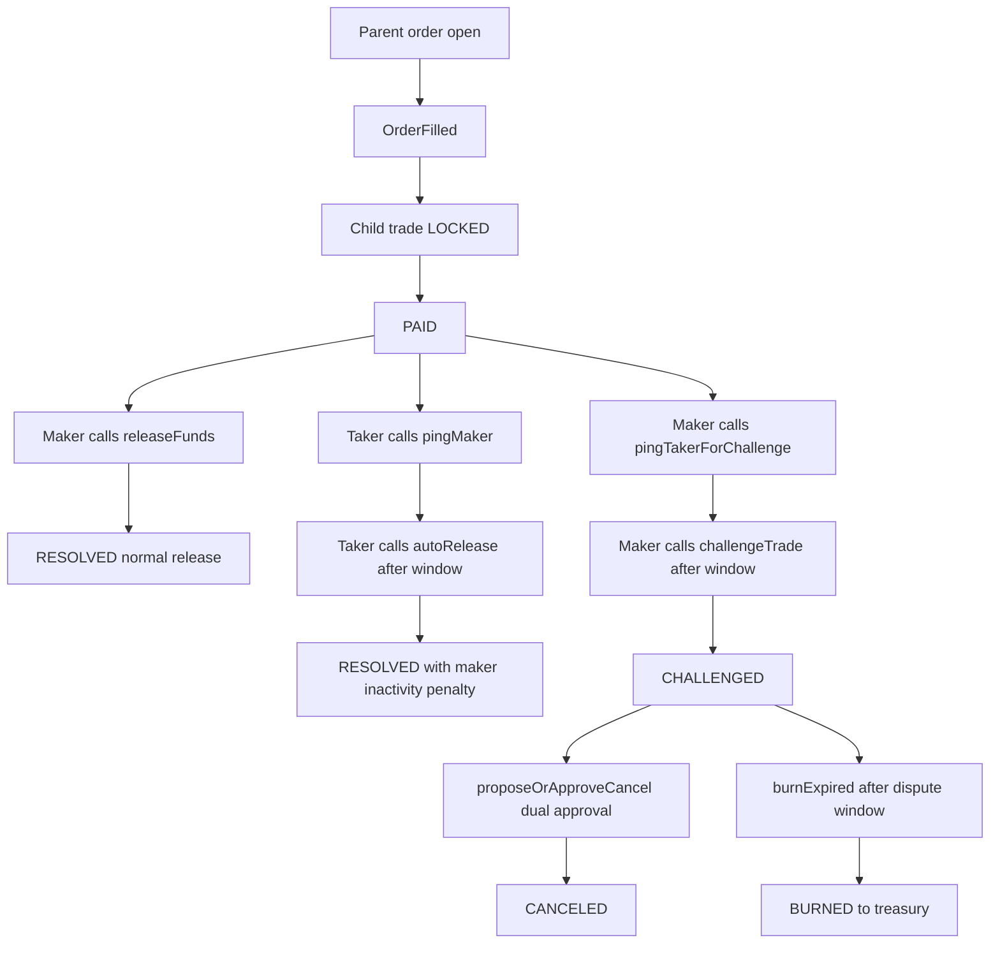

# Araf Protocol V3 Game Theory: Order-First Escrow Resolution

Araf V3 is an order-first market with a trade-level escrow machine. The parent order is the public liquidity primitive, while each `OrderFilled` event creates the child trade where real economic resolution happens. This note summarizes the canonical incentive design after `PAID`, including liveness, dispute escalation, mutual cancel, and burn finality.

---

## Canonical V3 flow after fill

**Mutual exclusivity rule:** the protocol enforces a `ConflictingPingPath` style guard. Once one ping path is opened from `PAID`, the opposite path cannot be opened in parallel. This prevents race-based path flipping and MEV-style ordering abuse.

---

## Resolution path summary

| Path | Entry condition | Required calls | Terminal state | Economic intent |
|---|---|---|---|---|
| Normal release | Taker marked payment and maker confirms | `releaseFunds` | `RESOLVED` | Fast completion when both sides cooperate |
| Liveness release | Maker is inactive after `PAID` | `pingMaker` -> wait -> `autoRelease` | `RESOLVED` | Penalize inactivity and unblock honest taker |
| Dispute escalation | Maker claims payment issue after `PAID` | `pingTakerForChallenge` -> wait -> `challengeTrade` | `CHALLENGED` | Move conflict into deterministic decay window |
| Mutual cancel | Both parties agree to unwind | `proposeOrApproveCancel` by both sides | `CANCELED` | Bilateral settlement without oracle judgment |
| Terminal burn | No settlement by end of challenge horizon | `burnExpired` | `BURNED` | Permissionless deadlock closure; protocol wins stalemate |

---

## Incentive and economic-pressure model

| Mechanism | What it does | Why it matters in V3 |
|---|---|---|
| `PAID` as decision point | Switches trade from passive lock to active resolution game | Concentrates all post-payment strategy at child-trade level |
| Conflicting ping paths | Enforces one escalation lane at a time | Removes simultaneous-branch manipulation risk |
| Time-gated escalation | Requires waits before `autoRelease` or `challengeTrade` | Creates explicit response windows instead of subjective arbitration |
| Dispute decay surface | Economic pressure increases over unresolved time | Pushes parties toward settlement without oracle truth claims |
| `getCurrentAmounts(tradeId)` | Canonical on-chain view of current distributable amounts | Frontend/backend must read this during decay/dispute; off-chain math is advisory only |
| Permissionless burn | Any actor can finalize expired deadlock with `burnExpired` | Guarantees liveness even if both original parties disappear |

---

## Authority boundaries and ambiguity handling

- **Contract is authoritative:** state transitions, payout math, and terminal outcomes are defined only by on-chain rules.
- **Backend is mirror/coordination/read:** it projects events, helps workflows, and exposes operational UX support, but it does not arbitrate truth.
- **Frontend is guardrail/orchestration:** it steers users into valid paths and clear timing windows, but cannot override contract outcomes.
- **Oracle-free by design:** the protocol does not prove off-chain fiat truth; it prices delay and conflict so unresolved trades become economically costly.
- **Chargeback and off-chain ambiguity remain real:** V3 does not eliminate fiat-layer reversibility risk; it contains it through explicit lifecycle boundaries and deterministic on-chain settlement mechanics.
