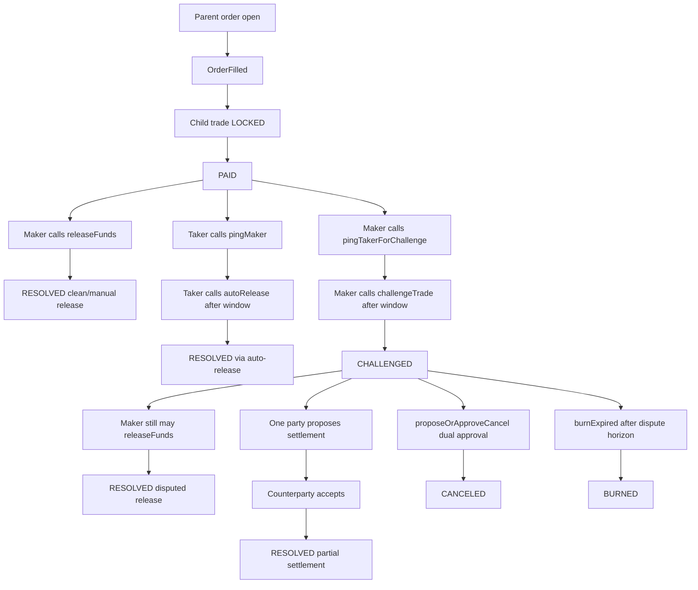
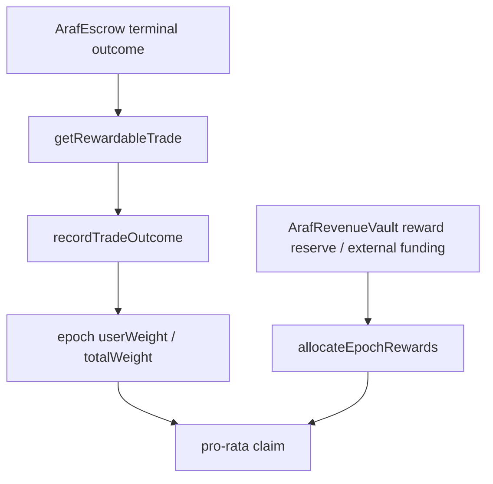

# Araf Protocol V3 Game Theory: Order-First Escrow Resolution

Araf V3 is an order-first market with a trade-level escrow machine. The parent order is the public liquidity primitive, while each `OrderFilled` event creates the child trade where real economic resolution happens. This note summarizes the canonical incentive design after `PAID`, including liveness, dispute escalation, mutual cancel, split settlement, burn finality, and Proof of Peace Rewards.

> **Developer note:** This file is intentionally aligned section-by-section with the TR version to keep canonical V3 semantics synchronized.

---

## 0. Core thesis

Araf does not act as a court, oracle, moderator, or backend arbitrator.

Araf's dispute system is better described as an **incentive pressure machine**:

> **The protocol does not prove off-chain truth. It makes unresolved conflict economically expensive and makes fast clean resolution economically attractive.**

This creates a two-sided game-theoretic structure:

| Layer | Incentive message | Mechanism |
|---|---|---|
| Negative incentive | If you stall, lie, or refuse resolution, value decays. | Bonds, bleeding, terminal burn, zero reward weight |
| Positive incentive | If you resolve cleanly and quickly, you gain future reward weight. | Proof of Peace epoch weights |

The correct product language is therefore not "Araf guarantees justice". The stronger and more precise claim is:

> **Araf does not judge. It prices delay, disagreement, and dishonest strategy.**

---

## 1. Canonical V3 flow after fill



**Mutual exclusivity rule:** the protocol enforces a `ConflictingPingPath` style guard. Once one ping path is opened from `PAID`, the opposite path cannot be opened in parallel. This prevents race-based path flipping and MEV-style ordering abuse.

---

## 2. Resolution path summary

| Path | Entry condition | Required calls | Terminal state | Economic intent | Reward posture |
|---|---|---|---|---|---|
| Fast clean release | Taker marked payment and maker confirms quickly | `releaseFunds` | `RESOLVED` | Best cooperative equilibrium | Highest positive weight |
| Slow clean release | Taker marked payment and maker eventually confirms | `releaseFunds` | `RESOLVED` | Acceptable but delayed cooperation | Lower positive weight |
| Liveness release | Maker is inactive after `PAID` | `pingMaker` -> wait -> `autoRelease` | `RESOLVED` | Penalize inactivity and unblock honest taker | Zero weight |
| Dispute escalation | Maker claims payment issue after `PAID` | `pingTakerForChallenge` -> wait -> `challengeTrade` | `CHALLENGED` | Move conflict into deterministic decay window | No terminal reward yet |
| Disputed release | Maker releases after challenge | `releaseFunds` from `CHALLENGED` | `RESOLVED` | Late correction after conflict | Zero weight in MVP |
| Partial settlement | Both parties agree on split inside dispute | `proposeSettlement` -> `acceptSettlement` | `RESOLVED` | Humanless negotiated exit | Low positive weight |
| Mutual cancel | Both parties agree to unwind | `proposeOrApproveCancel` by both sides | `CANCELED` | Bilateral exit without oracle judgment | Zero weight |
| Terminal burn | No settlement by end of challenge horizon | `burnExpired` | `BURNED` | Permissionless deadlock closure | Zero weight |

---

## 3. Incentive and economic-pressure model

| Mechanism | What it does | Why it matters in V3 |
|---|---|---|
| `PAID` as decision point | Switches trade from passive lock to active resolution game | Concentrates all post-payment strategy at child-trade level |
| Conflicting ping paths | Enforces one escalation lane at a time | Removes simultaneous-branch manipulation risk |
| Time-gated escalation | Requires waits before `autoRelease` or `challengeTrade` | Creates explicit response windows instead of subjective arbitration |
| Dispute decay surface | Economic pressure increases over unresolved time | Pushes parties toward settlement without oracle truth claims |
| `getCurrentAmounts(tradeId)` | Canonical on-chain view of current distributable amounts | Frontend/backend must read this during decay/dispute; off-chain math is advisory only |
| Permissionless burn | Any actor can finalize expired deadlock with `burnExpired` | Guarantees liveness even if both original parties disappear |
| Proof of Peace weight | Rewards fast clean resolution and low-conflict settlement | Adds positive incentive on top of bleeding/burn penalties |

---

## 4. Authority boundaries and ambiguity handling

- **Contract is authoritative:** state transitions, payout math, terminal outcomes, rewardable outcome views, and claim accounting are defined only by on-chain rules.
- **Backend is mirror/coordination/read:** it projects events, helps workflows, and exposes operational UX support, but it does not arbitrate truth or define reward eligibility.
- **Frontend is guardrail/orchestration:** it steers users into valid paths and clear timing windows, but cannot override contract outcomes.
- **Oracle-free by design:** the protocol does not prove off-chain fiat truth; it prices delay and conflict so unresolved trades become economically costly.
- **Chargeback and off-chain ambiguity remain real:** V3 does not eliminate fiat-layer reversibility risk; it contains it through explicit lifecycle boundaries, reputation context, and deterministic on-chain settlement mechanics.

---

## 5. Split settlement canon (dispute-only path)

- Split/partial settlement is **not** a normal close path after `PAID`.
- It is available only once trade state is `CHALLENGED`.
- Backend settlement preview is informational-only and non-authoritative.
- Final settlement economics are determined by on-chain acceptance execution.
- During settlement finalization, decay is accounted first and protocol fees are charged on gross maker/taker split payouts; parties receive net payouts.
- Partial settlement is not treated as a failure in the reward model, but it receives only a low positive multiplier because a dispute did occur.

The intended behavioral message is:

> **Settlement is better than stalemate, but clean release is still the highest-value equilibrium.**

---

## 6. Proof of Peace Rewards as positive game theory

Proof of Peace Rewards are not a trade cashback program. They are a pro-rata epoch allocation mechanism based on contract-authoritative terminal outcomes.



Reward weight is intentionally outcome-sensitive:

| Terminal outcome | Reward effect | Game-theoretic reason |
|---|---|---|
| Fast clean release | Highest positive weight | Makes immediate cooperation the dominant social behavior |
| Clean release within 24h/72h | Medium positive weight | Still rewards cooperation, but prices delay |
| Slow clean release | Low positive weight | Accepts late cooperation without treating it as ideal |
| Partial settlement | Low positive weight | Rewards dispute de-escalation without making disputes profitable |
| Auto-release | Zero weight | Does not reward maker inactivity or liveness failure |
| Mutual cancel | Zero weight | Avoids cancel-loop farming; neutral exit, not successful trade |
| Disputed release | Zero weight | Prevents strategic challenge-then-release farming |
| Burned | Zero weight | Deadlock must never become rewardable |

This creates a simple incentive ladder:

```text
fast clean release > slower clean release > partial settlement > zero-weight terminal outcomes > burn/deadlock
```

---

## 7. Reward farming and Sybil resistance posture

The reward model reduces, but does not magically eliminate, wash-trading risk.

Primary farming strategy:

```text
Use multiple wallets -> create/fill order -> clean release quickly -> earn epoch weight
```

Current mitigation posture:

- Tier 0 is not reward eligible.
- Self-trade with the same wallet is blocked at the escrow layer.
- Taker entry uses wallet age, native balance dust threshold, cooldowns, bans, and tier constraints.
- Rewards are pro-rata against the full epoch pool, not fixed per trade.
- Higher tiers receive only modest multipliers; outcome quality matters more than tier.
- Sponsors/funders can fund pools but cannot choose recipients, weights, or multipliers.

Remaining risk:

> Different-wallet wash trading cannot be fully solved on-chain. It must be made economically unattractive.

Operational rule:

> **Expected reward must stay below the all-in cost and risk of synthetic volume.**

This implies reward budgets, sponsor campaigns, and `rewardBps` should be ramped cautiously and monitored with read-only analytics before aggressive growth incentives.

---

## 8. Payoff matrix: dispute plus rewards

| Strategy | Short-term outcome | Long-term reward effect | Protocol message |
|---|---|---|---|
| Pay and release quickly | Trade completes cleanly | High positive weight | Best equilibrium |
| Pay and release late | Trade completes cleanly but slowly | Lower positive weight | Delay has opportunity cost |
| Enter dispute then settle | Conflict de-escalates | Low positive weight | Peace is better than burn |
| Stay inactive | Auto-release may resolve | Zero weight | Inactivity is not rewarded |
| Open dispute then release | Trade resolves after conflict | Zero weight | Late correction is allowed, but not rewarded |
| Mutual cancel | Parties exit bilaterally | Zero weight | Neutral exit, not reward farming surface |
| Refuse resolution | Bleeding/burn path | Zero weight and economic loss | Deadlock is irrational |

---

## 9. Product-language guardrails

Do say:

> **Proof of Peace is a peace premium: users who resolve trades quickly and cleanly earn pro-rata weight in future reward epochs.**

Do not say:

- "Rewards are cashback."
- "Every completed trade earns a fixed rebate."
- "Disputes can be gamed for rewards."
- "The protocol proves who was right."
- "Araf eliminates chargeback risk."

Canonical phrasing:

> **Araf does not judge fiat truth. It makes unresolved conflict expensive and makes fast clean resolution more valuable than delay.**
