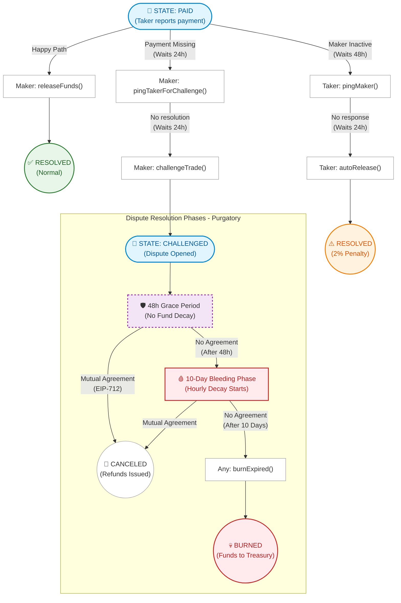

# 🌀 Araf Protocol: Game Theory Visualized

This document visually explains the core game theory and resolution paths of the Araf Protocol using a state-flow diagram.

---

## Bleeding Escrow Flowchart

This diagram illustrates all possible paths an escrow can take once a Taker reports a payment (`PAID` state) — including the happy path, auto-release mechanism, and the multi-phased dispute resolution (Purgatory).

> **Security note:** A `ConflictingPingPath` guard prevents both ping paths from being open simultaneously. If the Maker calls `pingTakerForChallenge`, the Taker cannot call `pingMaker` (autoRelease path), and vice versa. This prevents MEV and transaction ordering manipulation.

