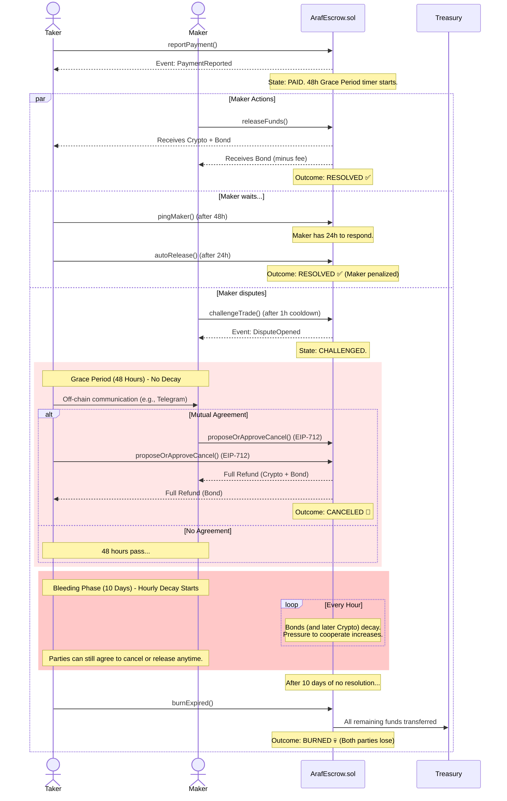

# 🌀 Araf Protocol: Game Theory Visualized

This document visually explains the core game theory of the Araf Protocol using a sequence diagram for the "Bleeding Escrow" dispute resolution process.

---

## Bleeding Escrow Sequence Diagram

This diagram illustrates the flow of events after a Taker reports a payment (`PAID` state) and the Maker disputes it, triggering the Purgatory phase.

