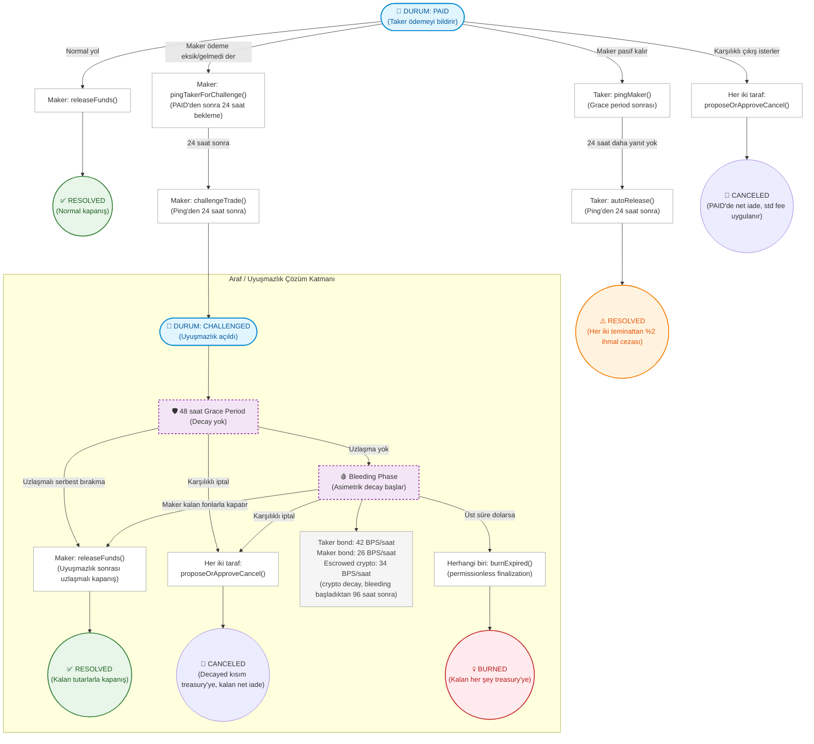

# 🌀 Araf Protocol: Oyun Teorisi ve Çözüm Yolları

Bu doküman, **kanonik mimari dosyasındaki (`ARCHITECTURE_UPDATED.md`) kurallarla hizalı** olarak Araf Protokolü'nün uyuşmazlık ve çözüm oyun teorisini görselleştirir.

> **Kapsam:** Bu sayfa özellikle `PAID → RESOLVED / CHALLENGED / CANCELED / BURNED` yollarını, `ConflictingPingPath` korumasını, asimetrik decay mantığını ve EIP-712 müşterek iptal akışını özetler.

---

## 1) Hızlı Özet

- **Normal yol:** Maker `releaseFunds()` çağırır → `RESOLVED`
- **Taker timeout yolu:** `pingMaker()` → 24 saat sonra `autoRelease()` → `RESOLVED`  
  - Her iki teminattan **%2 ihmal cezası** kesilir
- **Maker challenge yolu:** `pingTakerForChallenge()` → 24 saat sonra `challengeTrade()` → `CHALLENGED`
- **Müşterek iptal:** `LOCKED`, `PAID` veya `CHALLENGED` durumunda iki taraf da kendi imzasıyla `proposeOrApproveCancel()` çağırabilir
- **Burn yolu:** `CHALLENGED` durumunda üst süre dolarsa `burnExpired()` çağrılabilir  
  - Bu çağrı **permissionless** kabul edilmelidir; yalnız taraflarla sınırlı varsayılmamalıdır.

---

## 2) Kritik Güvenlik Notları

### `ConflictingPingPath`
Kontrat, iki zorlayıcı çözüm yolunun aynı anda açılmasını engeller:

- **Maker yolu:** `pingTakerForChallenge()` → `challengeTrade()`
- **Taker yolu:** `pingMaker()` → `autoRelease()`

Bir yol başlatıldıktan sonra diğer yol `ConflictingPingPath` ile engellenir. Bu, aynı trade üzerinde çakışan timeout/manipülasyon yollarını önler.

### Müşterek iptal gerçeği
Karşılıklı iptal:
- backend'in iki imzayı toplayıp üçüncü bir taraf gibi tek seferde submit ettiği bir batch akış **değildir**
- her taraf kendi imzasını üretir
- her taraf **kendi hesabıyla** `proposeOrApproveCancel()` çağırır
- backend yalnız koordinasyon / audit / UX kolaylaştırıcı olabilir.

### Auto-release gerçeği
`autoRelease()`:
- standard başarı ücreti mantığından ayrı değerlendirilmelidir
- her iki teminattan **%2 ihmal cezası** (`AUTO_RELEASE_PENALTY_BPS = 200`) uygular.

---

## 3) Güncel Akış Şeması

---

## 4) Çözüm Yollarının Ekonomik Anlamı

### A) Normal kapanış — `releaseFunds()`
- Maker ödemeyi kabul eder
- trade `RESOLVED` olur
- standart protokol ücreti uygulanır
- maker/taker başarı kaydı güncellenir.

### B) Taker timeout yolu — `pingMaker()` → `autoRelease()`
- Maker, `PAID` sonrasında pasif kalırsa taker zorlayıcı yol başlatabilir
- `GRACE_PERIOD` sonrası `pingMaker()`
- ping'den 24 saat sonra hâlâ yanıt yoksa `autoRelease()`
- her iki teminattan **%2 ihmal cezası** kesilir.

### C) Maker challenge yolu — `pingTakerForChallenge()` → `challengeTrade()`
- Maker, ödeme eksik/gelmedi kanaatindeyse önce uyarı yolunu açar
- `PAID` durumundan sonra **24 saat** beklemeden challenge ping atamaz
- ping'den **24 saat** sonra `challengeTrade()` ile `CHALLENGED` durumuna geçer.

### D) Müşterek iptal — `proposeOrApproveCancel()`
- `LOCKED`, `PAID`, `CHALLENGED` durumlarında mümkündür
- `LOCKED` durumunda fee yok / tam iade mantığı baskındır
- `PAID` ve `CHALLENGED` durumlarında decayed kısım önce treasury'ye gider, standart fee uygulanır, kalan net iade edilir
- ekstra itibar cezası yazılmaz.

### E) Burn — `burnExpired()`
- `CHALLENGED` üst süresi dolduğunda çağrılır
- kalan tüm fonlar treasury'ye gider
- yalnız tarafların değil, üçüncü kişilerin de tetikleyebileceği bir finalization olarak düşünülmelidir.

---

## 5) Decay Mantığı (Güncel)

| Kalem | Oran | Başlangıç |
|---|---:|---|
| Taker bond | 42 BPS / saat | Bleeding başlar başlamaz |
| Maker bond | 26 BPS / saat | Bleeding başlar başlamaz |
| Escrowed crypto | 34 BPS / saat | Bleeding başladıktan 96 saat sonra |

> **Önemli ayrım:** Bleeding decay tek kalemli değildir. `totalDecayed`, maker bond + taker bond + ana escrowed crypto decay toplamıdır.

---

## 6) Zaman Sabitleri (Kanonik Dosya ile Hizalı)

| Parametre | Değer |
|---|---:|
| Grace period | 48 saat |
| Maker challenge ping ön koşulu | `PAID`'den sonra 24 saat |
| Taker auto-release ping başlangıcı | `GRACE_PERIOD` sonrası |
| Ping sonrası cevap penceresi | 24 saat |
| Escrowed crypto decay başlangıcı | Bleeding başladıktan 96 saat sonra |
| Üst uyuşmazlık süresi (`MAX_BLEEDING`) | 240 saat |
| Auto-release ihmal cezası | Her iki teminattan %2 |

---

## 7) Uygulama (Frontend) Katmanı İçin Yorum

`App.jsx` bu oyun teorisini yalnız göstermiyor; kullanıcıyı doğru yola sokacak şekilde de orkestre ediyor:

- Maker challenge akışı iki adımlı UI olarak yürütülüyor (`pingTakerForChallenge` → `challengeTrade`)
- Taker timeout akışı ayrı tutuluyor (`pingMaker` → `autoRelease`)
- `ConflictingPingPath` revert'i kullanıcıya açık hata mesajıyla yansıtılıyor
- burn yolu `CHALLENGED` ve üst süre dolduğunda ayrıca görünür hale getiriliyor.

Bu yüzden bu diyagram yalnız sözleşme mantığını değil, frontend'de nasıl temsil edildiğini de daha doğru yansıtır.

---

## 8) Önceki Sürümden Başlıca Düzeltmeler

Bu revizyonda özellikle şu noktalar düzeltildi:

- `48s` / `24s` gibi belirsiz kısaltmalar → **48 saat / 24 saat** olarak netleştirildi
- `ConflictingPingPath` koruması daha açık yazıldı
- `PAID` durumunda da müşterek iptal yolu görünür kılındı
- `CHALLENGED` içinde yalnız burn değil, **release / cancel** kapanış yolları da eklendi
- auto-release cezası **%2** olarak mimari sabitlerle hizalandı
- burn yolunun **permissionless** doğası açık yazıldı
- decay tablosu maker bond / taker bond / escrowed crypto diye üç kalemli hale getirildi
