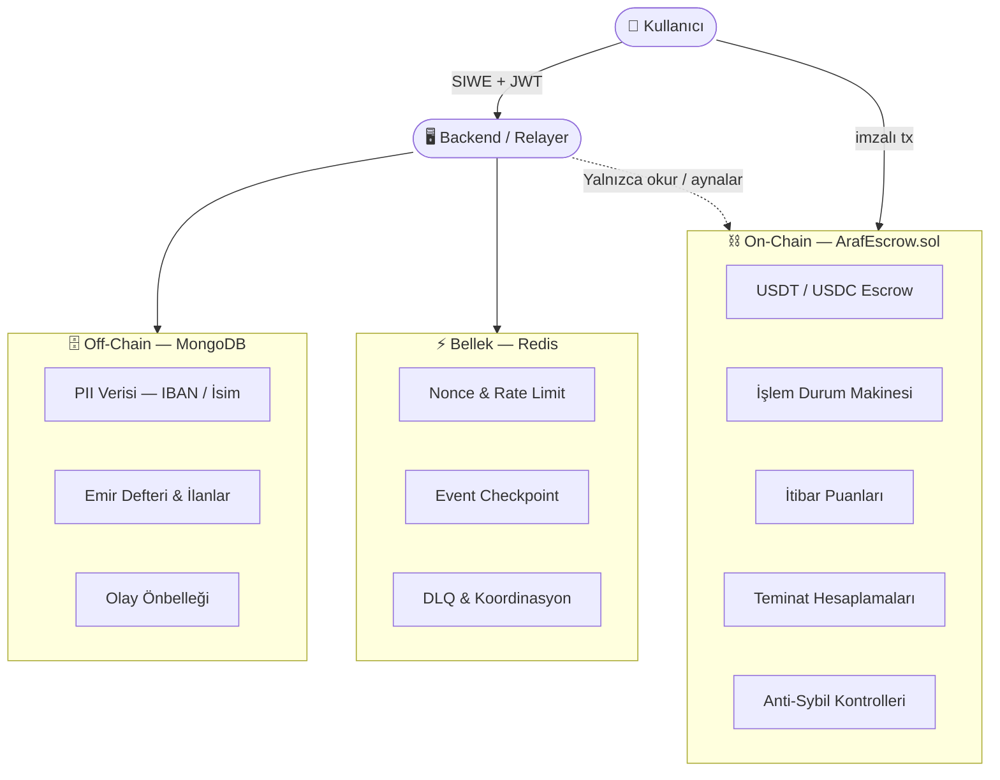
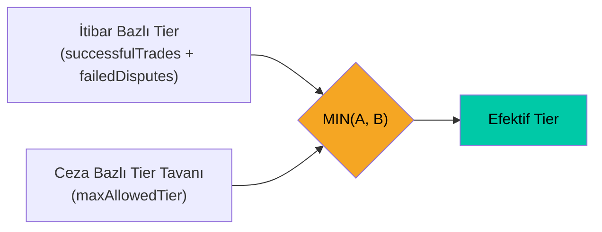
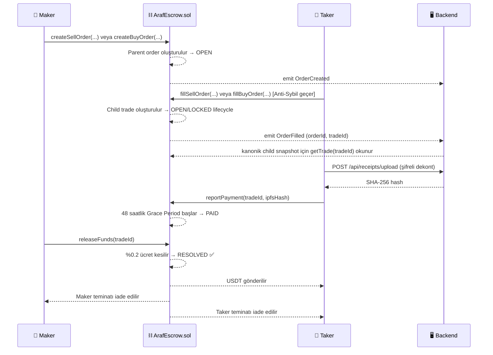
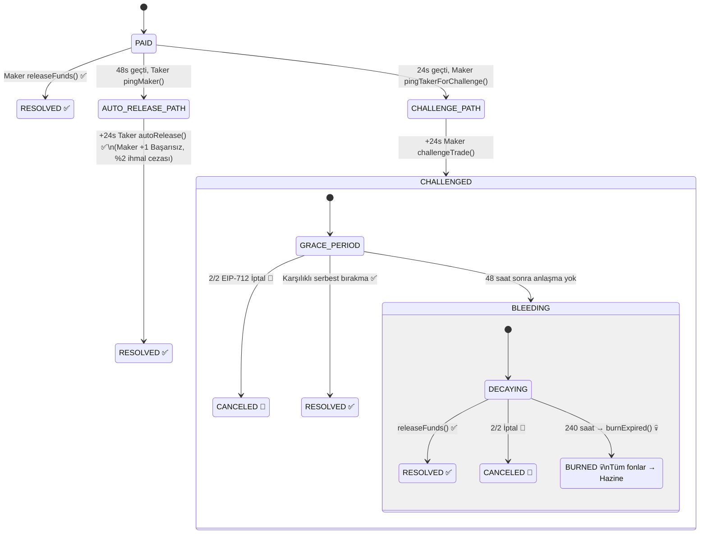
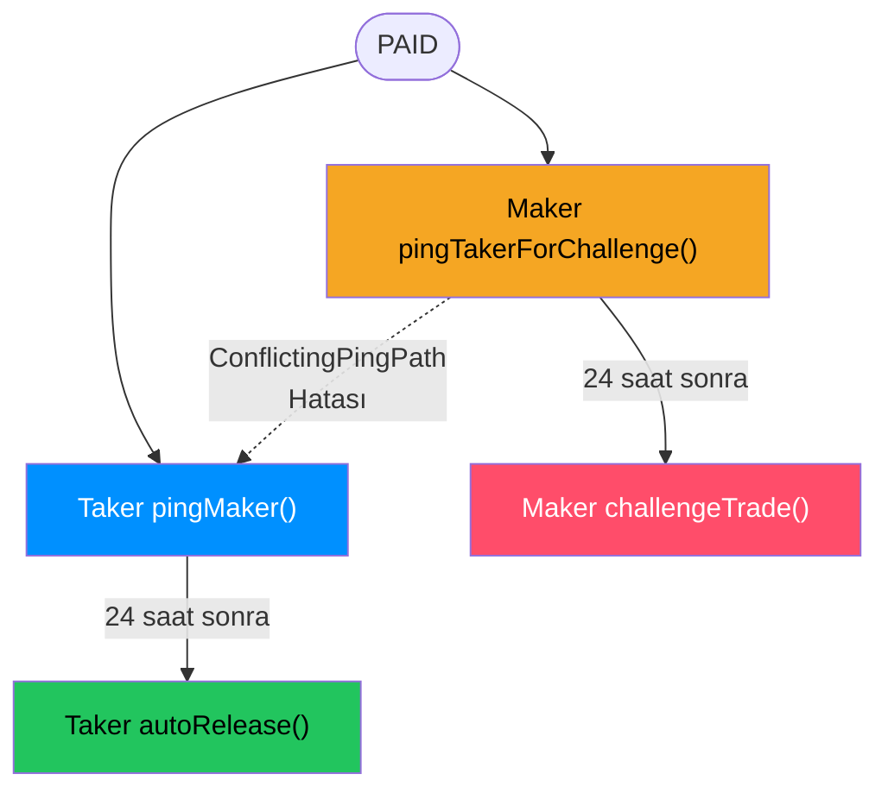
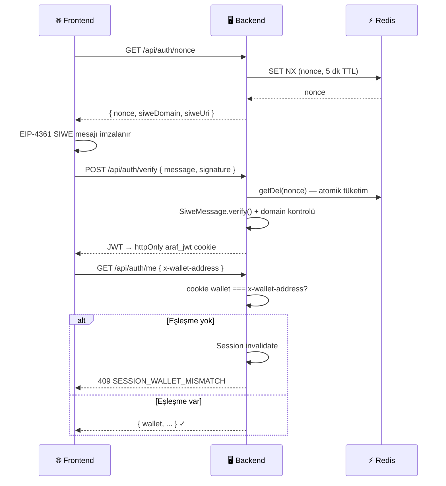
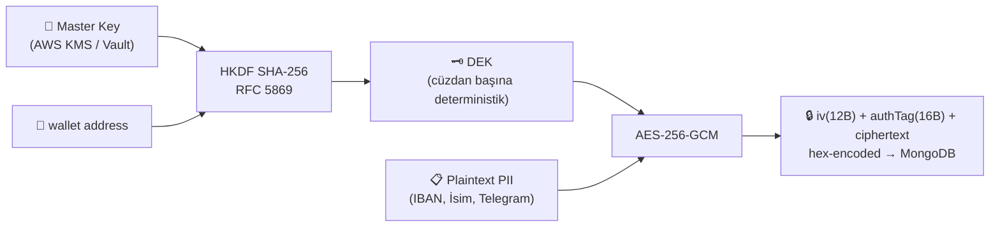
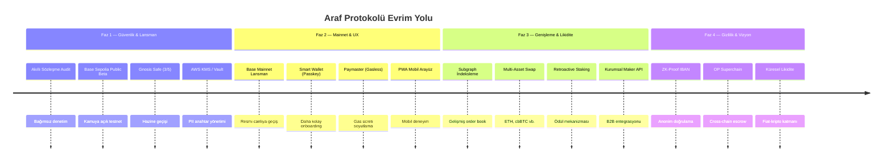
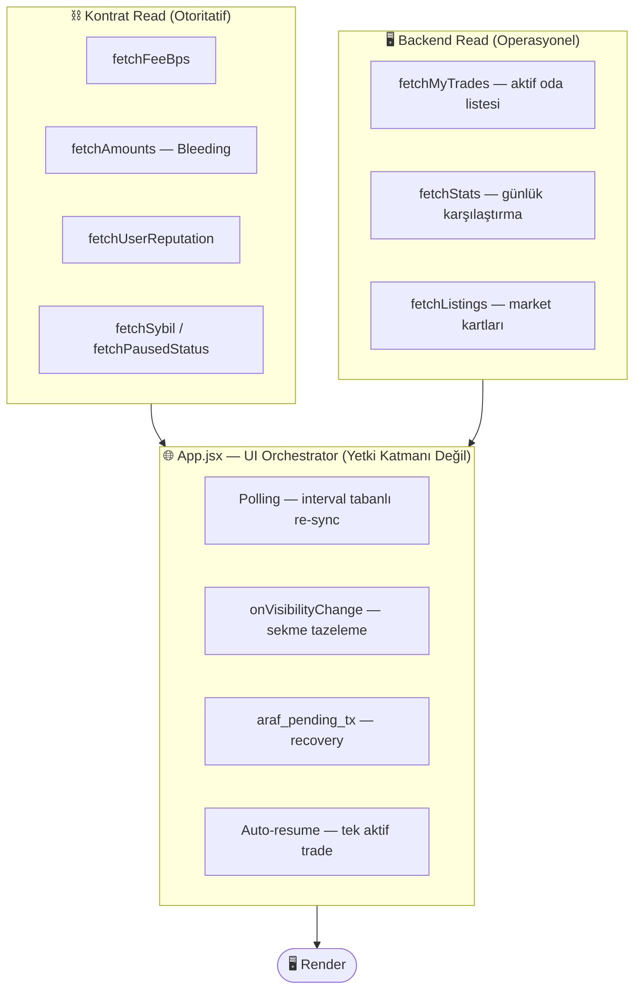

<div align="center">

# 🌀 Araf Protokolü
### Kanonik Mimari & Teknik Referans

[](.)
[-0052FF?style=flat-square&logo=coinbase)](.)
[](.)
[](.)
[](.)
[](.)

---

*Fiat ↔ Kripto takasını güvensiz ortamda mümkün kılan, **emanet tutmayan, insansız ve oracle-bağımsız** P2P escrow protokolü.*

> **"Sistem yargılamaz. Dürüstsüzlüğü pahalıya mal eder."**

</div>

---

## 📋 İçindekiler

| # | Bölüm |
|---|-------|
| 1 | [Vizyon ve Temel Felsefe](#1-vizyon-ve-temel-felsefe) |
| 2 | [Hibrit Mimari: On-Chain ve Off-Chain](#2-hibrit-mimari-on-chain-ve-off-chain) |
| 3 | [Sistem Katılımcıları](#3-sistem-katılımcıları) |
| 4 | [Tier ve Teminat Sistemi](#4-tier-ve-teminat-sistemi) |
| 5 | [Anti-Sybil Kalkanı](#5-anti-sybil-kalkanı) |
| 6 | [Standart İşlem Akışı (Happy Path)](#6-standart-işlem-akışı-happy-path) |
| 7 | [Uyuşmazlık Sistemi — Bleeding Escrow](#7-uyuşmazlık-sistemi--bleeding-escrow) |
| 8 | [İtibar ve Ceza Sistemi](#8-itibar-ve-ceza-sistemi) |
| 9 | [Güvenlik Mimarisi](#9-güvenlik-mimarisi) |
| 10 | [Veri Modelleri (MongoDB)](#10-veri-modelleri-mongodb) |
| 11 | [Hazine Modeli](#11-hazine-modeli) |
| 12 | [Saldırı Vektörleri ve Bilinen Sınırlamalar](#12-saldırı-vektörleri-ve-bilinen-sınırlamalar) |
| 13 | [Kesinleşmiş Protokol Parametreleri](#13-kesinleşmiş-protokol-parametreleri) |
| 14 | [Gelecek Evrim Yolu](#14-gelecek-evrim-yolu) |
| 15 | [Frontend UX Koruma Katmanı](#15-frontend-ux-koruma-katmanı-mart-2026) |

---

## 1. Vizyon ve Temel Felsefe

Araf Protokolü; fiat para birimi (TRY / USD / EUR) ile kripto varlıklar (USDT / USDC) arasında güvensiz ortamda takas yapmayı mümkün kılan, **emanet tutmayan, insansız ve oracle-bağımsız** P2P escrow sistemidir. Moderatör yok, hakeme başvuru yok, müşteri hizmetleri yok. Uyuşmazlıklar on-chain zamanlayıcılar ve ekonomik oyun teorisi ile özerk olarak çözülür.

> **"Sistem yargılamaz. Dürüstsüzlüğü pahalıya mal eder."**

### Temel İlkeler

| İlke | Açıklama |
|------|----------|
| 🔒 **Emanet Tutmayan (Non-Custodial)** | Platform kullanıcı fonlarına hiçbir zaman el sürmez. Tüm varlıklar şeffaf bir akıllı sözleşmede kilitlenir. |
| 🔮 **Oracle-Bağımsız Uyuşmazlık Çözümü** | Hiçbir dış veri kaynağı anlaşmazlıklarda kazananı belirlemez. Çözüm tamamen zaman bazlıdır (Bleeding Escrow). |
| 🤖 **İnsansız** | Moderatör yok. Jüri yok. Kod ve zamanlayıcılar her şeye karar verir. |
| ☢️ **MAD Tabanlı Güvenlik** | Karşılıklı Garantili Yıkım (MAD): dürüstsüz davranış her zaman dürüst davranıştan daha pahalıya mal olur. |
| 🔑 **Non-custodial Backend Anahtar Modeli** | Backend kullanıcı fonlarını kontrol eden custody anahtarı tutmaz; operasyonel automation/relayer signer olabilir, ancak kullanıcı fonlarını doğrudan hareket ettiremez. |

### Oracle-Bağımsızlık Sınırı

**Oracle KULLANILMAYAN alanlar:**
- ❌ Banka transferlerinin doğrulanması
- ❌ Uyuşmazlıklarda "haklı taraf" kararı
- ❌ Escrow serbest bırakmayı tetikleyen herhangi bir dış veri akışı

**Off-chain yaşayan veriler (ve nedeni):**
- ✅ PII verisi (IBAN, Telegram) — **GDPR / KVKK: Unutulma Hakkı**
- ✅ Emir defteri ve ilanlar — **Performans: 50ms altı sorgu**
- ✅ Analitik — **Kullanıcı deneyimi: gerçek zamanlı istatistikler**

> **Kritik ayrım:** Oracle'lar yalnızca yasal veri depolama için kullanılır — **asla uyuşmazlık sonuçları için değil.**

---

## 2. Hibrit Mimari: On-Chain ve Off-Chain

Araf **Web2.5 Hibrit Sistem** olarak çalışır. Güvenlik açısından kritik operasyonlar on-chain'de; gizlilik ve performans açısından kritik veriler off-chain'de yaşar.



### Mimari Karar Matrisi

| Bileşen | Depolama | Teknoloji | Gerekçe |
|---------|----------|-----------|---------|
| USDT / USDC Escrow | 🔗 On-Chain | `ArafEscrow.sol` | Değiştirilemez, emanet tutmayan |
| İşlem Durum Makinesi | 🔗 On-Chain | `ArafEscrow.sol` | Bleeding zamanlayıcısı tamamen özerk |
| İtibar Puanları | 🔗 On-Chain | `ArafEscrow.sol` | Kalıcı, sahte olunamaz geçmiş kanıtı |
| Teminat Hesaplamaları | 🔗 On-Chain | `ArafEscrow.sol` | Hiçbir backend cezaları manipüle edemez |
| Anti-Sybil Kontrolleri | 🔗 On-Chain | `ArafEscrow.sol` | Cüzdan yaşı, dust ve cooldown kuralları on-chain zorunlu kılınır |
| PII Verisi (IBAN / İsim) | 🗄️ Off-Chain | MongoDB + KMS | GDPR / KVKK: Unutulma Hakkı |
| Emir Defteri ve İlanlar | 🗄️ Off-Chain | MongoDB | 50ms altı sorgular |
| Olay Önbelleği | 🗄️ Off-Chain | MongoDB | Hızlı UI için işlem durumu aynası |
| Operasyonel Geçici Durum | ⚡ Bellek | Redis | Nonce, rate limit, checkpoint, DLQ |

### Teknoloji Yığını

| Katman | Teknoloji | Detaylar |
|--------|-----------|---------|
| Akıllı Sözleşme | Solidity + Hardhat | `0.8.24`, `optimizer runs=200`, `viaIR`, `evmVersion=cancun` — Base L2 (`8453`) / Base Sepolia (`84532`) |
| Backend | Node.js + Express | CommonJS, non-custodial relayer |
| Veritabanı | MongoDB + Mongoose | v8.x — `maxPoolSize=100`, `socketTimeoutMS=20000`, `serverSelectionTimeoutMS=5000` |
| Önbellek / Auth | Redis | v4.x — nonce'lar, event checkpoint, DLQ, readiness gate, kısa ömürlü koordinasyon |
| Zamanlanmış Görevler | Node.js jobs | Pending listing cleanup, PII/dekont retention cleanup, on-chain reputation decay, günlük stats snapshot |
| Şifreleme | AES-256-GCM + HKDF + KMS/Vault | Zarf şifreleme, cüzdan başına deterministik DEK, üretimde harici anahtar yöneticisi |
| Kimlik Doğrulama | SIWE + JWT (HS256) | EIP-4361, 15 dakika geçerlilik |
| Frontend | React 18 + Vite + Wagmi | Tailwind CSS, viem, EIP-712 |
| Sözleşme ABI | Otomatik üretim | `frontend/src/abi/ArafEscrow.json` |

### Çalışma Zamanı Bağlantı Politikaları

Araf'ın gerçek çalışma zamanı davranışı yalnızca teknoloji seçimiyle değil, **bağlantı ve hata politikalarıyla** da tanımlanır.

- **MongoDB havuz politikası:** Event replay/worker yükü ile eşzamanlı API trafiği aynı anda Mongo'ya binebilir. Bu nedenle bağlantı havuzu düşük tutulmaz; havuz doygunluğu sonucu kullanıcı isteklerinin `serverSelectionTimeoutMS` ile düşmesi önlenir.
- **Timeout hizalama:** Mongo `socketTimeoutMS`, reverse proxy/CDN timeout'ının altında tutulur. Amaç, istemci bağlantısı koptuktan sonra arka planda uzun süre yaşayan "zombi" sorgular bırakmamaktır.
- **Fail-fast DB yaklaşımı:** Mongo bağlantısı `disconnected` event'i ile koparsa süreç kendini sonlandırır. PM2 / Docker / orchestrator temiz bir process ile yeniden başlatır. Kısmi reconnect yerine temiz başlangıç tercih edilir.
- **Redis readiness-first yaklaşımı:** Redis yalnızca bağlanmış olmakla yetinmez; `isReady` durumu uygulama tarafından kontrol edilir. Böylece Redis'e bağlı middleware'ler tek nokta hatasına dönüşmez.
- **Managed Redis / TLS uyumu:** `rediss://` veya TLS zorunlu servislerde güvenli bağlantı yerel config tarafından desteklenir. Self-signed sertifika bypass yalnızca geliştirme içindir.

### Sıfır Güven Backend Modeli

```text
✅ Backend'de kullanıcı fonları için custody anahtarı yoktur (operasyonel signer olabilir)
✅ Backend escrow serbest bırakamaz (yalnızca kullanıcılar imzalayabilir)
✅ Backend Bleeding Escrow zamanlayıcısını atlayamaz (on-chain zorunlu)
✅ Backend itibar puanlarını sahte gösteremez (on-chain doğrulanır)
⚠️ Backend PII'yı şifre çözebilir (UX için zorunlu — hız sınırlama + denetim logları ile azaltılmış)
```

`ArafEscrow.sol`, protokolün **tek otoritatif durum makinesidir.** Backend, event listener ve Mongo aynası yalnızca bu gerçeği indeksler; iş kurallarını tek başına değiştiremez.

Bunun pratik anlamı:
- `TradeState` geçişleri kontratta zorunlu kılınır; backend yalnızca yansıtır.
- Tier limiti, teminat BPS'leri, maksimum tutarlar, anti-sybil kapıları ve decay matematiği kontrat sabitlerinden gelir.
- Backend bir UX yüzeyi sağlar ama kontratın reddettiği bir akışı “geçerli” hale getiremez.
- Mimari uyuşmazlıklarda **kontrat gerçekliği esas alınır**; backend mirror alanları en fazla cache / görüntüleme kolaylığıdır.
- Event adları, Mongo aynaları, route cevapları ve analitik özetler **yardımcı yorum katmanlarıdır**; kontrat storage'ı ve state-changing fonksiyonlarıyla çelişiyorsa otorite sayılmaz.

---

## 3. Sistem Katılımcıları

| Rol | Etiket | Yetenekler | Kısıtlamalar |
|-----|--------|------------|--------------|
| **Maker** | Satıcı | İlan açar. USDT + Teminat kilitler. Serbest bırakabilir, itiraz edebilir, iptal önerebilir. | Kendi ilanında Taker olamaz. Teminat işlem çözülene kadar kilitli. |
| **Taker** | Alıcı | Fiat'ı off-chain gönderir. Taker Teminatı kilitler. Ödeme bildirebilir, iptal onaylayabilir. | Anti-Sybil filtrelerine tabidir. Ban kapısı yalnız taker girişinde uygulanır. |
| **Hazine** | Protokol | %0.2 başarı ücreti + eriyip/yanan fonları alır. | İlk adres deploy sırasında verilir; owner `setTreasury()` ile güncelleyebilir. Backend tek başına değiştiremez. |
| **Backend** | Relayer | Şifreli PII depolar, emir defterini indeksler, JWT yayınlar, API sunar. | Custody anahtarı yoktur; operasyonel signer olabilir. Kullanıcı fonlarını hareket ettiremez. On-chain durumu değiştiremez. |

---

## 4. Tier ve Teminat Sistemi

5 kademeli sistem **"Soğuk Başlangıç" sorununu** çözer: yeni cüzdanlar yüksek hacimli işlemlere anında erişemez. Tüm teminat sabitleri on-chain zorunlu kılınmıştır ve backend tarafından değiştirilemez.

> **Kural:** Bir kullanıcı, yalnızca mevcut efektif tier seviyesine eşit veya daha düşük seviyedeki ilanları açabilir veya bu ilanlara alım emri verebilir.

| Tier | Kripto Limiti | Maker Teminatı | Taker Teminatı | Cooldown | Erişim Koşulu |
|------|--------------|----------------|----------------|----------|---------------|
| **Tier 0** | Maks. 150 USDT | %0 | %0 | 4 saat / işlem | Varsayılan — tüm yeni kullanıcılar |
| **Tier 1** | Maks. 1.500 USDT | %8 | %10 | 4 saat / işlem | ≥ 15 başarılı, 15 gün aktiflik, ≤ 2 başarısız uyuşmazlık |
| **Tier 2** | Maks. 7.500 USDT | %6 | %8 | Sınırsız | ≥ 50 başarılı, ≤ 5 başarısız uyuşmazlık |
| **Tier 3** | Maks. 30.000 USDT | %5 | %5 | Sınırsız | ≥ 100 başarılı, ≤ 10 başarısız uyuşmazlık |
| **Tier 4** | Limitsiz | %2 | %2 | Sınırsız | ≥ 200 başarılı, ≤ 15 başarısız uyuşmazlık |

> Limitler **tamamen kripto varlık (USDT/USDC) üzerinden** hesaplanır — kur manipülasyonunu önlemek için fiat kurları limit belirlemede dikkate alınmaz.

Kontrat, frontend veya backend varsayımlarına güvenmez; tier erişimi ve teminat mantığı doğrudan on-chain zorlanır. `createSellOrder()` / `createBuyOrder()` çağrılarında order sahibi tier kuralına tabidir; `fillSellOrder()` / `fillBuyOrder()` çağrılarında dolduran tarafın efektif tier’ı child-trade koşullarını karşılamak zorundadır. Tier 0–3 için maksimum escrow tutarları kontratta sabittir; Tier 4 ise bilinçli olarak limitsiz bırakılmıştır. Temiz itibar indirimi (`GOOD_REP_DISCOUNT_BPS`) ve kötü itibar cezası (`BAD_REP_PENALTY_BPS`) da maker/taker bond hesabına kontrat içinde uygulanır.

### Efektif Tier Hesaplaması



Bir kullanıcının işlem yapabileceği maksimum tier, iki değerin **en düşüğü** alınarak belirlenir:
1. **İtibar Bazlı Tier:** `successfulTrades` ve `failedDisputes` sayılarına göre ulaşılan seviye
2. **Ceza Bazlı Tier Tavanı (`maxAllowedTier`):** yasak/ceza geçmişi nedeniyle uygulanabilen üst sınır

**Ek kural:** Kullanıcı başarı sayısıyla Tier 1+ eşiğine ulaşmış olsa bile, ilk başarılı işleminin üzerinden en az **15 gün** (`MIN_ACTIVE_PERIOD`) geçmeden efektif tier'ı 0'ın üstüne çıkamaz. Yani performans tek başına yeterli değildir; zaman bileşeni de kontrat tarafından zorlanır. Örneğin bir kullanıcı itibar olarak Tier 3 görünse bile, ceza sonucu `maxAllowedTier = 1` ise yalnızca Tier 0 ve Tier 1 işlemleri yapabilir.

### İtibar Temelli Teminat Düzenleyicileri

| Koşul | Etki |
|-------|------|
| 0 başarısız uyuşmazlık + en az 1 başarılı işlem | **−%1** teminat indirimi (temiz geçmiş ödülü) |
| 1 veya daha fazla başarısız uyuşmazlık | **+%3** teminat cezası |

Bu düzenleyiciler Tier 1–4 için temel teminat oranlarının üzerine uygulanır; **Tier 0'a uygulanmaz.** Böylece iyi geçmiş daha düşük sürtünme ile ödüllendirilirken, uyuşmazlık geçmişi olan cüzdanlar daha yüksek ekonomik risk taşır.

---

## 5. Anti-Sybil Kalkanı

Her child-trade fill girişinden (`fillSellOrder()` / `fillBuyOrder()`) önce dört on-chain filtresi çalışır. Backend bunları **atlayamaz veya geçersiz kılamaz.**

| Filtre | Kural | Amaç |
|--------|-------|-------|
| 🚫 **Kendi Kendine İşlem Engeli** | `msg.sender ≠ maker adresi` | Kendi ilanlarında sahte işlemi engeller |
| 🕐 **Cüzdan Yaşı** | Kayıt ≥ ilk işlemden 7 gün önce | Yeni oluşturulan Sybil cüzdanlarını engeller |
| 💰 **Dust Limiti** | Yerel bakiye ≥ `0.001 ether` | Sıfır bakiyeli tek kullanımlık cüzdanları engeller |
| ⏱️ **Tier 0 / 1 Cooldown** | Maksimum 4 saatte 1 işlem | Düşük teminatlı tierlerde bot ölçekli spam saldırısını sınırlar |
| 🔔 **Challenge Ping Cooldown** | `PAID` durumundan sonra `pingTakerForChallenge` için ≥ 24 saat beklemek zorunlu | Hatalı itirazları ve anlık tacizi önler |
| 🔒 **Ban Kapısı (yalnız taker rolü)** | ban kapısı canonical order-fill girişinde uygulanır (`fillSellOrder()` / `fillBuyOrder()`) | Yasaklı cüzdanın alıcı rolünde yeni trade'e girmesini engeller; maker rolünü veya mevcut trade kapanışlarını tek başına dondurmaz |

<details>
<summary>📄 İlgili Kontrat Fonksiyonları</summary>

| Fonksiyon | Açıklama |
|-----------|----------|
| `registerWallet()` | Bir cüzdanın 7 günlük "cüzdan yaşlandırma" sürecini başlatmasını sağlar. order-fill girişindeki (`fillSellOrder()` / `fillBuyOrder()`) Anti-Sybil kontrolü için zorunlu ön koşuldur. |
| `antiSybilCheck(address)` | `aged`, `funded` ve `cooldownOk` alanlarını döndüren bilgi amaçlı bir `view` helper'ıdır. UX ve ön-bilgilendirme içindir; bağlayıcı karar yine order-fill girişinde (`fillSellOrder()` / `fillBuyOrder()`) alınır. |
| `getCooldownRemaining(address)` | Cooldown penceresinde kalan süreyi döndürür. Kullanıcıya "ne kadar beklemeliyim?" bilgisini vermek için yararlıdır; cooldown kuralını kendisi uygulamaz. |

</details>

---

## 6. Standart İşlem Akışı (Happy Path)



### Durum Tanımları

| Durum | Tetikleyen | Açıklama |
|-------|-----------|---------|
| `OPEN` | `createSellOrder()` / `createBuyOrder()` + `fill*Order()` | Parent order açılır; child trade lifecycle fill ile başlar ve on-chain ilerler. |
| `LOCKED` | Child-trade lifecycle state geçişi | Teminat/taraf kilit semantiği child-trade state’inde on-chain zorlanır. |
| `PAID` | Taker `reportPayment()` | IPFS makbuz hash'i on-chain kaydedildi. 48 saatlik zamanlayıcı başladı. |
| `RESOLVED` ✅ | Maker `releaseFunds()` | %0.2 ücret alındı. USDT → Taker. Teminatlar iade edildi. |
| `CANCELED` 🔄 | 2/2 EIP-712 imzası | `LOCKED` durumunda: tam iade, ücret yok. `PAID` veya `CHALLENGED` durumunda: kalan miktarlar üzerinden %0.2 protokol ücreti kesilir, net tutar iade edilir. Her iki durumda itibar cezası uygulanmaz. |
| `BURNED` 💀 | 240 saat sonra `burnExpired()` | Tüm kalan fonlar → Hazine. |

### Ücret Modeli

| Taraf | Kesinti | Kaynak |
|-------|---------|--------|
| Taker ücreti | %0,1 | Taker'ın aldığı USDT'den |
| Maker ücreti | %0,1 | Maker'ın teminat iadesinden |
| **Toplam** | **%0,2** | Başarıyla çözülen her işlemde |

### Listings Alias vs Kanonik Order Yaşam Döngüsü

1. Kanonik oluşturma on-chain `createSellOrder()` / `createBuyOrder()` ile başlar.
2. Kanonik eşleşme on-chain `fillSellOrder()` / `fillBuyOrder()` ile başlar.
3. Child trade authority’si `OrderFilled` + `getTrade(tradeId)` ile kurulur.
4. `POST /api/listings` ve `DELETE /api/listings/:id` deprecated compatibility endpoint’leridir (HTTP 410), write authority değildir.
5. `GET /api/listings`, V3 order mirror’ından üretilen compatibility read alias yüzeyidir.

Bu yaklaşım market UX’i hızlı tutar ama authority’yi kesin olarak on-chain’de bırakır; backend authoritative market/trade state üretemez.

### Kanonik Oluşturma Yolu ve Pause Semantiği

Kanonik V3 yol **Parent Order → Child Trade** modelidir (`create*Order` ardından `fill*Order`).

Ayrıca `pause()` durumu tüm sistemi dondurmaz:
- **Yeni** `create*Order()` ve `fill*Order()` çağrıları durur.
- Mevcut işlemler için `releaseFunds`, `autoRelease`, `proposeOrApproveCancel`, `burnExpired` gibi kapanış yolları açık kalır.

Bu tercih, emergency modda yeni risk alınmasını engellerken canlı trade'lerin kilitli kalıp kullanıcıları sonsuza kadar hapsetmesini önler.

---

## 7. Uyuşmazlık Sistemi — Bleeding Escrow

Araf Protokolünde hakem yoktur. Bunun yerine, **asimetrik zaman çürümesi mekanizması** kullanılır. Bir taraf ne kadar uzun süre iş birliği yapmayı reddederse, o kadar çok kaybeder.



### Kanama Çürüme Oranları

| Varlık | Oran | Başlangıç | Günlük Etki |
|--------|------|----------|------------|
| **Taker Teminatı** | 42 BPS / saat | Kanama'nın 0. saati | ~%10,1 / gün |
| **Maker Teminatı** | 26 BPS / saat | Kanama'nın 0. saati | ~%6,2 / gün |
| **Escrowed Kripto** | 34 BPS / saat | Kanama'nın **96. saati** | ~%8,2 / gün |

> **Neden 96. saat?** 48 saatlik grace period + hafta sonu banka gecikmelerine karşı 96 saatlik tampon. Dürüst tarafları anında zarar görmekten korurken aciliyeti sürdürür.

Bleeding decay tek kalemli değildir. Kontrat; **maker bond** için 26 BPS/saat, **taker bond** için 42 BPS/saat ve **escrowed crypto** için 34 BPS/saat uygular. `totalDecayed`, bu üç bileşenin toplamıdır.

### Karşılıklı Dışlayıcı Ping Yolları



> Bu iki yol `ConflictingPingPath` hatasıyla birbirini dışlar — aynı trade için iki çelişkili zorlayıcı çözüm hattının paralel açılmasını önler. Maker challenge penceresini açtıysa taker aynı trade üzerinde auto-release ping yolu başlatamaz; taker auto-release yolunu açtıysa maker sonradan challenge ping yoluna geçemez.

### Müşterek İptal (EIP-712)

Her iki taraf da `LOCKED`, `PAID` veya `CHALLENGED` durumunda karşılıklı çıkış önerebilir.

**Önemli kontrat gerçeği:** Mevcut kontrat, iki imzayı backend'de toplayıp üçüncü bir relayer'ın submit ettiği batch yol sunmaz. Her taraf kendi hesabıyla ayrı on-chain onay verir. Backend yalnızca koordinasyon ve UX kolaylaştırıcı rol üstlenir.

İmza tipi: `CancelProposal(uint256 tradeId, address proposer, uint256 nonce, uint256 deadline)`

> `sigNonces` sayaçları **cüzdan başına globaldir** — off-chain saklanan imza, başka bir trade işlemi sonrası bayatlayabilir.

Ekonomik sonuç kontrat içinde `_executeCancel()` ile belirlenir:
- erimiş (`decayed`) kısım önce Hazine'ye gider,
- `PAID` / `CHALLENGED` durumlarında standart protokol ücretleri uygulanır,
- kalan net tutarlar iade edilir,
- ek itibar cezası yazılmaz.

<details>
<summary>📄 İlgili Kontrat Fonksiyonları</summary>

| Fonksiyon | Açıklama |
|-----------|----------|
| `pingTakerForChallenge(tradeId)` | `challengeTrade()` için zorunlu ön koşuldur. |
| `challengeTrade(tradeId)` | 24 saat sonra itiraz ederek Bleeding Escrow fazını başlatır. |
| `pingMaker(tradeId)` | 48 saatlik grace period sonrası Maker'a sinyal gönderir. `autoRelease()` için ön koşuldur. |
| `autoRelease(tradeId)` | Taker'ın 24 saat sonra fonları tek taraflı serbest bırakmasını sağlar. |
| `proposeOrApproveCancel(...)` | EIP-712 imzasıyla müşterek iptal teklif eder veya onaylar. |
| `burnExpired(tradeId)` | 10 günlük kanama sonrası tüm fonları Hazine'ye aktarır. **Permissionless** — herhangi biri çağırabilir. |
| `getCurrentAmounts(tradeId)` | Bleeding sonrası anlık ekonomik durumu doğrudan kontrattan verir. |

</details>

---

## 8. İtibar ve Ceza Sistemi

### İtibar Güncelleme Mantığı

| Sonuç | Maker | Taker |
|-------|-------|-------|
| Uyuşmazlıksız kapanış (RESOLVED) | +1 Başarılı | +1 Başarılı |
| Maker itiraz etti → sonra serbest bıraktı | +1 Başarısız | +1 Başarılı |
| `autoRelease` — Maker 48 saat pasif kaldı | +1 Başarısız | +1 Başarılı |
| BURNED (10 günlük timeout) | +1 Başarısız | +1 Başarısız |

### Yasak Eskalasyonu

**Tetikleyici:** İlk ban `failedDisputes >= 2` eşiğinde başlar. Eşik aşıldıktan sonra **her yeni başarısızlıkta** yeniden cezalandırma uygulanır; model “her iki başarısızlıkta bir” değil, `consecutiveBans` sayacının her ek başarısızlıkta yeniden artması mantığıyla çalışır.

> Yasak **yalnızca Taker'a** uygulanır — ban kapısı canonical fill girişinde (`fillSellOrder()` / `fillBuyOrder()`) zorlanır. Yani yasaklı bir cüzdan yeni bir trade'e alıcı olarak giremez; ancak maker olarak order açması veya mevcut trade'lerini kapatması bu kapı nedeniyle otomatik engellenmez.

| Yasak Sayısı | Süre | Tier Etkisi |
|-------------|------|------------|
| 1. yasak | 30 gün | Tier değişimi yok |
| 2. yasak | 60 gün | `maxAllowedTier −1` |
| 3. yasak | 120 gün | `maxAllowedTier −1` |
| N. yasak | `30 × 2^(N−1)` gün (maks. 365) | Her yasakta `maxAllowedTier −1` (alt sınır: Tier 0) |

> **Tier Tavanı Zorunluluğu:** `createSellOrder()` / `createBuyOrder()` çağrılarında istenen tier, kullanıcının `maxAllowedTier` değerini aşarsa işlem revert eder. Örneğin Tier 3 seviyesinde bir kullanıcı ikinci yasağını aldıysa `maxAllowedTier` 2'ye düşer ve artık Tier 3 veya Tier 4 order açamaz.

### Temiz Sayfa Kuralı (`decayReputation`)

180 gün sonra:
- `consecutiveBans` sıfırlanır
- `hasTierPenalty` bayrağı kaldırılır
- `maxAllowedTier` tekrar 4'e çekilir

**Permissionless bakım çağrısıdır** — kullanıcının kendisi, backend relayer'ı veya herhangi bir üçüncü taraf çağırabilir.

> `decayReputation()` yalnız `consecutiveBans` ve tier ceiling cezasını sıfırlar; `failedDisputes` ve tarihsel `bannedUntil` izi kalır.

### Otoritatif İtibar Notu

İtibarın bağlayıcı kaynağı kontrattaki `reputation` mapping'idir. Backend'deki `reputation_cache`, `reputation_history`, `banned_until` ve benzeri alanlar yalnız aynalama / analitik / görüntüleme amaçlıdır; tek başına enforcement kaynağı sayılmaz.

---

## 9. Güvenlik Mimarisi

### 9.1 Kimlik Doğrulama Akışı (SIWE + JWT)



**Temel güvenlik kararları:**

| Karar | Açıklama |
|-------|----------|
| **Cookie-only auth** | Auth JWT yalnızca httpOnly `araf_jwt` cookie'sine yazılır; normal auth için Bearer fallback kapalıdır. |
| **Nonce atomikliği** | `SET NX` yarışı sonrası başarısız taraf Redis'te yaşayan nonce'ı re-read eder — drift olmaz. |
| **Route düzeyi wallet otoritesi** | `requireSessionWalletMatch`, `x-wallet-address` başlığını cookie içindeki session wallet ile eşleştirir; header tek başına auth kaynağı değildir. |
| **Session mismatch davranışı** | Eşleşme yoksa session aktif biçimde sonlandırılır; cookie'ler temizlenir, refresh token ailesi iptal edilir ve `409 SESSION_WALLET_MISMATCH` döner. |
| **Refresh token family** | Reuse denemesinde ilgili wallet'ın **tüm aileleri** kapatılır. |
| **JWT blacklist fail-mode** | Production'da varsayılan **fail-closed**, geliştirmede **fail-open**. |
| **JWT secret zorunluluğu** | Minimum uzunluk, placeholder yasağı ve Shannon entropy kontrolü — eksikse servis başlamaz. |
| **PII token ayrımı** | PII erişimi normal auth cookie'sinden ayrılmış, kısa ömürlü ve trade-scoped bearer token ile yürütülür. |

> Frontend signed session'ı pasif varsaymaz; `/api/auth/me` çağrısını bağlı cüzdan bağlamıyla doğrular. Bağlı cüzdan ile backend session wallet ayrışırsa yerel session temizlenir ve kullanıcı yeniden imzaya zorlanır.

### 9.2 PII Şifreleme (Zarf Şifreleme)



| Özellik | Değer |
|---------|-------|
| Algoritma | AES-256-GCM (doğrulanmış şifreleme) |
| Anahtar Türetme | Node.js native `crypto.hkdf()` — HKDF (SHA-256, RFC 5869) |
| Salt Politikası | Cüzdan bağımlı deterministik salt türetimi — aynı cüzdan için sabit, cüzdanlar arasında farklı |
| DEK Kapsamı | Cüzdan başına deterministik — depolanmaz, ihtiyaç anında yeniden türetilir |
| Ciphertext Formatı | `iv(12B) + authTag(16B) + ciphertext` hex-encoded |
| Master Key Kaynağı | Development: `.env` / Production: **AWS KMS** veya **HashiCorp Vault** |
| Production Koruması | `NODE_ENV=production` iken `KMS_PROVIDER=env` bilinçli olarak engellenir |
| Master Key Cache | KMS/Vault çağrı maliyetini azaltmak için kısa ömürlü bellek içi cache; shutdown/rotation'da temizlenir |
| IBAN Erişim Akışı | Auth JWT → PII token (15 dk, trade-scoped) → anlık trade statü kontrolü → şifre çözme |

> Plaintext PII kalıcı depoya yazılmaz. Route katmanı yalnızca validation/normalization yüzeyi olarak çalışır; kalıcı kayıtlar yalnız şifreli alanlardır.

### 9.3 Hız Sınırlama

| Endpoint Grubu | Limit | Pencere | Anahtar |
|----------------|-------|---------|---------|
| PII / IBAN | 3 istek | 10 dakika | IP + Cüzdan |
| Auth (SIWE) | 10 istek | 1 dakika | IP |
| İlanlar (okuma) | 100 istek | 1 dakika | IP |
| İlanlar (yazma) | 5 istek | 1 saat | Cüzdan |
| İşlemler | 30 istek | 1 dakika | Cüzdan |
| Geri Bildirim | 3 istek | 1 saat | Cüzdan |
| Client error log | Sınırlı / kırpılmış payload | Kısa pencere | IP |

> Auth yüzeyi Redis yokken **in-memory fallback limiter** devreye girer ve `429` döner. Diğer yüzeyler genel fail-open davranır; ancak sağlık, readiness ve bootstrap kontrolleri servis güvenliğini ayrıca korur.

<details>
<summary>📄 Olay Dinleyici Güvenilirliği (9.4)</summary>

- **Durum makinesi:** Worker `booting → connected → replaying → live → reconnecting → stopped`
- **Safe Checkpoint:** Yalnızca tüm event'leri başarıyla ack'lenmiş bloklar checkpoint'e alınır
- **DLQ:** Başarısız olaylar `worker:dlq` Redis listesinde tutulur; exponential backoff (maks. 30 dk)
- **Poison Event Politikası:** Otomatik silinmez — manuel inceleme için görünür kalır
- **Authoritative Linkage:** Child-trade bağı kanonik olarak `OrderFilled(orderId, tradeId)` + `getTrade(tradeId)` ile kurulur; heuristik fallback yok
- **Atomik Bağlama:** `Listing.onchain_escrow_id` yalnızca atomik update ile bağlanır
- **Atomik Sonlandırma:** `EscrowReleased` ve `EscrowBurned` akışları Mongo transaction ile yürür
- **Mirror uyarısı:** `EscrowReleased` ve `EscrowCanceled` event adları ekonomik bağlamı tek başına taşımaz; backend analitiği state ve çağrı bağlamını birlikte yorumlamalıdır.

</details>

<details>
<summary>📄 Bootstrap, Middleware, Health ve Shutdown Orkestrasyonu (9.5)</summary>

**Bootstrap sırası:**
```text
.env yükle → MongoDB bağlan → Redis bağlan → On-chain config yükle
→ Event worker başlat → Scheduler'ları kur → HTTP route'larını mount et
```

**Temel middleware zinciri:** `helmet` + `cors(credentials=true)` + `express.json(50kb)` + `cookieParser` + `express-mongo-sanitize`

**Health / readiness ilkeleri:**
- Redis yalnız bağlantı ile değil, `isReady` benzeri readiness mantığı ile değerlendirilir.
- Mongo bağlantısı `disconnected` durumuna düşerse süreç fail-fast yaklaşımıyla kapanır; temiz restart tercih edilir.
- `SIWE_DOMAIN`, `SIWE_URI`, CORS ve temel env güvenlik kontrolleri fail-fast uygulanır.

**Güvenli crash loglama ilkeleri:**
- İstemci tarafı crash logları PII scrub sonrası backend'e best-effort ile gönderilir.
- `VITE_API_URL` tanımsızsa üretimde istemci yanlış fallback hedefe log sızdırmaz.
- Log payload'ı kırpılır; `componentStack` ve route bağlamı tanısal ama sınırlı taşınır.

**Shutdown sırası:**
```text
server.close() → worker kapat → Mongo kapat → Redis quit()
→ master key cache sıfırla → zamanlayıcılar temizle → force-exit timeout
```

**Fail-fast startup kuralları:**
- Production'da `SIWE_DOMAIN=localhost` → başlamaz
- Boş/`*` CORS origin'leri → başlamaz
- `SIWE_URI` `https` değilse → başlamaz
- Üretimde güvensiz KMS/env kombinasyonu → başlamaz

</details>

---

## 10. Veri Modelleri (MongoDB)

> **Kritik ilke:** On-chain alanlar otoritatif gerçekliği temsil eder. `reputation_cache`, `banned_until`, `crypto_amount_num` gibi alanlar **yalnızca hız ve görüntüleme amaçlı aynalardır** — yetkilendirme veya ekonomik enforcement için tek başına kullanılmaz.

### 10.1 Kullanıcılar

| Alan | Tür | Açıklama |
|------|-----|----------|
| `wallet_address` | String (unique) | Küçük harfli Ethereum adresi — birincil kimlik |
| `pii_data.bankOwner_enc` | String | AES-256-GCM şifreli banka sahibi adı |
| `pii_data.iban_enc` | String | AES-256-GCM şifreli IBAN |
| `pii_data.telegram_enc` | String | AES-256-GCM şifreli Telegram kullanıcı adı |
| `reputation_cache.total_trades` | Number | Başarılı tamamlanan toplam işlem sayısı aynası |
| `reputation_cache.failed_disputes` | Number | Başarısız uyuşmazlık sayısı aynası |
| `reputation_cache.success_rate` | Number | UI için hesaplanan başarı oranı |
| `reputation_cache.failure_score` | Number | Ağırlıklı başarısızlık puanı |
| `reputation_history` | Array | Zamanla etkisi düşen başarısızlık geçmişi |
| `is_banned` / `banned_until` | Boolean / Date | On-chain yasak durumu aynası |
| `consecutive_bans` | Number | On-chain ardışık yasak sayısı aynası |
| `max_allowed_tier` | Number | Ceza kaynaklı tier tavanı aynası |
| `last_login` | Date | TTL: 2 yıl hareketsizlik → otomatik silme (GDPR) |

**Model notları**
- `toPublicProfile()` allowlist/fail-safe yaklaşımıyla yalnız açıkça seçilmiş public alanları döndürür.
- `checkBanExpiry()` ban süresi geçmişse kalıcı `save()` ile aynayı düzeltir; yalnız bellek içi flag değiştirmez.
- `reputation_cache` ve ban alanları hızlı UI render içindir; nihai otorite gerektiğinde on-chain veridir.

### 10.2 İlanlar

| Alan | Tür | Açıklama |
|------|-----|----------|
| `maker_address` | String | İlan oluşturucunun adresi |
| `crypto_asset` | `USDT` \| `USDC` | Satılan varlık |
| `fiat_currency` | `TRY` \| `USD` \| `EUR` | İstenen fiat para birimi |
| `exchange_rate` | Number | 1 kripto birimi başına oran |
| `limits.min` / `limits.max` | Number | İşlem başına fiat tutar aralığı |
| `tier_rules.required_tier` | 0–4 | Bu ilanı almak için gereken minimum tier |
| `tier_rules.maker_bond_pct` | Number | Maker teminat yüzdesi |
| `tier_rules.taker_bond_pct` | Number | Taker teminat yüzdesi |
| `status` | `PENDING\|OPEN\|PAUSED\|COMPLETED\|DELETED` | `PENDING` = henüz on-chain'e yazılmamış |
| `onchain_escrow_id` | Number \| null | Escrow oluştuğunda on-chain `tradeId` |
| `listing_ref` | String | 64-byte hex referans; sparse+unique |
| `token_address` | String | Base'deki ERC-20 sözleşme adresi |

**Model notları**
- `limits.max > limits.min` kuralı model seviyesinde zorlanır.
- `PENDING`, kalıcı iş durumu değil; frontend/backend ile on-chain senkronizasyon penceresidir.
- Uzun süre `PENDING` kalan ve `onchain_escrow_id = null` olan kayıtlar cleanup job ile `DELETED` durumuna süpürülebilir.
- `GET /api/listings` yalnız `OPEN` kayıtları döndürür; sayfalama deterministik sıralama ile yürür.
- Backend, listing oluştururken on-chain `effectiveTier` doğrulaması yapamazsa güvenli varsayılan olarak Tier 0'a düşürmez; isteği reddeder.

### 10.3 İşlemler

| Alan Grubu | Temel Alanlar | Notlar |
|-----------|---------------|--------|
| Kimlik | `onchain_escrow_id`, `listing_id`, `maker_address`, `taker_address` | `onchain_escrow_id` = gerçeğin kaynağı |
| Finansal | `crypto_amount` **(String, authoritative)**, `crypto_amount_num` (Number, cache), `fiat_amount`, `exchange_rate`, `total_decayed` **(String)**, `total_decayed_num` (Number, cache) | `*_num` alanları yalnızca analytics/UI içindir |
| Durum | `status` | `OPEN\|LOCKED\|PAID\|CHALLENGED\|RESOLVED\|CANCELED\|BURNED` |
| Zamanlayıcılar | `locked_at`, `paid_at`, `challenged_at`, `resolved_at`, `last_decay_at`, `pinged_at`, `challenge_pinged_at` | Uyuşmazlık ve decay zaman çizelgesini yansıtır |
| Kanıt | `evidence.ipfs_receipt_hash`, `evidence.receipt_encrypted`, `evidence.receipt_timestamp`, `evidence.receipt_delete_at` | Hash on-chain referansı; payload backend'de şifreli |
| PII Snapshot | `pii_snapshot.*` | LOCKED anında karşı taraf verisinin sabitlenmiş görünümü — bait-and-switch riskini azaltır |
| İptal Önerisi | `cancel_proposal.*` | Karşılıklı iptal için toplanan imzalar ve deadline |
| Chargeback Onayı | `chargeback_ack.*` | `releaseFunds` öncesi Maker'ın yasal beyan izi |
| Tier | `tier` (0–4) | İşlem açıldığı andaki tier |

> Finansal doğruluk için `crypto_amount` ve `total_decayed` **String** tutulur — BigInt-safe otoritatif değerlerdir.

**Model notları**
- Dekont verisi gerçek public IPFS payload'ı değil; tarihsel isim korunmuş olsa da backend tarafında AES-256-GCM ile şifreli tutulur.
- `pii_snapshot`, LOCKED anındaki karşı taraf bilgisini dondurur.
- `isInGracePeriod` ve `isInBleedingPhase` gibi alanlar sorgu değil, runtime hesaplama kolaylığıdır.
- Trade okuma endpoint'leri tam belge yerine daraltılmış güvenli projection döndürmelidir.

### 10.4 Geri Bildirimler

| Alan | Tür | Açıklama |
|------|-----|----------|
| `wallet_address` | String | Geri bildirimi gönderen cüzdan |
| `rating` | 1–5 | Zorunlu yıldız puanı |
| `comment` | String | Maksimum 1000 karakter yorum |
| `category` | `bug` \| `suggestion` \| `ui/ux` \| `other` | Route doğrulamasıyla senkron kategori |
| `created_at` | Date | Kayıt tarihi |

**Model notları**
- Feedback modeli hafif ve operasyoneldir; protokol otoritesi üretmez.
- `POST /api/feedback`, auth ve rate-limit arkasındadır; anonim geri bildirim kabul edilmez.
- `created_at` üzerinde 1 yıllık TTL bulunur.

### 10.5 Günlük İstatistikler

| Alan | Tür | Açıklama |
|------|-----|----------|
| `date` | `YYYY-MM-DD` String | Günlük benzersiz anahtar |
| `total_volume_usdt` | Number | Çözülen trade'lerin toplam hacmi |
| `completed_trades` | Number | Günlük snapshot anındaki toplam tamamlanan trade sayısı |
| `active_listings` | Number | Snapshot anındaki açık ilan sayısı |
| `burned_bonds_usdt` | Number | Toplam eriyen/yakılan miktar |
| `avg_trade_hours` | Number \| null | Ortalama çözülme süresi (saat) |
| `created_at` | Date | Snapshot'ın oluşturulma zamanı |

**Model notları**
- `date` benzersiz anahtardır; aynı gün ikinci snapshot yeni satır açmaz.
- `/api/stats`, trade koleksiyonunu her istekte taramadan 30 günlük trend ve karşılaştırma üretmek için bu koleksiyonu kullanır.
- Bu yüzey hızlı görünüm ve analitik içindir; kontrat storage'ının birebir canlı aynası değildir.

---

## 11. Hazine Modeli

| Gelir Kaynağı | Oran | Koşul |
|--------------|------|-------|
| Başarı ücreti | %0,2 (her iki taraftan %0,1) | Her `RESOLVED` işlem |
| Taker teminat çürümesi | 42 BPS / saat | `CHALLENGED` + Kanama aşaması |
| Maker teminat çürümesi | 26 BPS / saat | `CHALLENGED` + Kanama aşaması |
| Escrowed kripto çürümesi | 34 BPS / saat | Kanama'nın 96. saatinden sonra |
| BURNED sonucu | Kalan fonların %100'ü | 240 saat içinde uzlaşma olmaması |

### İlgili Kontrat Fonksiyonları

| Fonksiyon | Açıklama |
|-----------|----------|
| `setTreasury(address)` | Yalnız owner çağırabilir; protokol ücretlerinin ve decay/burn gelirlerinin akacağı hazine adresini günceller. |
| `setTokenConfig(address,bool,bool,bool)` | Order entry için token yön authority’sini (`supported`, `allowSellOrders`, `allowBuyOrders`) yönetir. |
| `pause()` / `unpause()` | Yalnız yeni create/lock akışlarını durdurur veya yeniden açar; mevcut işlemlerin kapanış fonksiyonlarını kilitlemez. |

> Hazine adresi deploy anında verilir, ancak immutable değildir; owner tarafından güncellenebilir. Bu nedenle ekonomik akış güven modeli yalnız deploy-time sabit adres varsayımına kurulamaz.

---

## 12. Saldırı Vektörleri ve Bilinen Sınırlamalar

<details>
<summary>✅ Giderilen Vektörler</summary>

| Saldırı | Risk | Azaltma |
|---------|------|---------|
| Kendi kendine işlem | Yüksek | On-chain `msg.sender ≠ maker` |
| Backend anahtar hırsızlığı | Kritik | Sıfır özel anahtar mimarisi — yalnızca relayer |
| JWT ele geçirme | Yüksek | 15 dk geçerlilik + cookie-only auth + strict wallet authority check |
| PII veri sızıntısı | Kritik | AES-256-GCM + HKDF + hız sınırı (3 / 10 dk) + retention cleanup |
| Production'da `.env` master key | Kritik | `KMS_PROVIDER=env` üretimde bloklanır |
| Dekont kanıtı üzerine yazma | Kritik | Atomik `findOneAndUpdate` + `evidence.receipt_encrypted: null` filtresi |
| Kur manipülasyonu | Kritik | Tier limitleri mutlak kripto miktarı üzerinden on-chain zorunlu |
| Redis tek nokta hatası | Yüksek | Fail-open (genel) + in-memory fallback limiter (auth) + readiness-first yaklaşımı |
| DLQ event kaybı | Yüksek | Re-drive worker + poison event metrikleri + arşivleme |
| Zero `listingRef` | Kritik | Zero ref = kritik bütünlük ihlali; heuristik fallback yok |
| Canlı checkpoint sessiz veri kaybı | Kritik | `seen/acked/unsafe` blok takibi |
| SIWE nonce yarışı | Yüksek | `SET NX` + atomik re-read + `getDel` tüketimi |
| Zayıf JWT secret | Kritik | Min. uzunluk + placeholder yasağı + entropy kontrolü + startup fail-fast |
| Challenge spam (Tier 0/1) | Yüksek | 4 saatlik cooldown + dust limiti + cüzdan yaşı |
| Yanlış ağ / eksik kontrat adresi ile write | Orta/Yüksek | Frontend preflight guard + kontrat tarafı enforcement |

</details>

<details>
<summary>⚠️ Açık Notlar (Giderilmemiş / İzleme Gerektirir)</summary>

| Saldırı / Risk | Risk | Not |
|---------------|------|-----|
| Sahte makbuz yükleme | Yüksek | Teminat cezası caydırıcı ama tam giderme zor |
| Chargeback (TRY geri alımı) | Orta | IP hash + audit log var ama tam önlenemez |
| Backend yorum katmanının kontrat otoritesinin önüne geçmesi | Kritik | Düzenli contract-authoritative review gerekli |
| Mutual cancel anlatısının batch-model sanılması | Yüksek | Her taraf kendi hesabıyla `proposeOrApproveCancel()` çağırmalı; off-chain imza koordinasyonu otorite değildir |
| `EscrowReleased` / `EscrowCanceled` event adlarının tekil sanılması | Orta | Aynı event adı farklı kapanış yollarında kullanılır |
| Owner governance yüzeyinin küçümsenmesi | Yüksek | `setTreasury`, `setTokenConfig`, `pause` doğrudan ekonomik akış üzerinde etkilidir |
| `getReputation()` çıktısının tam state kapsaması | Orta | `hasTierPenalty`, `maxAllowedTier`, `consecutiveBans` için ek okuma gerekir |
| Frontend EIP-712 domain drift riski | Yüksek | Hook domain'ini sabit tanımlar; kontrat değişirse imzalar geçersizleşir |
| Yasaklı cüzdanın tamamen protokolden men edildiğinin varsayılması | Orta | Ban kapısı canonical order-fill girişinde uygulanır (`fillSellOrder` / `fillBuyOrder`) |
| `decayReputation()` fonksiyonunun tam itibar affı sanılması | Yüksek | Yalnız `consecutiveBans` ve tier ceiling cezasını sıfırlar; tarihsel iz kalır |
| Off-chain saklanan mutual-cancel imzalarının her zaman geçerli sanılması | Orta | `sigNonces` cüzdan başına globaldir; başka bir cancel akışı imzayı bayatlatabilir |
| `burnExpired()` fonksiyonunun yalnız taraflarca çağrılabildiğinin varsayılması | Orta | Süre dolduğunda permissionless finalizasyon mümkündür |
| Treasury adresinin immutable sanılması | Orta | `setTreasury()` ile owner güncelleyebilir |
| Desteklenen token setinin statik sanılması | Orta | `tokenConfigs(token)` owner tarafından runtime'da değiştirilebilir |
| Terms modal / toast / banner'ların enforcement sanılması | Orta | Bunlar UX yönlendirme katmanıdır; karar mercii kontrat ve backend guard'lardır |

</details>

---

## 13. Kesinleşmiş Protokol Parametreleri

> Aşağıdaki tüm değerler Solidity `public constant` olarak deploy edilmiştir — **backend tarafından değiştirilemez.** Kontrat adresi / RPC eksikse sistem `CONFIG_UNAVAILABLE` durumuna geçer ve ilgili route'lar `503` döndürür.

| Parametre | Değer | Sözleşme Sabiti |
|-----------|-------|-----------------|
| Ağ | Base (Chain ID 8453) / Base Sepolia (84532) | — |
| Protokol ücreti | %0,2 (her taraftan %0,1) | `TAKER_FEE_BPS = 10`, `MAKER_FEE_BPS = 10` |
| Grace period | 48 saat | `GRACE_PERIOD` |
| Escrowed crypto decay başlangıcı | Kanama'dan 96 saat sonra | `USDT_DECAY_START` |
| Maksimum kanama süresi | 240 saat (10 gün) | `MAX_BLEEDING` |
| Taker teminat çürüme hızı | 42 BPS / saat | `TAKER_BOND_DECAY_BPS_H` |
| Maker teminat çürüme hızı | 26 BPS / saat | `MAKER_BOND_DECAY_BPS_H` |
| Escrowed kripto çürüme hızı | 34 BPS / saat | `CRYPTO_DECAY_BPS_H` |
| Minimum cüzdan yaşı | 7 gün | `WALLET_AGE_MIN` |
| Dust limiti | 0.001 ether | `DUST_LIMIT` |
| Minimum aktif süre | 15 gün | `MIN_ACTIVE_PERIOD` |
| Tier 0 max miktar | 150 USDT/USDC | `TIER_MAX_AMOUNT_TIER0` |
| Tier 1 max miktar | 1.500 USDT/USDC | `TIER_MAX_AMOUNT_TIER1` |
| Tier 2 max miktar | 7.500 USDT/USDC | `TIER_MAX_AMOUNT_TIER2` |
| Tier 3 max miktar | 30.000 USDT/USDC | `TIER_MAX_AMOUNT_TIER3` |
| Tier 4 max miktar | Limitsiz | `_getTierMaxAmount(4) -> 0` |
| Tier 0 / 1 cooldown | 4 saat / işlem | `TIER0_TRADE_COOLDOWN`, `TIER1_TRADE_COOLDOWN` |
| Auto-release ihmal cezası | Her iki teminattan %2 | `AUTO_RELEASE_PENALTY_BPS = 200` |
| Karşılıklı iptal son tarih tavanı | 7 gün | `MAX_CANCEL_DEADLINE` |
| EIP-712 domain | ArafEscrow / version 1 | `EIP712("ArafEscrow", "1")` |
| Temiz itibar indirimi | −%1 | `GOOD_REP_DISCOUNT_BPS = 100` |
| Kötü itibar cezası | +%3 | `BAD_REP_PENALTY_BPS = 300` |
| Yasak tetikleyici | 2+ başarısız uyuşmazlık | `_updateReputation()` |
| 1. yasak süresi | 30 gün | Eskalasyon: `30 × 2^(N−1)` gün |
| Maksimum yasak süresi | 365 gün | Sözleşmede üst sınır |
| Treasury ilk adresi | Deploy sırasında verilir, owner güncelleyebilir | `treasury` + `setTreasury()` |
| Desteklenen token yön haritası | Statik değil, owner yönetimli | `tokenConfigs` + `setTokenConfig()` |

**Derleme profili:** `Solidity 0.8.24 + optimizer(runs=200) + viaIR + evmVersion=cancun`

### Derleme ve Ağ Toolchain Varsayımları

- Resmi derleme hattı yukarıdaki profile sadık kalmalıdır; `viaIR` veya `evmVersion` ayarlarının sessiz değişimi doğrulama ve bytecode beklentisini bozabilir.
- Yerel geliştirme ağı `hardhat` / `localhost` için `31337` kullanılır.
- Basescan doğrulaması toolchain'in parçasıdır; bağımsız güvenlik garantisi değil, bytecode'un gözden geçirilebilir olması içindir.

### Deploy ve Kurulum Güvenliği

- Production'da gerçek token adresleri env üzerinden zorunlu alınır; eksik veya zero-address ise deploy hard fail olur.
- `setTokenConfig(token, supported, allowSellOrders, allowBuyOrders)` sonrası değerler zincir üstünde yeniden okunup doğrulanmadan ownership devri tamamlanmamalıdır.
- ABI kopyalama ve frontend env auto-write geliştirici ergonomisidir; güven modelinin çekirdeği değildir.
- Token support doğrulaması ve ownership devri sırası ise doğrudan güven modelinin parçasıdır.

---

## 14. Gelecek Evrim Yolu

Araf Protokolü'nün gelişimi, teknik olgunluk ve ekosistem büyümesine paralel olarak aşağıdaki dört ana fazda ilerler:



---

## 15. Frontend UX Koruma Katmanı (Mart 2026)

> **Kritik ilke korunur: karar mercii daima kontrattır, frontend yalnızca yönlendirir.**

Bu katman; hakemlik yapmadan, kullanıcıyı yüksek maliyetli hata akışlarından uzaklaştıracak biçimde güncellenmiştir.

### App.jsx Veri Akışı (Non-Authoritative UI Orchestration)



### Temel Özellikler

| Özellik | Açıklama |
|---------|----------|
| 🔒 **PIIDisplay** | IBAN varsayılan gizli. Kullanıcı aksiyonu olmadan fetch yok. `AbortController` ile race condition koruması. Trade-scoped PII token akışı kullanılır; reveal state kalıcı cache'e alınmaz. |
| 📡 **useArafContract** | Her write'tan önce 3 preflight guard: `walletClient` + `VITE_ESCROW_ADDRESS` + ağ doğrulaması. Approval, receipt bekleme ve `araf_pending_tx` recovery izi bu katmanda orkestre edilir. |
| ⏱️ **useCountdown** | Page Visibility API ile arka plan drift koruması. İlk `isFinished` state'i hedef tarihe göre hesaplanır — flicker yok. Countdown yalnız görünürlüğü yönetir; yetki vermez. |
| 🔑 **Signed Session Guard** | `isConnected + authenticatedWallet === connectedWallet` — cüzdan bağlı olmak tek başına yetki vermez. Session/wallet mismatch güvenlik olayı sayılır. |
| 💾 **Pending Tx Recovery** | `araf_pending_tx` localStorage'da korunur. Sayfa yenilemesinde receipt kontrol edilir, iz temizlenir; on-chain görünürlük tamamen kaybolmaz. |
| 🔄 **Auto-resume** | Tek aktif trade varsa trade room bağlamına geri dönülür — kesinleşme garantisi vermez, UX kolaylığıdır. |
| 🛡️ **ErrorBoundary** | Render hataları PII-scrubbed (IBAN/kart/telefon pattern temizliği) olarak backend'e gönderilir. Crash loglama best-effort'tur; yanlış fallback hedefe sızıntı önlenir. |
| 💬 **Feedback Modal** | Yıldız + kategori zorunlu, minimum açıklama uzunluğu uygulanır; başarısız API çağrısında yanlış başarı toast'ı gösterilmez. |
| 🧭 **Bootstrap / Provider Katmanı** | `WagmiProvider → QueryClientProvider → ErrorBoundary → App` zinciri wallet erişimi, cache ve render izolasyon sınırını tanımlar. |
| 🏪 **Market / Trade Room Guard Rails** | Listing create/start-trade/release/challenge/auto-release akışlarında signed session, wrong-network, pause, tier, allowance ve anti-sybil görünürlüğü birlikte çalışır; bunlar enforcement değil yönlendirme katmanıdır. |

### Uygulama Katmanı Ek Notları

- Ana sayfa yalnız landing ekranı değil; onboarding, FAQ ve hakemsiz modelin zihinsel çerçevesini kuran bilgilendirme katmanıdır.
- Footer, kamusal protokol kimliğini ve env tabanlı sosyal link yönlendirmesini taşır.
- `main.jsx` wallet/provider/query katmanını ortak kökte kurar; network önceliği ve connector yüzeyi burada tanımlanır.
- Market kartlarındaki bazı metrikler placeholder olabilir; kontrat otoritesinin yerine geçmez.
- Trade room kritik aksiyonları yalnız local state ile değil, hızlı resync (`fetchMyTrades`) ve görünüm yeniden kurma ile desteklenir.
- Profil merkezi aynı kullanıcı yüzeyinde hem off-chain PII yönetimini hem on-chain wallet registration eylemini birleştirebilir.
- Banner, terms modal ve toast yüzeyi yüksek görünürlüklü guard rail sağlar; kontrat enforcement yerine geçmez.

### Mimari Sonuç

```text
✅ On-chain state machine değişmedi
✅ Hakemlik ve backend takdiri eklenmedi
✅ PII varsayılan gizli kalır — reveal/hide/clipboard akışı savunmacı UX ile sınırlandırılır
✅ Frontend countdown mantığı on-chain zaman pencerelerini senkronize eder — yetki vermez
✅ Frontend crash'leri scrub edilmiş ve best-effort biçimde merkezi log yüzeyine iletilir
✅ Frontend kontrat erişimi yanlış ağ / eksik kontrat adresi / eksik allowance hatalarını daraltır
✅ Pending transaction izi sayfa yenilemesinde kaybolmaz
✅ App kök katmanı, canlı bir frontend runtime orchestrator gibi davranır
✅ UX iyileştirmesi = daha düşük operasyonel sürtünme, daha az destek yükü
```

### Hibrit Neden Dürüsttür

**Merkeziyetsizleştirdiğimiz (kritik kısımlar):**
- ✅ Fon emaneti — non-custodial akıllı sözleşme
- ✅ Uyuşmazlık çözümü — zaman bazlı, insan kararı yok
- ✅ İtibar bütünlüğü — değiştirilemez on-chain kayıtlar
- ✅ Anti-Sybil zorunluluğu — on-chain kontroller

**Merkezileştirdiğimiz (gizlilik / performans):**
- ⚠️ PII depolama — GDPR, silme yeteneği gerektiriyor
- ⚠️ Emir defteri indeksleme — UX için saniye altı sorgular
- ⚠️ Rate limit / nonce / checkpoint koordinasyonu — kısa ömürlü operasyonel state

**Backend asla kontrol etmez:**

| ❌ Fon emaneti | ❌ Uyuşmazlık sonuçları | ❌ İtibar puanları | ❌ İşlem durum geçişleri |
|---|---|---|---|

<div align="center">

*Araf Protokolü — "Sistem yargılamaz. Dürüstsüzlüğü pahalıya mal eder."*

[](https://base.org)
[](https://soliditylang.org)
[](https://mongodb.com)
[](https://redis.io)

</div>
