

# 🌀 Araf Protokolü
### Kanonik Mimari & Teknik Referans — V3 Order-First

[-0052FF?style=flat-square&logo=coinbase)](.)

---

*Parent-order first market modeli ile çalışan, child-trade seviyesinde gerçek escrow lifecycle yürüten, non-custodial ve oracle-free P2P protocol.*

> **"Contract decides. Off-chain only mirrors, coordinates, and accelerates."**

---

## 📋 İçindekiler

| # | Bölüm |
|---|---|
| 1 | [Executive canonical model](#1-executive-canonical-model) |
| 2 | [Hibrit mimari ve teknoloji stack](#2-hibrit-mimari-ve-teknoloji-stack) |
| 3 | [On-chain public surface](#3-on-chain-public-surface-arafescrowsol) |
| 4 | [Parent order vs child trade state modeli](#4-parent-order-vs-child-trade-state-modeli) |
| 5 | [Sell flow, Buy flow ve role mapping](#5-sell-flow-buy-flow-ve-role-mapping) |
| 6 | [Anti-sybil enforcement semantiği](#6-anti-sybil-enforcement-semantiği-v3) |
| 7 | [Dispute / Bleeding Escrow teknik akışı](#7-disputebleeding-escrow-teknik-akışı) |
| 8 | [Reputation / bans / clean-slate](#8-reputation--bans--clean-slate) |
| 9 | [Finalized parameters ve mutable config ayrımı](#9-finalized-parameters-ve-mutable-config-ayrımı) |
| 10 | [Runtime bağlantı ve operasyon politikaları](#10-runtime-bağlantı-ve-operasyon-politikaları) |
| 11 | [Event worker / replay / mirror reliability](#11-event-worker--replay--mirror-reliability) |
| 12 | [Güvenlik mimarisi ve trust boundaries](#12-güvenlik-mimarisi-ve-trust-boundaries) |
| 13 | [Veri modelleri](#13-veri-modelleri-mongo-read-model-katmanı) |
| 14 | [Backend route surface ve coordination semantiği](#14-backend-route-surface-ve-coordination-semantiği) |
| 15 | [Frontend UX guardrail katmanı](#15-frontend-ux-guardrail-katmanı) |
| 16 | [Saldırı vektörleri ve bilinen sınırlamalar](#16-saldırı-vektörleri-ve-bilinen-sınırlamalar) |
| 17 | [Legacy concepts](#17-legacy-concepts-historical--deprecated--non-canonical) |
| 18 | [Sonuç: bu dokümanın rolü](#18-sonuç-bu-dokümanın-rolü) |

---

## 1. Executive canonical model

Araf V3’te pazar primitive’i artık listing değil, **parent order**’dır.

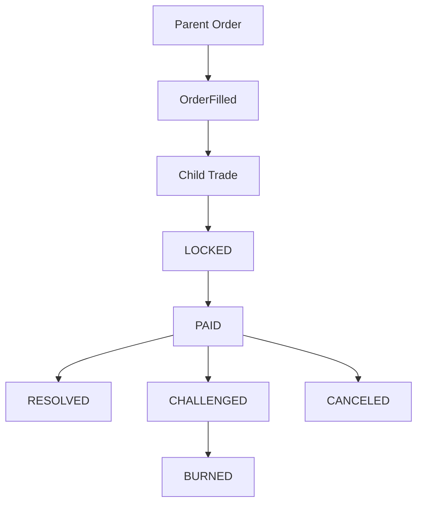

- **Parent Order** = kamusal market/order katmanı
- **Child Trade** = gerçek escrow lifecycle (ekonomik state machine)
- **Contract** = tek authoritative state machine
- **Backend** = mirror + coordination + operational read layer
- **Frontend** = UX guardrail + contract access layer

### 1.1 Otorite sınırları
- On-chain state transition ve ekonomik dağıtımın nihai belirleyicisi kontrattır.
- Backend “hakem” değildir; state üretmez, yalnızca mirror eder ve operasyonel koordinasyon sağlar.
- Frontend enforcement katmanı değildir; kullanıcıyı doğru akışa zorlayan guardrail katmanıdır.

### 1.2 V3’ün pratik sonucu
- Market yüzeyinde konuşulan nesne parent order’dır.
- Dispute, release, cancel, burn gibi escrow yaşam döngüsü child trade seviyesinde yürür.
- Kimlik doğrulamada authority: `OrderFilled + getTrade(tradeId)` kombinasyonu.

---

## 2. Hibrit mimari ve teknoloji stack

Araf hem güvenlik hem operasyonel gereksinimleri birlikte taşır. Bu nedenle mimari “Web2.5” hibrittir: on-chain authority + off-chain operational acceleration.

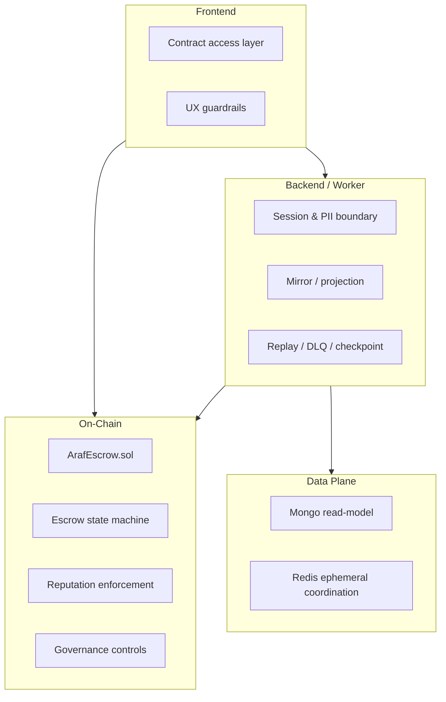

### 2.1 Neden hibrit tasarım?
- **On-chain:** fon custody, state transition, ekonomik kurallar, reputasyon enforcement
- **Off-chain (Mongo):** read model, performans, PII ve operasyonel metadata
- **Redis:** checkpoint, readiness, rate limit, kısa ömürlü koordinasyon

### 2.2 Katman matrisi

| Katman | Ana sorumluluk | Authority seviyesi | Teknoloji |
|---|---|---|---|
| Contract | Escrow state machine, payout, dispute economics, governance controls | **Authoritative** | Solidity / Base |
| Backend API | Session, projection, coordination, PII güvenlik sınırı | Non-authoritative | Node.js + Express |
| Event Worker | Event mirror, replay, checkpoint/DLQ | Non-authoritative | ethers + Mongo + Redis |
| Mongo | Read model / operasyonel cache | Non-authoritative | MongoDB + Mongoose |
| Redis | Ephemeral coordination / safety signals | Non-authoritative | Redis |
| Frontend | Contract write/read orchestration + UX guardrails | Non-authoritative | React + Wagmi + viem |

### 2.3 Non-custodial backend modeli
- Backend kullanıcı fonlarını hareket ettiren custody anahtarı taşımaz.
- Backend, kontrat adına release/challenge/cancel sonucu “uyduramaz”.
- Backend’in güçlü olduğu yer: session/policy/PII access boundary ve operasyonel görünürlük.
- Araf kimin haklı olduğuna karar vermez; iki tarafın imzasıyla kontrollü settlement sağlar.

---

## 3. On-chain public surface (`ArafEscrow.sol`)

Kontrat, V3’ün tek authoritative state machine yüzeyidir. Aşağıdaki fonksiyon kümeleri canlı protocol davranışını tanımlar.

| Surface | Fonksiyonlar | Mimari anlam |
|---|---|---|
| Parent-order write surface | `createSellOrder`, `fillSellOrder`, `cancelSellOrder`, `createBuyOrder`, `fillBuyOrder`, `cancelBuyOrder` | Kamusal market ve fill primitive’i |
| Child-trade lifecycle write surface | `reportPayment`, `releaseFunds`, `challengeTrade`, `autoRelease`, `burnExpired`, `proposeOrApproveCancel` | Gerçek escrow lifecycle ve ekonomik state geçişleri |
| Liveness / yardımcı write surface | `registerWallet`, `pingMaker`, `pingTakerForChallenge`, `decayReputation` | Entry gate, liveness ve clean-slate bakım yüzeyi |
| Governance / mutable admin surface | `setTreasury`, `setFeeConfig`, `setCooldownConfig`, `setTokenConfig`, `pause`, `unpause` | Runtime policy ve governance kontrol yüzeyi |
| Read surface | `getOrder`, `getTrade`, `getReputation`, `getFeeConfig`, `getCooldownConfig`, `getCurrentAmounts`, `antiSybilCheck`, `getCooldownRemaining`, `getFirstSuccessfulTradeAt` | Doğrulama, görünürlük ve runtime read yüzeyi |

### 3.1 Parent-order write surface
- `createSellOrder`
- `fillSellOrder`
- `cancelSellOrder`
- `createBuyOrder`
- `fillBuyOrder`
- `cancelBuyOrder`

### 3.2 Child-trade lifecycle write surface
- `reportPayment`
- `releaseFunds`
- `challengeTrade`
- `autoRelease`
- `burnExpired`
- `proposeOrApproveCancel`

### 3.3 Liveness / yardımcı write surface
- `registerWallet`
- `pingMaker`
- `pingTakerForChallenge`
- `decayReputation`

### 3.4 Governance / mutable admin surface
- `setTreasury`
- `setFeeConfig`
- `setCooldownConfig`
- `setTokenConfig`
- `pause` / `unpause`

### 3.5 Read surface
- `getOrder`, `getTrade`, `getReputation`
- `getFeeConfig`, `getCooldownConfig`
- `getCurrentAmounts`
- `antiSybilCheck`, `getCooldownRemaining`, `getFirstSuccessfulTradeAt`

---

## 4. Parent order vs child trade state modeli

Parent order market görünürlüğünü taşır; child trade ise gerçek escrow lifecycle’ı taşır.

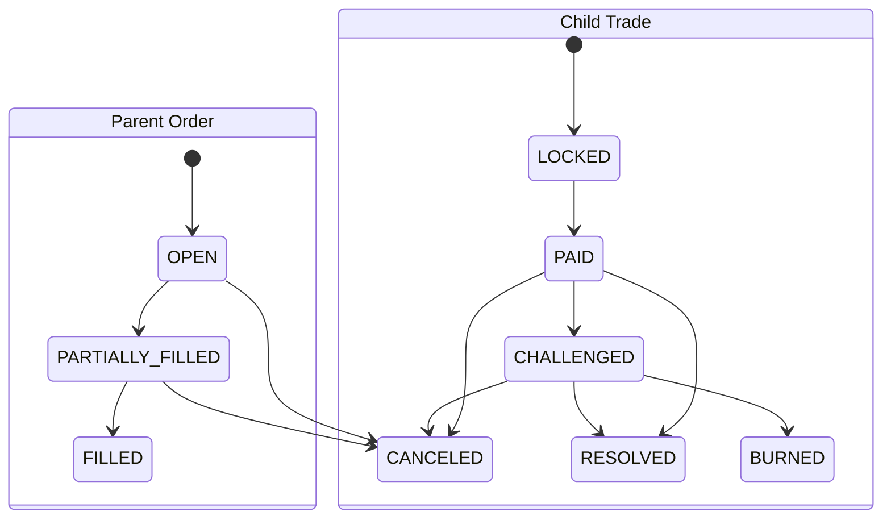

### 4.1 Parent order state
- `OPEN`
- `PARTIALLY_FILLED`
- `FILLED`
- `CANCELED`

Parent order market görünürlüğünü taşır; escrow uyuşmazlığı çözmez.

### 4.2 Child trade state
- `OPEN` (V3 fill path’inde pratikte kullanılmıyor)
- `LOCKED`
- `PAID`
- `CHALLENGED`
- `RESOLVED`
- `CANCELED`
- `BURNED`

### 4.3 Fill anında child trade yaratımı
Hem `fillSellOrder` hem `fillBuyOrder` akışında child trade aynı tx içinde doğrudan `LOCKED` oluşur. Böylece eski create+lock zinciri yerine tek adımda escrow entry gerçekleşir.

### 4.4 Kimlik ilişkisi
- Parent order identity: `orderId`
- Child trade identity: `tradeId` (`onchain_escrow_id` mirror)
- Link authority: `OrderFilled(orderId, tradeId, ...)` + `getTrade(tradeId)`

---

## 5. Sell flow, Buy flow ve role mapping

V3’te role mapping side-dependent olduğu için bu bölümde “owner kim, maker kim, taker kim?” ilişkisi netleştirilmelidir.

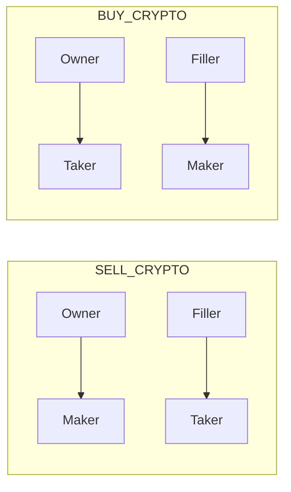

### 5.1 Sell flow
1. Owner `createSellOrder`
2. Filler `fillSellOrder` (taker gate uygulanır)
3. Child trade `LOCKED`
4. Taker `reportPayment`
5. Maker `releaseFunds` veya dispute/cancel yolları

### 5.2 Buy flow
1. Owner `createBuyOrder` (owner eventual taker olduğu için gate create-time’da uygulanır)
2. Filler `fillBuyOrder`
3. Owner (taker) fill-time’da yeniden gate kontrolünden geçer
4. Child trade `LOCKED`
5. `reportPayment` → `releaseFunds` / dispute / cancel

### 5.3 Side-dependent role mapping
Mutlak “maker=seller, taker=buyer” yoktur:
- `SELL_CRYPTO`: owner→maker, filler→taker
- `BUY_CRYPTO`: owner→taker, filler→maker

---

## 6. Anti-sybil enforcement semantiği (V3)

Kanonik gate helper: `_enforceTakerEntry(wallet, tier)`

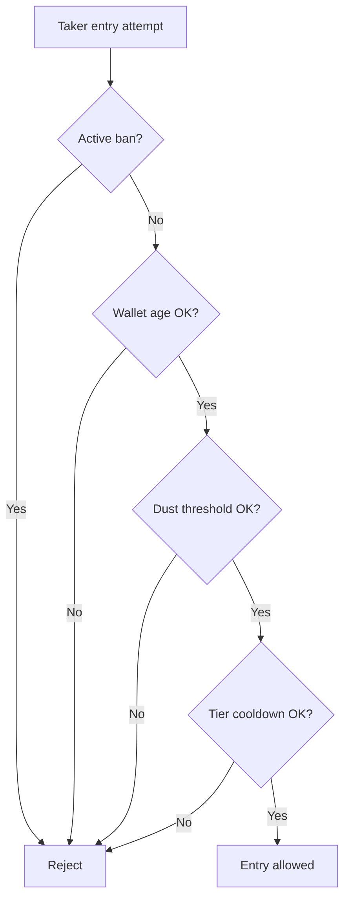

Gate bileşenleri:
- aktif ban kontrolü (`bannedUntil`)
- wallet age (`WALLET_AGE_MIN`)
- native balance dust eşiği (`DUST_LIMIT`)
- tier bazlı cooldown (`tier0TradeCooldown`, `tier1TradeCooldown`)

V3 uygulama noktaları:
- `fillSellOrder` (filler taker)
- `createBuyOrder` (owner eventual taker)
- `fillBuyOrder` (owner taker re-check)

Sonuç: anti-sybil enforcement lockEscrow-merkezli legacy değildir; V3 child-trade entry path merkezlidir.

---

## 7. Dispute/Bleeding Escrow teknik akışı

Bu bölüm V3’ün gerçek ekonomik state machine’ini açıklar. `PAID` sonrası normal çözüm, dispute, liveness, cancel ve burn yolları child trade seviyesinde çalışır.

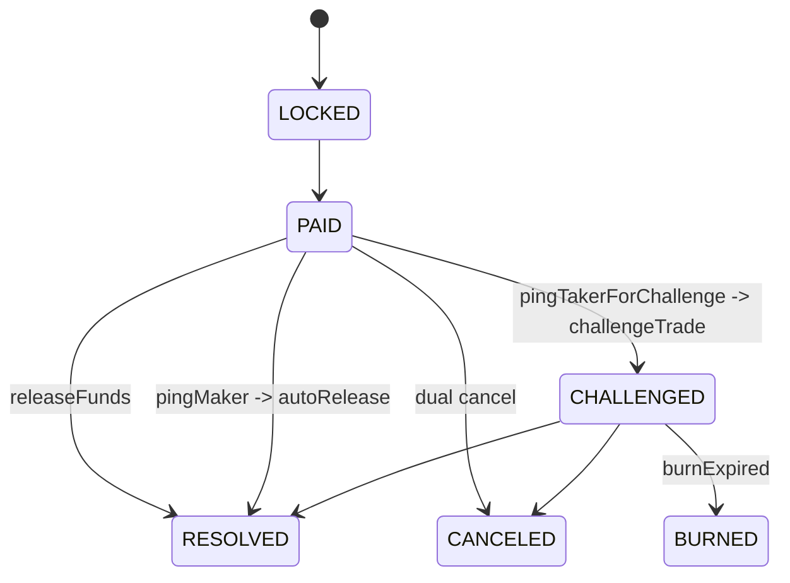

### 7.1 `PAID` sonrası çözüm yolları
- **Normal kapanış:** maker `releaseFunds`
- **Dispute hattı:** maker `pingTakerForChallenge` → bekleme → `challengeTrade`
- **Liveness hattı:** taker `pingMaker` → bekleme → `autoRelease`
- **Mutual cancel:** iki tarafın imzalı iradesiyle `proposeOrApproveCancel`
- **Terminal burn:** challenge sonrası süre dolunca `burnExpired`

### 7.2 Bleeding bileşenleri
- maker bond decay
- taker bond decay
- belirli eşik sonrası crypto side decay

`getCurrentAmounts(tradeId)`, o anki ekonomik bakiyeyi kanonik olarak çıkarır.

### 7.3 Challenge ve liveness ping semantiği
- Ping yolları birbirini dışlayan şekilde tasarlanır (conflicting path koruması).
- Bekleme pencereleri state-guard ile enforce edilir.

### 7.4 Burn semantiği
- `burnExpired` permissionless pattern’e yakındır: challenge süresi dolan state’i finalize eder.
- Kalan ekonomik değer treasury yönüne gider.

### 7.5 Cancel semantiği
- `proposeOrApproveCancel` EIP-712 imza + nonce + deadline disiplinini kontrat içinde doğrular.
- Her iki taraf imzası tamamlanmadan cancel finalize edilmez.

📄 Teknik notlar

- maker bond decay  
- taker bond decay  
- belirli eşik sonrası crypto side decay  
- `getCurrentAmounts(tradeId)`, o anki ekonomik bakiyeyi kanonik olarak çıkarır.  
- Ping yolları birbirini dışlayan şekilde tasarlanır (conflicting path koruması).  
- Bekleme pencereleri state-guard ile enforce edilir.  
- `burnExpired` permissionless pattern’e yakındır: challenge süresi dolan state’i finalize eder.  
- Kalan ekonomik değer treasury yönüne gider.  
- `proposeOrApproveCancel` EIP-712 imza + nonce + deadline disiplinini kontrat içinde doğrular.  
- Her iki taraf imzası tamamlanmadan cancel finalize edilmez.

---

## 8. Reputation / bans / clean-slate

Reputation modeli V3’te tier progression, ban disiplini ve clean-slate bakım çağrısını birlikte taşır.

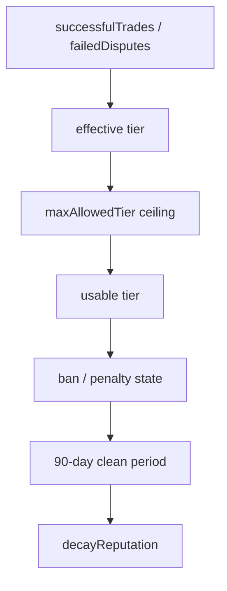

### 8.1 Reputation alanları
- `successfulTrades`
- `failedDisputes`
- `bannedUntil`
- `consecutiveBans`

### 8.2 Tier etkisi
- Başarı/başarısızlık geçmişi efektif tier’ı etkiler.
- Ceza sonrası tier ceiling (`maxAllowedTier`) devreye girebilir.
- `MIN_ACTIVE_PERIOD` tier progression’da zaman bileşeni uygular.

### 8.3 Clean-slate kuralı
- `decayReputation` clean period tamamlanınca çağrılabilir.
- Güncel clean period: **90 gün**.
- Bu tam af değildir; `failedDisputes` silinmez.

---

## 9. Finalized parameters ve mutable config ayrımı

Bu bölüm immutable parametreler ile runtime’da owner tarafından değiştirilebilen yüzeyleri ayırır.

### 9.0 Parametre sınıflandırma tablosu

| Sınıf | Parametreler | Not |
|---|---|---|
| Immutable/public constants | `TIER_MAX_AMOUNT_*`, `*_DECAY_BPS_H`, `WALLET_AGE_MIN`, `DUST_LIMIT`, `MAX_BLEEDING`, `MIN_ACTIVE_PERIOD`, `AUTO_RELEASE_PENALTY_BPS`, `MAX_CANCEL_DEADLINE`, `GOOD_REP_DISCOUNT_BPS`, `BAD_REP_PENALTY_BPS` | Runtime’da owner çağrısıyla değişmez. |
| Mutable runtime config | `takerFeeBps`, `makerFeeBps`, `tier0TradeCooldown`, `tier1TradeCooldown` | Owner governance surface ile değişebilir. |
| Direction-aware token runtime policy | `tokenConfigs[token] => {supported, allowSellOrders, allowBuyOrders}` | Token desteği yön-bilinçli yönetilir. |

### 9.1 Immutable/public constant sınıfı
- tier max amount seti (`TIER_MAX_AMOUNT_*`)
- decay sabitleri (`*_DECAY_BPS_H`)
- wallet age / dust / bleeding / active period limitleri
- auto release penalty
- max cancel deadline
- rep discount/penalty BPS

### 9.2 Mutable runtime config
- `takerFeeBps`
- `makerFeeBps`
- `tier0TradeCooldown`
- `tier1TradeCooldown`
- direction-aware token config (`setTokenConfig`)

### 9.3 Fee snapshot semantiği
- Snapshot order create anında alınır.
- Child trade, parent snapshot’ını taşır.
- Sonraki `setFeeConfig` aktif trade economics’ini geriye dönük değiştirmez.

### 9.4 Toolchain / deployment assumptions
- Kontrat deploy akışı `constructor(treasury)` + token direction config ile başlar.
- Deploy sonrası token yön politikası zincir üstünde `tokenConfigs(token)` ile doğrulanmalıdır.
- Production rehberinde owner key’in multisig altında tutulması governance risk azaltımı için varsayımdır.

---

## 10. Runtime bağlantı ve operasyon politikaları

Backend davranışı yalnız teknoloji seçimiyle değil, bootstrap, readiness ve shutdown disipliniyle tanımlanır.

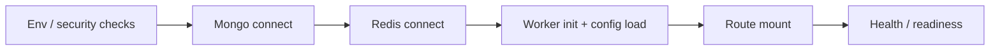

### 10.1 Bootstrap sırası (backend)
1. Env ve güvenlik kontrolleri
2. Mongo bağlantısı
3. Redis bağlantısı
4. Worker init + protocol config load
5. Route mount
6. Health/readiness aktiflenmesi

### 10.2 Readiness-first yaklaşımı
- Liveness (`/health`) süreç ayakta mı sorusuna bakar.
- Readiness (`/ready`) bağımlılıkların gerçekten hazır olup olmadığını doğrular.
- Trafik açma kararı readiness’e göre verilmelidir.

### 10.3 Fail-fast / fail-open kararları
- Kritik bağımlılık kopuşlarında fail-fast yaklaşımı uygulanır (özellikle DB/worker bütünlüğü için).
- Güvenlik sınırında fail-open yerine fail-closed tercih edilir (ör. auth/session sınırları).

### 10.4 Timeout ve bağlantı politikaları
- Mongo tarafında `maxPoolSize`, `socketTimeoutMS`, `serverSelectionTimeoutMS` ayarları worker+API yükünü birlikte kaldıracak şekilde kullanılır.
- Mongo kopuşunda fail-fast yaklaşımıyla süreç yeniden başlatma tercih edilir (stale/yarım bağlantı drift’ini azaltmak için).
- Redis tarafında `isReady` sinyali `connected` durumundan ayrı ele alınır; middleware kararları buna göre verilir.
- Redis TLS (`rediss://`) ve managed servis senaryoları runtime config’te dikkate alınır.

### 10.5 Graceful shutdown sırası
- Yeni istekleri kes
- Worker’ı durdur
- scheduler interval/timeout’ları temizle
- Mongo/Redis bağlantılarını kapat
- süreçten kontrollü çık

### 10.6 Scheduler / cleanup jobs
- reputation decay tetikleyicileri
- stats snapshot
- receipt & PII retention cleanup
- user bank risk metadata cleanup
- DLQ processing

### 10.7 Health vs ready operasyonel anlamı
- `/health`: süreç ayakta mı? (process liveness)
- `/ready`: bağımlılıklar + config + worker lag + replay durumu güvenli mi? (traffic gate)
- Worker replay veya yüksek lag durumunda liveness true kalsa bile readiness false olabilir; bu bilinçli tasarım tercihidir.

---

## 11. Event worker / replay / mirror reliability

Worker zincirden authoritative state’i okur, Mongo’ya operational mirror üretir; fakat authority olmaz.

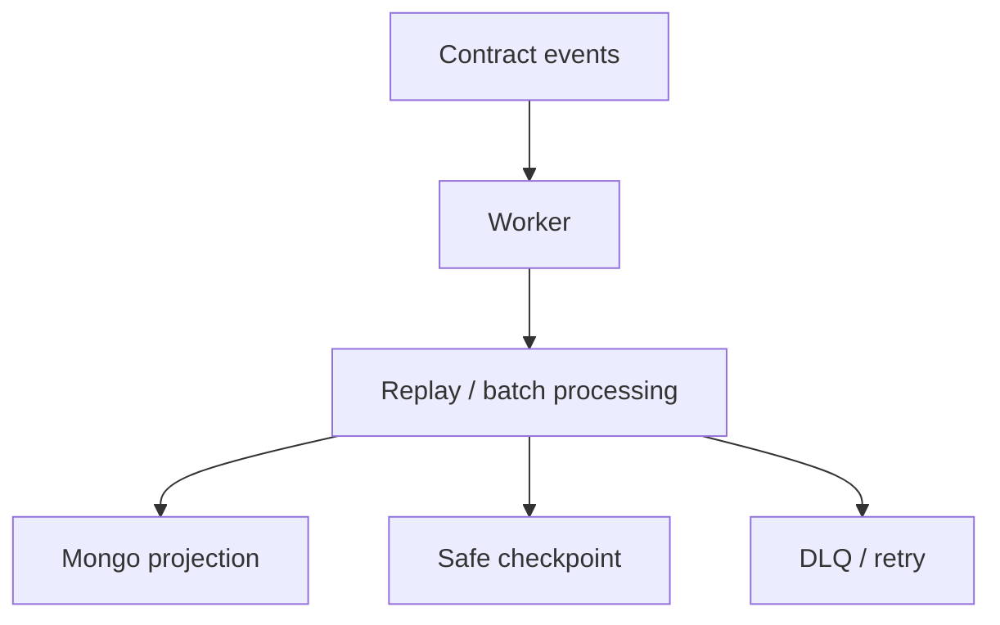

### 11.1 Worker state mantığı
Worker kontrat event’lerini consume eder, Mongo’yu authoritative olmadan günceller.

### 11.2 Checkpoint yaklaşımı
- son işlenen blok
- last safe checkpoint
- replay başlangıç güvenliği

### 11.3 Replay ve batch işleme
- bloklar batch halinde işlenir
- replay’de idempotent davranış hedeflenir
- state regression guard’larıyla geriye düşüş engellenir

### 11.3.1 Last-safe-block semantiği
- Worker yalnız son görülen blok değil, son güvenli checkpoint bloğunu da izler.
- Ready kararı, provider block yüksekliği ile worker safe checkpoint farkını (lag) hesaba katar.
- Bu yaklaşım “işleniyor gibi görünüp geride kalma” durumunu operasyonel olarak görünür kılar.

### 11.4 DLQ ve poison event görünürlüğü
- işlemeye alınamayan event’ler DLQ’ya taşınır
- tekrar deneme/backoff uygulanır
- operasyonel görünürlük için log/metric izi korunur

### 11.5 Kimlik normalizasyonu
- on-chain id alanları numeric-string disipliniyle tutulur
- parent order id ve child trade id karışmasını önleyen explicit lookup stratejisi uygulanır

### 11.6 OrderFilled + getTrade linkage
Child trade authority worker tarafında heuristik yerine explicit event+getter kombinasyonuyla mirror edilir.

### 11.7 Mirror authority uyarısı
- Event worker, protokol kuralı üretmez; yalnız authoritative zincir durumunu operasyonel modele taşır.
- Mongo’daki bir alan ile kontrat storage çelişirse otorite kontrattadır.

---

## 12. Güvenlik mimarisi ve trust boundaries

Bu bölüm auth, session, PII ve client telemetry gibi güvenlik sınırlarını tek yerde toplar.

### 12.1 Auth modeli (SIWE + JWT + cookie session)

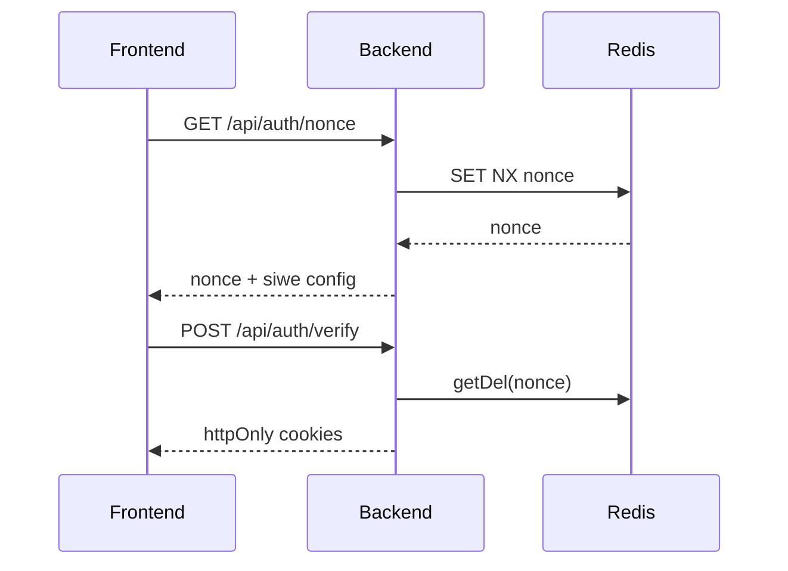

#### 12.1.1 Nonce lifecycle (TTL + consume)
- Nonce Redis’te wallet bazlı tutulur (`nonce:<wallet>`), varsayılan TTL **5 dakika**dır.
- Yarış durumunda nonce authority’si Redis’tir: `SET NX` başarısızsa yerel üretilen değer döndürülmez; Redis’te yaşayan nonce yeniden okunur.
- SIWE verify sırasında nonce `getDel` ile consume edilir; replay penceresi daraltılır.
- SIWE domain/URI doğrulaması request-time’da yapılır (özellikle production’da host/origin eşleşmesi zorunlu).

#### 12.1.2 Session token lifecycle
- Auth JWT cookie (`araf_jwt`) varsayılan kısa ömürlüdür (konfigürasyonla; default 15m).
- Refresh cookie (`araf_refresh`) daha uzun ömürlüdür (default 7 gün) ve `/api/auth` path scope’u ile sınırlandırılır.
- Cookie modeli httpOnly + sameSite=lax + credentials:include çizgisini korur; header bearer normal auth authority üretmez.

### 12.2 Cookie-only auth boundary ve session-wallet mismatch davranışı

| Kontrol adımı | Ne kontrol edilir | Mismatch sonucu |
|---|---|---|
| `requireAuth` | Cookie JWT geçerli mi + blacklist durumu | 401 / 403 |
| `requireSessionWalletMatch` | `x-wallet-address` == cookie-auth wallet | 409 + session invalidation |
| Session invalidation | JWT blacklist + refresh revoke + cookie clear | Session güvenli kapatılır |

> Önemli sınır: `x-wallet-address` tek başına auth kaynağı değildir; yalnız cookie-auth oturumla eşleşme kontrolüdür.

### 12.3 Refresh token family invalidation
- Logout ve session-wallet mismatch olaylarında refresh family revoke edilir.
- Amaç yalnız aktif access token’ı değil, refresh zincirinin yeniden kullanım riskini de kırmaktır.
- Böylece “tek request reddi” yerine “oturum soy ağacı iptali” uygulanır.

### 12.4 PII access boundary (trade-scoped token + canlı state kontrolü)

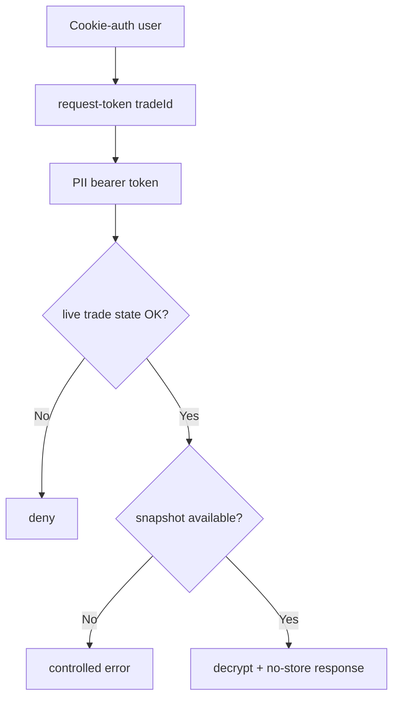

- PII token parent order’a değil, tek bir `tradeId`’ye scoped üretilir.
- `requirePIIToken` token type=`pii`, tradeId eşleşmesi ve token wallet == cookie session wallet koşullarını birlikte doğrular.
- Token tek başına yeterli değildir; route tekrar canlı trade state kontrolü yapar (`LOCKED/PAID/CHALLENGED` penceresi).
- Snapshot-first politika: payout snapshot yoksa controlled hata döner; current profile fallback kapalıdır.
- Hassas PII yanıtları `Cache-Control: no-store` / `Pragma: no-cache` ile döndürülür.

### 12.5 Şifreleme modeli
- PII ve receipt payload alanları AES-256-GCM ile şifrelenmiş saklanır.
- Key türetme/yönetim tarafında HKDF + KMS/Vault tabanlı model hedeflenir.
- Kontrat tarafına plaintext yazılmaz; receipt için zincire yalnız hash izi taşınır.

### 12.6 Rate-limit sınıfları ve fallback davranışı
- Limiter sınıfları yüzeye göre ayrılır: auth, nonce, market read, orders/trades read-write, PII, feedback, logs.
- Auth/PII gibi hassas yüzeylerde Redis yoksa in-memory fallback koruması devrededir (fail-open minimize edilir).
- Public/read yüzeylerinde availability için kontrollü fail-open tercihleri bulunabilir; bu security boundary’yi auth/PII tarafında gevşetmez.

### 12.7 Client-error logging boundary (scrub semantiği)
- Frontend telemetry yalnız `/api/logs/client-error` endpoint’ine gider.
- Mesaj/stack alanlarında regex scrub ile IBAN, wallet, email, bearer/JWT benzeri duyarlı parçalar redakte edilir.
- Log boyutu sınırları ve rate-limit birlikte kullanılarak hem veri minimizasyonu hem abuse direnci sağlanır.

### 12.8 Trust boundary özeti
- Contract: economic/state authority.
- Backend: auth/session/PII koordinasyonu + read-model projection.
- Frontend: runtime guardrail ve kullanıcı geri bildirimi katmanı.
- Off-chain veri: operasyonel fayda; protocol authority değildir.

---

## 13. Veri modelleri (Mongo read-model katmanı)

> Mongo canonical protocol authority değildir; ama yüksek performanslı read-model ve operasyonel observability için kritik katmandır.

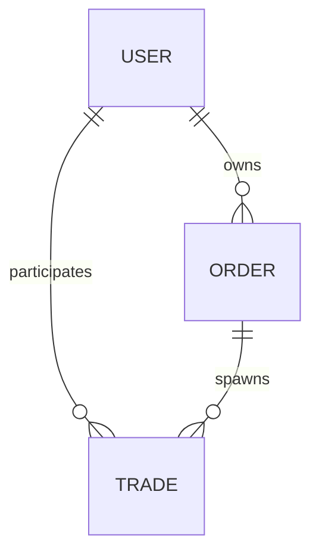

### 13.1 User modeli (field-aware)

#### Kimlik ve payout profile yapısı
- `wallet_address` birincil kullanıcı kimliğidir (lowercase EVM address).
- `payout_profile` yapısı rail-aware tutulur:
  - `rail`, `country`
  - `contact.{channel, value_enc}`
  - `payout_details_enc`
  - `fingerprint.{hash, version, last_changed_at}`
  - `updated_at`

#### Şifreleme ve public projection sınırı
- `contact.value_enc` ve `payout_details_enc` şifreli saklanır; plaintext kalıcı depoda tutulmaz.
- `toPublicProfile()` allowlist yaklaşımıyla yalnız güvenli alanları döndürür.
- `bank_change_history` ve payout detayları public profile’a sızdırılmaz.

#### Banka profil risk metadata’sı (authority değil)
- `profileVersion`
- `lastBankChangeAt`
- `bankChangeCount7d`
- `bankChangeCount30d`
- `bank_change_history` (rolling pencere hesabı için internal dizi)
- Bu alanlar anti-fraud/risk sinyalidir; kontrat enforcement authority’si değildir.

#### Reputation/ban mirror sınırı
- `reputation_cache` ve ban mirror alanları (`is_banned`, `banned_until`, `consecutive_bans`, `max_allowed_tier`) query/UI kolaylığı içindir.
- Kontrat ile çelişki durumunda otorite on-chain veridedir.
- Reputation extension içinde `partialSettlementCount` event-taxonomy amaçlı sayaçtır.
- `partialSettlementCount` tek başına ceza/failure anlamına gelmez.

### 13.2 Order modeli (field-aware)

#### Kimlik + lifecycle alanları
- `onchain_order_id` (numeric-string kimlik)
- `owner_address`, `side`, `status`, `tier`, `token_address`

#### Finansal/snapshot alanları
- `amounts.{total_amount, remaining_amount, min_fill_amount}` + `*_num` cache
- `reserves.{remaining_maker_bond_reserve, remaining_taker_bond_reserve}` + `*_num` cache
- `fee_snapshot.{taker_fee_bps, maker_fee_bps}`

#### Referans, timer ve yardımcı istatistik alanları
- `refs.order_ref` (event trace / idempotent ilişkilendirme için)
- `timers.{created_at_onchain, last_filled_at, canceled_at}`
- `stats.*` (`child_trade_count`, `active/resolved/canceled/burned` dağılımı, `total_filled_amount`)

#### Mirror sınırı
- Remaining/reserve değerleri backend’de hesaplanan authority değil; worker’ın kontrattan taşıdığı projeksiyon verisidir.

### 13.3 Trade modeli (field-aware)

#### Kimlik ve canonical ilişki
- `onchain_escrow_id` (child trade birincil kimliği)
- `parent_order_id`
- `parent_order_side`
- `trade_origin` (`ORDER_CHILD` / `DIRECT_ESCROW`)
- `canonical_refs.{listing_ref, order_ref}`

#### Fill ve fee ilişkisi
- `fill_metadata.{fill_amount, filler_address, remaining_amount_after_fill}` (+ num cache’ler)
- `fee_snapshot.{taker_fee_bps, maker_fee_bps}`

#### BigInt-safe finansal strateji
- Otoritatif finansal alanlar string tutulur:
  - `financials.crypto_amount`
  - `financials.maker_bond`
  - `financials.taker_bond`
  - `financials.total_decayed`
- `*_num` alanları yalnız UI/aggregation kolaylığı içindir; enforcement input’u değildir.

#### PII / receipt / payout snapshot alanları
- `evidence.ipfs_receipt_hash`
- `evidence.receipt_encrypted`
- `evidence.receipt_timestamp`
- `evidence.receipt_delete_at`
- `payout_snapshot.{maker,taker,...}` altında lock-time `profile_version_at_lock`, `bank_change_count_*_at_lock`, `fingerprint_hash_at_lock` gibi risk bağlamı alanları tutulur.

#### Cancel / chargeback audit alanları
- `cancel_proposal.{proposed_by, proposed_at, approved_by, maker_signed, taker_signed, maker_signature, taker_signature, deadline}`
- `chargeback_ack.{acknowledged, acknowledged_by, acknowledged_at, ip_hash}`
- `settlement_proposal` taraf-imzalı partial-settlement lifecycle mirror’ını taşır:
  - `NONE -> PROPOSED -> REJECTED/WITHDRAWN/EXPIRED/FINALIZED`
  - proposer trade taraflarından biridir; accept/reject yalnız karşı tarafla tamamlanır
  - backend yalnız mirror/audit tutar; settlement authority kontratta kalır

#### Retention ve terminal TTL ayrımı
- Trade dokümanı terminal state’lerde ayrı TTL index politikasıyla temizlenir.
- Receipt/snapshot alanları için ayrı cleanup alanları (`receipt_delete_at`, `snapshot_delete_at`) ve job’lar kullanılır.
- Bu ayrım “belge yaşam döngüsü” ile “hassas payload minimizasyonu”nu birbirinden ayırır.

### 13.4 Feedback / stats/snapshot katmanı
- Feedback modeli ürün geri bildirimi için ayrı operational yüzeydir.
- Stats/snapshot katmanı (daily aggregates, dashboard counters) karar desteği üretir; protocol authority üretmez.
- Read-model snapshot’ları kontrat state’inin yerini almaz; yalnız operatör görünürlüğünü artırır.

---

## 14. Backend route surface ve coordination semantiği

V3 backend yüzeyi authority üretmez; route’lar projection, coordination ve güvenlik sınırlarını uygular.

| Route grubu | Yüzey | Anlam |
|---|---|---|
| Orders | Parent order read/config yüzeyi, owner-scope child-trade listesi | Market read-model ve owner görünürlüğü |
| Trades | active/history/by-escrow, cancel signature coordination, chargeback ack | Child-trade operasyonları ve audit yardımcı yüzeyi |
| Auth | nonce/verify/refresh/logout/me/profile | Session ve wallet-bound auth authority sınırı |
| PII | `/my`, `taker-name`, request-token, trade-scoped retrieve | Snapshot-first, role-bound hassas veri erişimi |
| Receipts | file validation + encryption + hash | Taker + `LOCKED` state için receipt taşıma yüzeyi |
| Logs / stats / feedback | client error logs, protocol stats, feedback intake | Observability ve ürün geri bildirimi |

### 14.1 Orders routes
- Parent order read/config yüzeyi
- Owner-scope child-trade listesi

### 14.2 Trades routes
- active/history/by-escrow kimlikli okuma
- cancel signature coordination
- chargeback ack audit surface
- settlement-proposal preview + mirror read yüzeyi bilgilendirme/non-authoritative amaçlıdır
- backend rolü: preview, event mirror, read-model, audit/observability
- backend’in rolü olmayanlar: outcome belirleme, release/cancel/burn/payout override, reputation authority yazma, fon transferi

### 14.2.1 Payment risk sınırı
- `PaymentRiskLevel`, payment rail complexity sinyalidir (UI/read-model).
- Kullanıcı güven/reputation skoru değildir; on-chain authority kaynağı olamaz.

### 14.3 Auth routes
- nonce/verify/refresh/logout/me/profile
- session-wallet mismatch guard

### 14.4 PII routes
- `/my`, `taker-name`, request-token, trade-scoped retrieve
- snapshot-first ve role-bound access

### 14.5 Receipts routes
- file validation + encryption + hash
- yalnız taker + `LOCKED` state kabulü

### 14.6 Logs/stats/feedback
- client error logs
- protocol stats read surface
- feedback intake

---

## 15. Frontend UX guardrail katmanı

Frontend enforcement değildir; ama runtime orchestration ve fail-fast UX guardrail katmanı olarak kritik rol oynar.

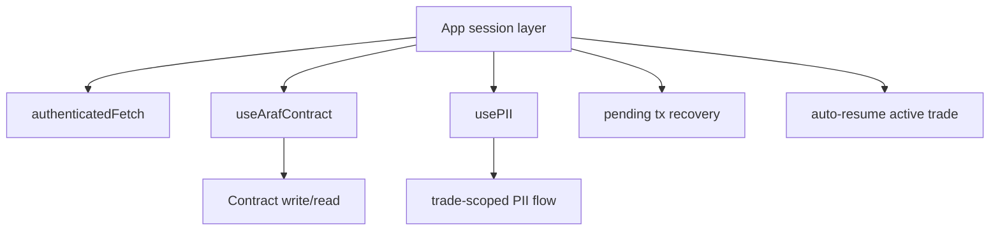

### 15.1 Runtime orchestration: `useArafContract`
- Tüm write çağrılarında preflight guard:
  - wallet client var mı
  - kontrat adresi geçerli mi (`VITE_ESCROW_ADDRESS`)
  - chain destekli mi
- İşlem gönderildikten sonra receipt beklenir; pending tx hash’i `localStorage(araf_pending_tx)` altında saklanır.
- Fill akışlarında `OrderFilled` event decode edilerek `tradeId` çıkarılır; frontend trade kimliği uydurmaz, receipt’ten okur.

### 15.2 Runtime orchestration: `usePII`
- PII akışı 2 adımlıdır:
  1) `pii/request-token/:tradeId`
  2) `pii/:tradeId` (Bearer + cookie session birlikte)
- API path canonicalization `buildApiUrl(...)` üstünden zorlanır.
- `authenticatedFetch` ile me/refresh orkestrasyonu merkezileştirilir.
- Her yeni PII isteğinde önceki request `AbortController` ile iptal edilir; stale response state’i ezemez.
- Unmount/trade değişiminde hassas PII state temizlenir.

### 15.3 Session mismatch ve recovery UX
- `authenticatedFetch` 409 (`SESSION_WALLET_MISMATCH`) gördüğünde backend logout + local session cleanup uygular.
- 401 durumunda `auth/refresh` denenir; başarısızsa kullanıcı yeniden imza akışına yönlendirilir.
- Bağlı cüzdan ile authenticated wallet ayrışırsa fail-fast logout/re-entry davranışı uygulanır.

### 15.4 Wrong-network / wrong-address fail-fast
- Desteklenmeyen chain’de kontrat write çağrısı başlamadan hata verilir.
- Geçersiz/sıfır kontrat adresi durumunda işlem başlatılmaz.
- Amaç zincir dışı silent-failure yerine kullanıcıya erken ve net hata geri bildirimi vermektir.

### 15.5 Provider/bootstrap notları
- App session katmanı açılışta pending tx recovery kontrolü yapar; 24 saatten eski/bozuk hash’ler temizlenir.
- Aynı katman aktif trade’i otomatik resume ederek kullanıcıyı doğru trade room’a döndürebilir.

### 15.6 Frontend enforcement sınırı
Frontend kontratın yerine geçmez; enforcement kontrattadır. Frontend guardrail/orchestration katmanıdır.

---

## 16. Saldırı vektörleri ve bilinen sınırlamalar

### 16.1 Azaltılmış / mitigated riskler
- **Backend authority confusion (kısmen azaltıldı):** doküman + route projection sınırları + worker mirror uyarıları ile backend’in “hakem” gibi yorumlanma riski daraltıldı.
- **Session/account confusion:** cookie wallet ↔ header wallet mismatch durumunda request reddi + refresh family revoke + cookie clear zinciri uygulanır.
- **PII overexposure:** trade-scoped token + role/state/session üçlü kontrolü + snapshot-first + no-store semantiği.
- **API path drift:** frontend canonical path helper kullanımıyla farklı endpoint kökü kaynaklı sessiz hatalar azaltıldı.
- **Wrong-network tx riski (UX düzeyinde):** chain/address preflight guard’ları ile işlem başlamadan fail-fast.

### 16.2 Kalan / open riskler
- **Governance key risk:** mutable fee/cooldown/token-direction surface owner kontrolündedir; multisig ve operasyon disiplini gerektirir.
- **Fake receipt / off-chain payment ambiguity:** dekont hash’i ve encrypted payload fraud’u pahalılaştırır ama fiat transferin maddi gerçekliğini matematiksel kanıtlamaz.
- **Chargeback reality:** bankacılık katmanındaki geri alma/itiraz süreçleri zincir üstü finaliteyi dış dünyada tartışmalı hale getirebilir.
- **Off-chain signature staleness:** cancel signature akışında domain/nonce/deadline kontrollerine rağmen kullanıcı tarafında gecikmiş/onaysız imza UX riski kalır.
- **Backend mirror’in authority sanılması:** operatör veya entegratör, Mongo/state cache’i yanlışlıkla source-of-truth okuyabilir.
- **Frontend wrong-network/wrong-address configuration riski:** guardrail’e rağmen yanlış env/config dağıtımı kullanıcıyı yanıltabilir.
- **Operator/doc misunderstanding riski:** eski listing-first veya “backend hakemdir” gibi mental model kalıntıları operasyonel hataya yol açabilir.

### 16.3 Bilinçli sınırlamalar (oracle-free model)
- Oracle-free tasarım gereği fiat transferin “gerçekten yapıldı mı” sorusu kontrat içinde kesin doğrulanmaz.
- Sistem mutlak hakemlik yerine ekonomik teşvik/ceza ve zaman-bazlı decay mekanizmasıyla kötü davranışı pahalılaştırır.
- Bu bilinçli sınır, merkezi oracle/arbiter güven varsayımını azaltırken sosyal/operasyonel uyuşmazlık riskini tamamen yok etmez.

---

## 17. Legacy concepts (historical / deprecated / non-canonical)

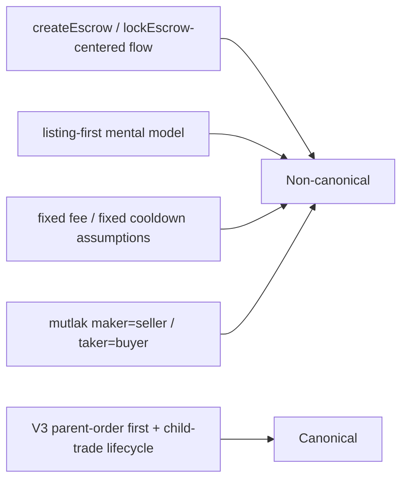

Aşağıdakiler canlı V3 mimarinin canonical yüzeyi değildir:
- createEscrow/lockEscrow merkezli anlatı
- listing-first market primitive
- fixed fee/fixed cooldown varsayımları
- maker=seller, taker=buyer mutlaklığı
- old single-dimension token support dili

Legacy içerik yalnız tarihsel bağlam için tutulmalı; operasyonel kararlar bu doküman + source-of-truth kod üzerinden verilmelidir.

---

## 18. Sonuç: bu dokümanın rolü

Bu metin iki rolü aynı anda taşır:
1. V3 canonical modelin kısa ve net çerçevesi
2. Ekip içi operasyonel/teknik referans (security, data model, runtime reliability, guardrails, attack surface)

Dolayısıyla doküman ne yalnız “özet”, ne de stale legacy metin kopyasıdır; güncel V3 gerçekliğe hizalanmış kapsamlı teknik referanstır.

*Araf Protokolü — V3 Order-First canonical docs*

