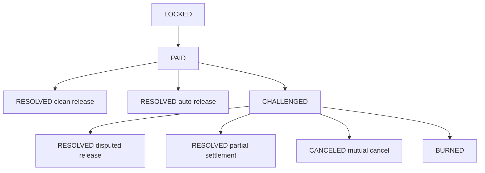
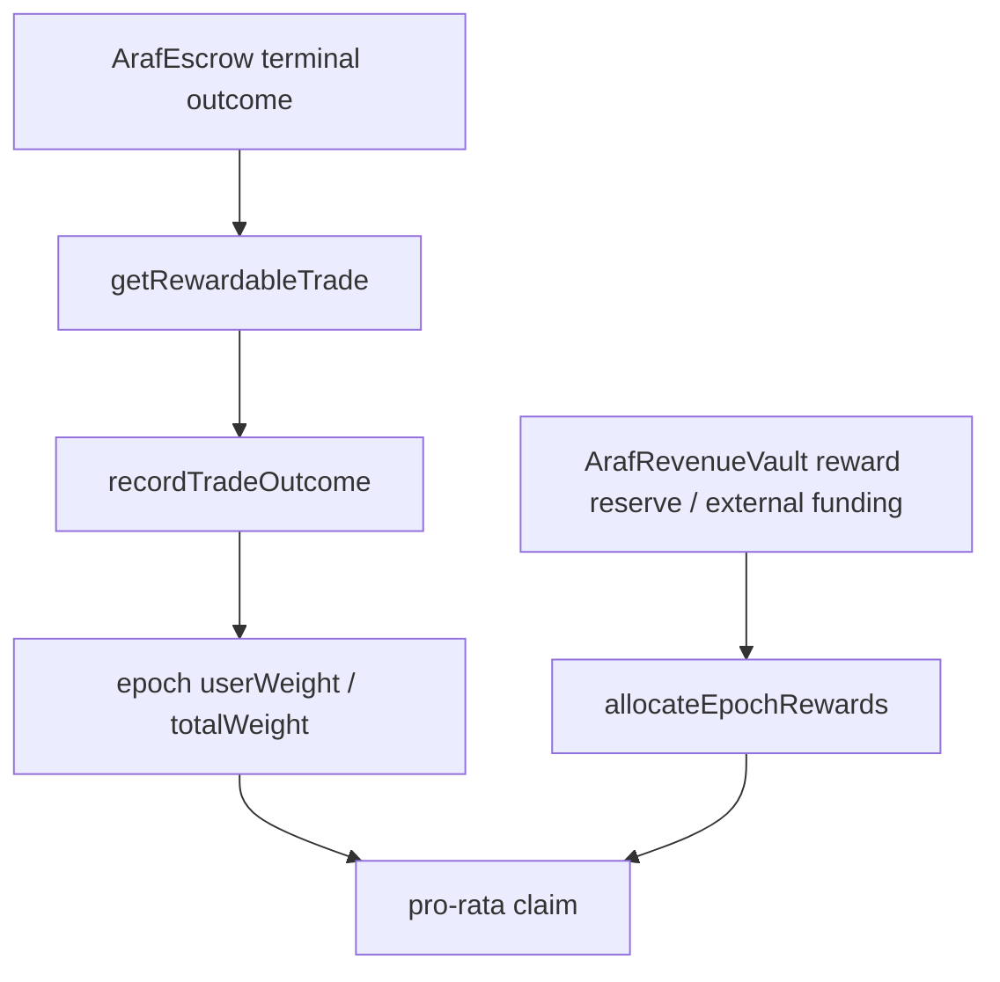

# Araf V3 Mimari Teşvik Katmanı — Dispute, Bleeding Escrow ve Proof of Peace

> Bu doküman, `ARCHITECTURE.md` ana teknik referansını tamamlayan mimari addendum’dur. Amaç, Araf’ın pazarlama/felsefe dilini teknik state machine ve reward authority sınırlarıyla aynı düzleme yerleştirmektir.

## 1. Kanonik mimari tez

Araf mahkeme, oracle, moderatör veya backend hakemi değildir.

Araf’ın mimari görevi şudur:

> **Off-chain fiat gerçeğini ispatlamadan, çözülmeyen çatışmayı ekonomik olarak pahalılaştırmak ve hızlı temiz çözümü daha değerli hale getirmek.**

Bu nedenle mimari iki ayrı ama tamamlayıcı teşvik katmanı taşır:

| Katman | Amaç | Teknik yüzey |
|---|---|---|
| Negatif teşvik | Kötü strateji, inat ve gecikmeyi maliyetlendirmek | bond, bleeding, `challengeTrade`, `burnExpired`, zero reward weight |
| Pozitif teşvik | Hızlı ve temiz çözümü ödüllendirmek | `ArafRewards`, epoch weight, pro-rata claim |

Kanonik ifade:

> **Araf fiat gerçeğini yargılamaz. Davranışı fiyatlandırır.**

## 2. Dispute mimarisinin rolü

Dispute sistemi `child trade` seviyesinde çalışır. Parent order market görünürlüğünü taşır; gerçek ekonomik risk child trade’de başlar.

Dispute mimarisinin temel mesajı:

- Taker ödeme bildirdiğinde maker sessiz kalamaz.
- Maker ödeme almadığını iddia ederse trade challenge alanına girer.
- Challenge, haklılık kararı değildir; ekonomik baskı modudur.
- Taraflar release, settlement veya mutual cancel ile çıkabilir.
- Çıkmaz devam ederse bleeding/burn hattı değeri korumaz; çözümsüzlüğü maliyetlendirir.

## 3. Proof of Peace mimarisinin rolü

Proof of Peace Rewards, dispute sisteminin pozitif teşvik ayağıdır.

Rewards **cashback değildir**. Sabit işlem iadesi veya getiri garantisi olarak tasarlanmaz. Eligibility yalnız `ArafEscrow` terminal outcome verisinden üretilir.

Mimari kural:

> **Backend, admin ve sponsor recipient, weight veya multiplier seçemez.**

## 4. Outcome → reward posture tablosu

| Terminal outcome | Reward posture | Mimari gerekçe |
|---|---|---|
| Fast clean release | En yüksek pozitif weight | En iyi iş birliği dengesini teşvik eder |
| Slower clean release | Daha düşük pozitif weight | Gecikmeyi opportunity cost ile fiyatlandırır |
| Partial settlement | Düşük pozitif weight | Dispute içi barışı ödüllendirir ama dispute farming’i cazip yapmaz |
| Auto-release | Zero weight | Maker inaktivitesi ödüllendirilmez |
| Mutual cancel | Zero weight | Cancel-loop farming engellenir |
| Disputed release | Zero weight | Challenge-sonra-release farming engellenir |
| Burn | Zero weight | Deadlock hiçbir koşulda rewardable değildir |

## 5. Mimari authority sınırları

| Bileşen | Yetkisi | Yetkisiz olduğu alan |
|---|---|---|
| `ArafEscrow` | State transition, terminal outcome, payout math | Off-chain fiat truth’u ispatlamak |
| `ArafRevenueVault` | Revenue reserve accounting, reward/treasury split | Reward recipient seçmek |
| `ArafRewards` | Outcome-derived weight, epoch pool, claim math | Off-chain dispute yargısı üretmek |
| Backend | Mirror, read model, coordination, PII boundary | Economic outcome, reward eligibility, recipient, multiplier |
| Frontend | UX guardrail, timing guidance, contract access | Contract outcome override |

## 6. Wash trading / Sybil duruşu

Reward sistemi wash trading riskini tamamen ortadan kaldırmaz; bunu ekonomik olarak cazibesiz hale getirmeye çalışır.

Mevcut mimari savunmalar:

- Tier 0 reward dışıdır.
- Aynı wallet self-trade escrow katmanında engellenir.
- Taker entry wallet age, dust threshold, cooldown, ban ve tier kontrollerine bağlıdır.
- Reward fixed per-trade ödeme değil, epoch pool’a karşı pro-rata dağılımdır.
- Sponsor/funder recipient veya multiplier seçemez.

Operasyonel kural:

> **Beklenen reward, sentetik hacmin tüm maliyet ve riskinden düşük kalmalıdır.**

## 7. Ürün ve mimari dil standardı

Kullanılması gereken dil:

> **Proof of Peace bir barış primidir: trade’leri hızlı ve temiz çözen kullanıcılar gelecek reward epoch’larında pro-rata weight kazanır.**

Kaçınılması gereken dil:

- Rewards cashback’tir.
- Her tamamlanan trade sabit rebate kazanır.
- Protokol kimin haklı olduğunu ispatlar.
- Araf chargeback riskini yok eder.
- Dispute açmak reward için kârlı hale getirilebilir.

Kanonik son cümle:

> **Bleeding Escrow kötü stratejiyi pahalılaştırır. Proof of Peace hızlı temiz çözümü daha değerli hale getirir. Araf gerçeği yargılamaz; davranışı fiyatlandırır.**
