# Araf Protokol Veritabanı Modeli

## Kapsam

Bu belge, Araf Protokol backend tarafındaki MongoDB/Mongoose veri modelini **PR #51 dahil** olacak şekilde özetler. Sistem fiziksel olarak doküman tabanlıdır; ancak veri ilişkileri bakımından yarı-ilişkisel bir model gibi davranır.

PR #51 ile gelen en kritik değişiklik, zincir kimlik alanlarının `Number` yerine `String` olarak saklanmasıdır:

- `Order.onchain_order_id`
- `Trade.onchain_escrow_id`
- `Trade.parent_order_id`

Bu değişiklik sayesinde JavaScript `Number.MAX_SAFE_INTEGER` sınırını aşan büyük on-chain ID'ler güvenli biçimde saklanır ve lookup/sıralama sorunları azaltılır.

---

## Veritabanı Yaklaşımı

- **Veritabanı tipi:** MongoDB
- **ORM/ODM:** Mongoose
- **Mantıksal model:** User → Order → Trade akışı
- **Authority yaklaşımı:**
  - On-chain veriler authority'dir.
  - Backend çoğu ekonomik/state alanını **üretmez**, zincirden **mirror** eder.
  - Off-chain alanlar çoğunlukla UI, risk analizi, PII koruma ve sorgu performansı içindir.

---

## Ana Koleksiyonlar

### 1) User

**Koleksiyon:** `users`

**Amaç:**
Kullanıcı cüzdanı, payout profili, banka değişim geçmişi, reputation cache ve ban mirror verilerini tutar.

**Temel alanlar:**

| Alan | Tip | Not |
|---|---|---|
| `wallet_address` | String | Benzersiz kullanıcı kimliği, mantıksal PK |
| `payout_profile.rail` | String | `TR_IBAN`, `US_ACH`, `SEPA_IBAN` |
| `payout_profile.country` | String | Ülke kodu |
| `payout_profile.contact.channel` | String | `telegram`, `email`, `phone` |
| `payout_profile.contact.value_enc` | String | Şifreli iletişim bilgisi |
| `payout_profile.payout_details_enc` | String | Şifreli ödeme detayları |
| `payout_profile.fingerprint.hash` | String | Payout fingerprint hash |
| `payout_profile.fingerprint.version` | Number | Profil versiyonu |
| `profileVersion` | Number | Banka profili değişim versiyonu |
| `lastBankChangeAt` | Date | Son banka değişim zamanı |
| `bankChangeCount7d` | Number | Son 7 gündeki değişim sayısı |
| `bankChangeCount30d` | Number | Son 30 gündeki değişim sayısı |
| `bank_change_history` | Date[] | Internal risk sinyali geçmişi |
| `reputation_cache.success_rate` | Number | Başarı oranı |
| `reputation_cache.total_trades` | Number | Toplam trade |
| `reputation_cache.successful_trades` | Number | Başarılı trade |
| `reputation_cache.failed_disputes` | Number | Başarısız dispute sayısı |
| `reputation_cache.effective_tier` | Number | Etkin tier cache |
| `reputation_cache.failure_score` | Number | Risk/başarısızlık puanı |
| `reputation_history` | Mixed[] | Audit/history izi |
| `is_banned` | Boolean | Ban mirror |
| `banned_until` | Date | Geçici ban sonu |
| `consecutive_bans` | Number | Zincir mirror alanı |
| `max_allowed_tier` | Number | İzin verilen max tier |
| `last_onchain_sync_at` | Date | Son sync zamanı |
| `last_login` | Date | TTL cleanup için kullanılır |
| `created_at` / `updated_at` | Date | Otomatik timestamps |

**Önemli indeksler:**

- `wallet_address` unique index
- `is_banned` index
- `lastBankChangeAt` index
- `last_login` üzerinde TTL index (2 yıl)

**İşlevsel rolü:**

- Order sahibi bu koleksiyondaki kullanıcıdır.
- Trade maker/taker tarafları bu kullanıcılarla eşleşir.
- Payout bilgileri plaintext değil, şifreli tutulur.

---

### 2) Order

**Koleksiyon:** `orders`

**Amaç:**
Parent order katmanını mirror eder. Kamuya açık emir yüzeyi, fill istatistikleri ve child trade ilişkileri burada tutulur.

**Temel alanlar:**

| Alan | Tip | Not |
|---|---|---|
| `onchain_order_id` | String | Mantıksal PK, PR #51 ile String oldu |
| `owner_address` | String | `User.wallet_address` referansı |
| `side` | String | `SELL_CRYPTO` / `BUY_CRYPTO` |
| `status` | String | `OPEN`, `PARTIALLY_FILLED`, `FILLED`, `CANCELED` |
| `tier` | Number | 0-4 |
| `token_address` | String | Token kontrat adresi |
| `market.crypto_asset` | String | `USDT`, `USDC` |
| `market.fiat_currency` | String | `TRY`, `USD`, `EUR` |
| `market.exchange_rate` | Number | UI/enrichment alanı |
| `amounts.total_amount` | String | BigInt-safe otoritatif miktar |
| `amounts.total_amount_num` | Number | Analytics/UI cache |
| `amounts.remaining_amount` | String | Kalan miktar |
| `amounts.remaining_amount_num` | Number | Numeric cache |
| `amounts.min_fill_amount` | String | Minimum fill |
| `amounts.min_fill_amount_num` | Number | Numeric cache |
| `reserves.remaining_maker_bond_reserve` | String | Maker reserve |
| `reserves.remaining_maker_bond_reserve_num` | Number | Numeric cache |
| `reserves.remaining_taker_bond_reserve` | String | Taker reserve |
| `reserves.remaining_taker_bond_reserve_num` | Number | Numeric cache |
| `fee_snapshot.taker_fee_bps` | Number | Fee snapshot |
| `fee_snapshot.maker_fee_bps` | Number | Fee snapshot |
| `refs.order_ref` | String | Unique canonical ref |
| `stats.child_trade_count` | Number | Toplam child trade |
| `stats.active_child_trade_count` | Number | Aktif child trade |
| `stats.resolved_child_trade_count` | Number | Çözülen child trade |
| `stats.canceled_child_trade_count` | Number | İptal edilen child trade |
| `stats.burned_child_trade_count` | Number | Burned child trade |
| `stats.total_filled_amount` | String | Doldurulan toplam miktar |
| `stats.total_filled_amount_num` | Number | Numeric cache |
| `timers.created_at_onchain` | Date | Zincirde oluşma zamanı |
| `timers.last_filled_at` | Date | Son fill zamanı |
| `timers.canceled_at` | Date | İptal zamanı |
| `created_at` / `updated_at` | Date | Otomatik timestamps |

**Önemli indeksler:**

- `onchain_order_id` unique index
- `(owner_address, status, side)`
- `(side, status, tier)`
- `(token_address, side, status)`
- `refs.order_ref` unique index
- `timers.last_filled_at` index

**İşlevsel rolü:**

- Kullanıcı emirlerini temsil eder.
- Trade kayıtları için parent bağlam sağlar.
- Feed, dashboard ve sorgu hızlandırma amacı taşır.

---

### 3) Trade

**Koleksiyon:** `trades`

**Amaç:**
Gerçek escrow lifecycle burada tutulur. Child trade mantığı, maker/taker ilişkisi, ödeme snapshot'ı, dekont ve dispute süreci bu koleksiyondadır.

**Temel alanlar:**

| Alan | Tip | Not |
|---|---|---|
| `onchain_escrow_id` | String | Mantıksal PK, PR #51 ile String oldu |
| `parent_order_id` | String / null | `Order.onchain_order_id` referansı |
| `trade_origin` | String | `ORDER_CHILD` / `DIRECT_ESCROW` |
| `parent_order_side` | String | Parent order yönü |
| `maker_address` | String | `User.wallet_address` referansı |
| `taker_address` | String | `User.wallet_address` referansı |
| `token_address` | String | Token kontrat adresi |
| `canonical_refs.listing_ref` | String | Event trace ref |
| `canonical_refs.order_ref` | String | Order referansı |
| `fill_metadata.fill_amount` | String | Fill miktarı |
| `fill_metadata.fill_amount_num` | Number | Numeric cache |
| `fill_metadata.filler_address` | String | Fill yapan adres |
| `fill_metadata.remaining_amount_after_fill` | String | Fill sonrası kalan |
| `fill_metadata.remaining_amount_after_fill_num` | Number | Numeric cache |
| `fee_snapshot.taker_fee_bps` | Number | Fee snapshot |
| `fee_snapshot.maker_fee_bps` | Number | Fee snapshot |
| `financials.crypto_amount` | String | Otoritatif miktar |
| `financials.crypto_amount_num` | Number | Numeric cache |
| `financials.maker_bond` | String | Maker bond |
| `financials.maker_bond_num` | Number | Numeric cache |
| `financials.taker_bond` | String | Taker bond |
| `financials.taker_bond_num` | Number | Numeric cache |
| `financials.fiat_amount` | Number | UI alanı |
| `financials.exchange_rate` | Number | UI alanı |
| `financials.crypto_asset` | String | `USDT`, `USDC` |
| `financials.fiat_currency` | String | `TRY`, `USD`, `EUR` |
| `financials.total_decayed` | String | Kümülatif decay |
| `financials.total_decayed_num` | Number | Numeric cache |
| `financials.decay_tx_hashes` | String[] | Idempotency/audit |
| `financials.decayed_amounts` | String[] | Decay geçmişi |
| `status` | String | `OPEN`, `LOCKED`, `PAID`, `CHALLENGED`, `RESOLVED`, `CANCELED`, `BURNED` |
| `tier` | Number | 0-4 |
| `timers.created_at_onchain` | Date | On-chain creation |
| `timers.locked_at` | Date | LOCKED zamanı |
| `timers.paid_at` | Date | PAID zamanı |
| `timers.challenged_at` | Date | CHALLENGED zamanı |
| `timers.resolved_at` | Date | RESOLVED zamanı |
| `timers.last_decay_at` | Date | Son decay zamanı |
| `timers.pinged_at` | Date | Ping zamanı |
| `timers.challenge_pinged_at` | Date | Challenge ping zamanı |
| `pinged_by_taker` | Boolean | Ping flag |
| `challenge_pinged_by_maker` | Boolean | Ping flag |
| `evidence.ipfs_receipt_hash` | String | Dekont hash'i |
| `evidence.receipt_encrypted` | String | Şifreli dekont |
| `evidence.receipt_timestamp` | Date | Upload zamanı |
| `evidence.receipt_delete_at` | Date | Cleanup zamanı |
| `payout_snapshot.maker.*` | Mixed alt alanlar | Maker payout snapshot |
| `payout_snapshot.taker.*` | Mixed alt alanlar | Taker payout snapshot |
| `payout_snapshot.captured_at` | Date | Snapshot zamanı |
| `payout_snapshot.snapshot_delete_at` | Date | Cleanup zamanı |
| `payout_snapshot.is_complete` | Boolean | Snapshot tamam mı |
| `payout_snapshot.incomplete_reason` | String | Eksikse neden |
| `cancel_proposal.*` | Alt belge | Cancel teklif akışı |
| `chargeback_ack.*` | Alt belge | Chargeback acknowledgement |
| `created_at` / `updated_at` | Date | Otomatik timestamps |

**Önemli indeksler:**

- `onchain_escrow_id` unique + sparse index
- `(parent_order_id, status)`
- `(maker_address, status)`
- `(taker_address, status)`
- `(trade_origin, status)`
- `(parent_order_side, status)`
- `(token_address, status)`
- `(tier, status)`
- `timers.resolved_at` üzerinde TTL index (1 yıl, yalnız final statüler)
- `evidence.receipt_delete_at` sparse index

**İşlevsel rolü:**

- Gerçek escrow state makinesi burada yaşar.
- PII ve payout snapshot alanları trade bağlamında tutulur.
- Dispute, cancel, decay ve receipt süreçleri trade belgesinde yürür.

---

## Mantıksal İlişkiler

### User → Order

- Bir kullanıcı birden fazla order açabilir.
- İlişki alanı: `Order.owner_address = User.wallet_address`
- Fiziksel foreign key yoktur; mantıksal ilişki vardır.

### User → Trade

- Bir kullanıcı bir trade'de maker olabilir.
- Bir kullanıcı bir trade'de taker olabilir.
- İlişki alanları:
  - `Trade.maker_address = User.wallet_address`
  - `Trade.taker_address = User.wallet_address`

### Order → Trade

- Bir parent order birden çok child trade doğurabilir.
- İlişki alanı: `Trade.parent_order_id = Order.onchain_order_id`
- Ayrıca `Trade.canonical_refs.order_ref` ile `Order.refs.order_ref` arasında event/ref tabanlı ikincil bağ kurulabilir.

---

## PR #51'in Veri Modeline Etkisi

### 1. Kimlik alanları String oldu

Aşağıdaki alanlar artık String olarak tutuluyor:

- `Order.onchain_order_id`
- `Trade.onchain_escrow_id`
- `Trade.parent_order_id`

Bu değişiklik:

- büyük on-chain ID kaybını önler,
- precision bozulmasını engeller,
- lookup tarafında daha güvenli normalize edilmiş akış sağlar.

### 2. Identity normalization migration eklendi

Yeni migration script:

- eski numeric ID kayıtlarını canonical string forma taşır,
- logical collision kontrolü yapar,
- dry-run destekler.

### 3. Identity guard eklendi

Uygulama açılışında ve bazı hassas rotalarda mixed numeric/string kimlik durumu tespit edilip:

- uyarı verilebilir,
- production'da enforce edilerek uygulama çalışması engellenebilir.

### 4. Sıralama davranışı güncellendi

Kimlik alanları artık String olduğu için lexicographic drift riski oluşur. Bu yüzden bazı route'larda tie-break için doğrudan `onchain_*_id` yerine `_id` kullanılmaya başlandı.

### 5. /my rotalarına pagination eklendi

- `/api/orders/my`
- `/api/trades/my`

Bu değişiklik veri modelini değil, modelin güvenli ve kontrollü sorgulanmasını iyileştirir.

---

## Tasarım Notları

### Neden MongoDB ama ilişkisel düşünce?

Sistem belge tabanlı olsa da iş kuralları şu şekilde ilişkisel davranır:

- Kullanıcı emir açar.
- Emir child trade üretir.
- Trade maker/taker bağlamında akar.
- Snapshot ve risk verileri ilişkisel bağlamda okunur.

Yani fiziksel şema NoSQL, mantıksal şema ise güçlü alan ilişkilerine sahiptir.

### Authority ayrımı

Araf Protokol'de önemli bir ayrım vardır:

- **On-chain alanlar:** authority
- **Off-chain cache/mirror alanlar:** query, analytics, UI, risk, retention, PII koruma

Bu yüzden `*_num` alanları enforcement için değil; sadece sorgu/analitik kolaylığı için tutulur.

---

## Mermaid ER Diyagramı

```mermaid
erDiagram
    USER ||--o{ ORDER : owns
    USER ||--o{ TRADE : maker_of
    USER ||--o{ TRADE : taker_of
    ORDER ||--o{ TRADE : spawns

    USER {
        string wallet_address PK
        string payout_profile_rail
        string payout_profile_country
        string payout_contact_channel
        string payout_contact_value_enc
        string payout_details_enc
        number profileVersion
        date lastBankChangeAt
        number bankChangeCount7d
        number bankChangeCount30d
        number reputation_success_rate
        number reputation_total_trades
        number reputation_effective_tier
        boolean is_banned
        date banned_until
        date last_login
    }

    ORDER {
        string onchain_order_id PK
        string owner_address FK
        string side
        string status
        number tier
        string token_address
        string crypto_asset
        string fiat_currency
        number exchange_rate
        string total_amount
        number total_amount_num
        string remaining_amount
        number remaining_amount_num
        string min_fill_amount
        number min_fill_amount_num
        string order_ref
        number child_trade_count
        number active_child_trade_count
        string total_filled_amount
        date created_at_onchain
        date last_filled_at
    }

    TRADE {
        string onchain_escrow_id PK
        string parent_order_id FK
        string maker_address FK
        string taker_address FK
        string trade_origin
        string parent_order_side
        string token_address
        string listing_ref
        string order_ref
        string fill_amount
        string crypto_amount
        number crypto_amount_num
        string maker_bond
        string taker_bond
        string status
        number tier
        date created_at_onchain
        date locked_at
        date paid_at
        date challenged_at
        date resolved_at
        boolean pinged_by_taker
        boolean challenge_pinged_by_maker
        string receipt_encrypted
        date receipt_delete_at
        boolean payout_snapshot_is_complete
    }
```

---

## Kısa Özet

Araf Protokol veri modeli üç ana koleksiyon etrafında kuruludur:

- **User:** kimlik, payout profili, risk ve reputation cache
- **Order:** parent order mirror katmanı
- **Trade:** gerçek escrow/child trade lifecycle katmanı

PR #51 ile birlikte en kritik model değişimi, büyük zincir kimliklerini güvenli yönetmek için on-chain ID alanlarının String'e dönüştürülmesidir.
