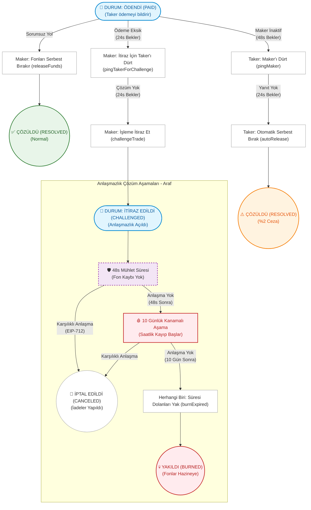

# 🌀 Araf Protocol: Oyun Teorisi Görselleştirmesi

Bu doküman, Araf Protokolü'nün temel oyun teorisini ve çözümleme yollarını bir durum-akış diyagramı (state-flow diagram) kullanarak görsel olarak açıklar.

---

## Bleeding Escrow Akış Şeması

Bu diyagram, bir Taker'ın ödeme bildiriminde bulunmasının ardından (`PAID` durumu) bir escrow'un izleyebileceği tüm olası yolları gösterir — buna sorunsuz yol (happy path), otomatik serbest bırakma mekanizması (auto-release) ve çok aşamalı anlaşmazlık çözümü (Purgatory - Araf) dahildir.

> **Güvenlik notu:** `ConflictingPingPath` koruması, her iki "ping" yolunun aynı anda açık olmasını engeller. Eğer Maker `pingTakerForChallenge` çağırırsa, Taker `pingMaker` (autoRelease yolu) çağıramaz veya tam tersi. Bu durum, MEV ve işlem sırası manipülasyonunu (transaction ordering manipulation) önler.

