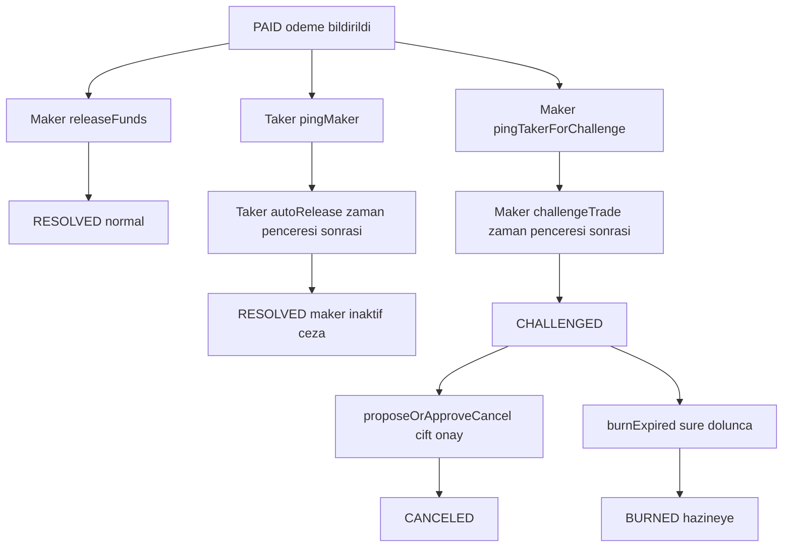

# 🌀 Araf Protocol: Oyun Teorisi Görselleştirmesi

Bu doküman, Araf Protokolü'nün temel oyun teorisini ve çözümleme yollarını bir durum-akış diyagramı (state-flow diagram) kullanarak görsel olarak açıklar.

---

## Bleeding Escrow Akış Şeması

Bu diyagram, bir Taker'ın ödeme bildiriminde bulunmasının ardından (`PAID` durumu) bir escrow'un izleyebileceği tüm olası yolları gösterir — buna sorunsuz yol (happy path), otomatik serbest bırakma mekanizması (auto-release) ve çok aşamalı anlaşmazlık çözümü (Purgatory - Araf) dahildir.

> **Güvenlik notu:** `ConflictingPingPath` koruması, her iki "ping" yolunun aynı anda açık olmasını engeller. Eğer Maker `pingTakerForChallenge` çağırırsa, Taker `pingMaker` (autoRelease yolu) çağıramaz veya tam tersi. Bu durum, MEV ve işlem sırası manipülasyonunu (transaction ordering manipulation) önler.



---

## Mekanizmanın Yorumu

Bleeding Escrow, **haklı tarafı bulmaya çalışan bir arbitraj akışı değil; aşamalı ekonomik zorlama motorudur.** Sistem tarafların niyetini yorumlamaz. Bunun yerine tarafları şu sırayla uzlaşmaya iter:

1. **`PAID` aşaması — liveness baskısı:** Önce iki ayrı ping hattı açılır. Taker, `pingMaker → autoRelease`; maker ise `pingTakerForChallenge → challengeTrade` hattını izler.
2. **`CHALLENGED` iç grace:** Challenge açıldıktan sonraki ilk 48 saatte fon kaybı yoktur. Bu pencere, dispute'u anında para yakma oyununa çevirmeden son bir çözüm alanı bırakır.
3. **Bond-first bleeding:** Grace sonrası ilk ekonomik baskı principal'e değil, maker ve taker bond'larına uygulanır.
4. **Gecikmeli principal bleed:** Escrowed crypto decay, bleeding'in 96. saatinde devreye girer. Yani principal decay challenge anında değil, yaklaşık 144 saat sonra başlar.
5. **Terminal acceleration:** Principal geç başlatıldığı için son pencerenin gerçekten uzlaşma üretmesi gerekir. Bu nedenle kontrat formülünde `CRYPTO_DECAY_BPS_H * 2` uygulanır; taban katsayı 34 BPS/saat olsa da etkin principal decay oranı 68 BPS/saat'tir.
6. **Permissionless burn:** Süre dolduğunda `burnExpired()` ile kalan her şey hazineye gider. Deadlock'un kazananı taraflar değil, protokol olur.

### Neden `* 2` Kullanılır?

Principal decay bu sistemde erken baskı aracı değildir. Erken fazda sistem önce:
- cevap verme yükümlülüğünü,
- ardından bond kaybını,
- en son da principal kaybını

devreye sokar.

Bu yüzden principal decay **geç** başlatılır. Geç başlatılan decay'in yine de burn öncesi anlamlı bir uzlaşma baskısı üretebilmesi için terminal fazda hızlandırılması gerekir. `CRYPTO_DECAY_BPS_H = 34` taban katsayısı korunur; hesapta kullanılan `* 2` çarpanı ise principal'i son fazda **etkin 68 BPS/saat** hızında eriten acceleration katmanıdır.

### Kısa Özet

```text
PAID        = önce liveness zorlaması
CHALLENGED  = 48 saat kayıpsız iç grace
BLEEDING    = önce bond'lar erir
LATE BLEED  = principal de hızlandırılmış biçimde erir
DEADLOCK    = burnExpired() ile permissionless kapanır
```
