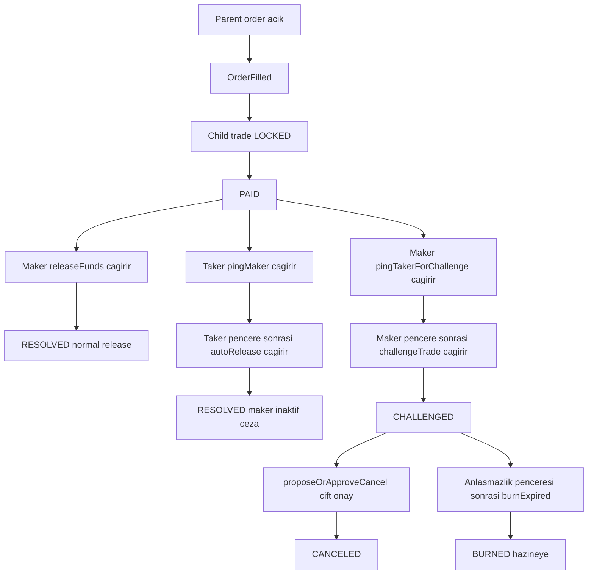

# Araf Protocol V3 Oyun Teorisi: Order-First Escrow Çözüm Modeli

Araf V3, order-first pazar modeli üzerine kurulu, trade seviyesinde çalışan bir escrow state machine tasarımıdır. Parent order kamuya açık likidite primitifidir; her `OrderFilled` olayı ise gerçek ekonomik çözümün yürüdüğü child trade'i üretir. Bu doküman `PAID` sonrası kanonik teşvik tasarımını; liveness, dispute escalation, mutual cancel ve burn finality ekseninde özetler.

> **Geliştirici Notu:** Bu metin, EN sürümüyle birebir aynı mimari kapsamı ve V3 anlamını koruyacak şekilde güncellenmiştir.

---

## Fill sonrası kanonik V3 akışı

**Karşılıklı dışlayıcılık kuralı:** Protokol `ConflictingPingPath` tarzı bir koruma uygular. `PAID` durumundan bir ping yolu açıldığında karşıt yol paralel olarak açılamaz. Bu yaklaşım, yarış koşullu yol değiştirme ve MEV tipi sıralama manipülasyonunu engeller.

---

## Çözüm yolları özeti

| Yol | Giriş koşulu | Gerekli çağrılar | Terminal durum | Ekonomik amaç |
|---|---|---|---|---|
| Normal release | Taker ödemeyi işaretler, maker onaylar | `releaseFunds` | `RESOLVED` | Taraflar iş birliği yaptığında hızlı kapanış |
| Liveness release | `PAID` sonrası maker inaktif kalır | `pingMaker` -> bekleme -> `autoRelease` | `RESOLVED` | İnaktiviteyi cezalandırmak ve dürüst taker'ı kilitten çıkarmak |
| Dispute escalation | Maker ödeme sorununu bildirir | `pingTakerForChallenge` -> bekleme -> `challengeTrade` | `CHALLENGED` | Çatışmayı deterministik decay penceresine taşımak |
| Mutual cancel | Her iki taraf unwind konusunda uzlaşır | iki taraf da `proposeOrApproveCancel` çağırır | `CANCELED` | Oracle yargısı olmadan çift taraflı uzlaşma |
| Terminal burn | Challenge ufku sonunda uzlaşma yok | `burnExpired` | `BURNED` | Permissionless deadlock kapanışı; çıkmazı protokol çözer |

---

## Teşvik ve ekonomik baskı modeli

| Mekanizma | Ne yapar | V3 açısından neden önemli |
|---|---|---|
| `PAID` karar noktası | Trade'i pasif lock durumundan aktif çözüm oyununa taşır | Tüm ödeme-sonrası stratejiyi child-trade seviyesinde toplar |
| Conflicting ping yolları | Aynı anda tek escalation şeridine izin verir | Eşzamanlı dal manipülasyonu riskini azaltır |
| Zaman kilitli escalation | `autoRelease` ve `challengeTrade` öncesi bekleme zorunlu kılar | Sübjektif arbitraj yerine net yanıt pencereleri üretir |
| Dispute decay yüzeyi | Çözülmeyen anlaşmazlıkta ekonomik baskı zamanla artar | Oracle olmadan tarafları uzlaşmaya iter |
| `getCurrentAmounts(tradeId)` | O anki dağıtılabilir tutarların kanonik on-chain görünümü | Decay/dispute sürecinde frontend/backend bu değeri esas almalıdır; off-chain hesaplar yalnızca yardımcıdır |
| Permissionless burn | Süresi dolan çıkmazı herhangi biri `burnExpired` ile kapatabilir | İki taraf da kaybolsa dahi protokol liveness garantisini korur |

---

## Otorite sınırları ve belirsizlik yönetimi

- **Kontrat otoriterdir:** state transition, payout matematiği ve terminal sonuçlar yalnızca on-chain kurallarla belirlenir.
- **Backend mirror/coordination/read katmanıdır:** event projeksiyonu ve operasyonel akış desteği sağlar; hakemlik yapmaz.
- **Frontend guardrail/orchestration katmanıdır:** kullanıcıyı geçerli yollara yönlendirir; kontrat sonucunu override edemez.
- **Oracle-free tasarım:** protokol off-chain fiat doğruluğunu kanıtlamaz; gecikme ve çatışmayı maliyetlendirir.
- **Chargeback ve off-chain belirsizlik gerçektir:** V3 fiat katmanındaki geri çevrilebilirlik riskini yok etmez; bunu açık lifecycle sınırları ve deterministik on-chain çözüm mekanizmasıyla sınırlar.
