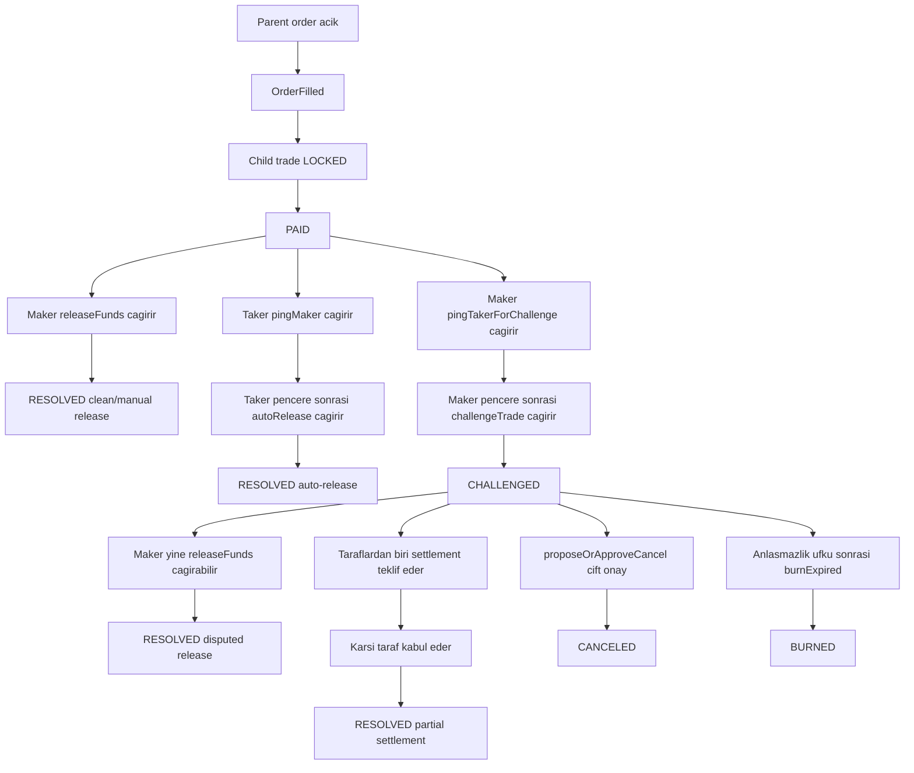
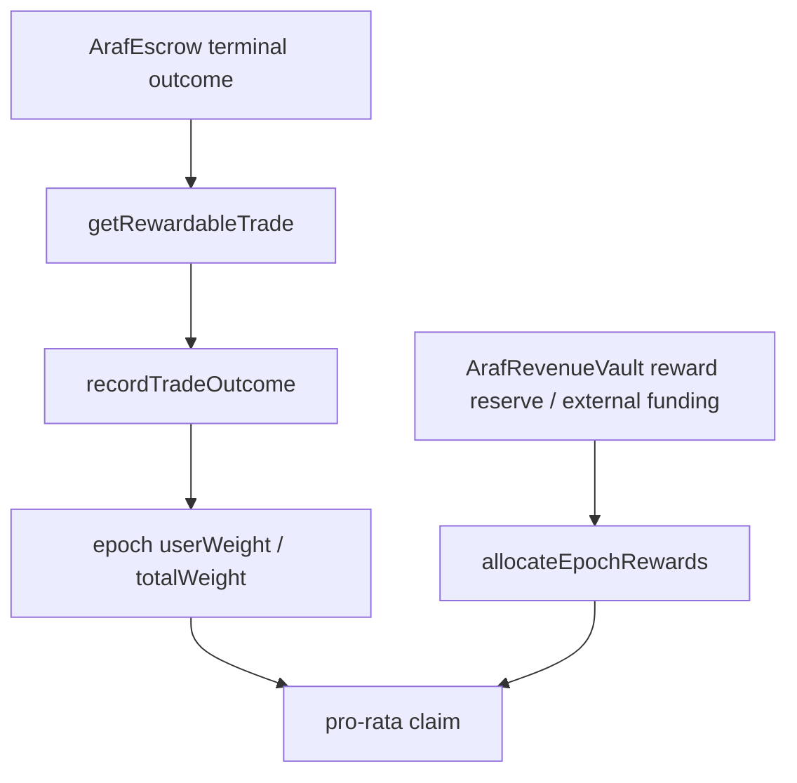

# Araf Protocol V3 Oyun Teorisi: Order-First Escrow Çözüm Modeli

Araf V3, order-first pazar modeli üzerine kurulu, trade seviyesinde çalışan bir escrow state machine tasarımıdır. Parent order kamuya açık likidite primitifidir; her `OrderFilled` olayı ise gerçek ekonomik çözümün yürüdüğü child trade'i üretir. Bu doküman `PAID` sonrası kanonik teşvik tasarımını; liveness, dispute escalation, mutual cancel, split settlement, burn finality ve Proof of Peace Rewards ekseninde özetler.

> **Geliştirici Notu:** Bu metin, EN sürümüyle birebir aynı mimari kapsamı ve V3 anlamını koruyacak şekilde güncellenmiştir.

---

## 0. Çekirdek tez

Araf mahkeme, oracle, moderatör veya backend hakemi değildir.

Araf'ın dispute sistemi daha doğru şekilde bir **teşvik baskısı makinesi** olarak tanımlanır:

> **Protokol off-chain gerçeği ispatlamaz. Çözülmeyen çatışmayı ekonomik olarak pahalılaştırır ve hızlı temiz çözümü ekonomik olarak cazip hale getirir.**

Bu iki katmanlı bir oyun teorisi üretir:

| Katman | Teşvik mesajı | Mekanizma |
|---|---|---|
| Negatif teşvik | Oyalarsan, yalan söylersen veya çözümü reddedersen değer erir. | Bond, bleeding, terminal burn, zero reward weight |
| Pozitif teşvik | Hızlı ve temiz çözersen gelecekte reward weight kazanırsın. | Proof of Peace epoch ağırlıkları |

Bu nedenle doğru ürün dili "Araf adaleti garanti eder" değildir. Daha güçlü ve doğru iddia şudur:

> **Araf yargılamaz. Gecikmeyi, anlaşmazlığı ve kötü stratejiyi fiyatlandırır.**

---

## 1. Fill sonrası kanonik V3 akışı



**Karşılıklı dışlayıcılık kuralı:** Protokol `ConflictingPingPath` tarzı bir koruma uygular. `PAID` durumundan bir ping yolu açıldığında karşıt yol paralel olarak açılamaz. Bu yaklaşım, yarış koşullu yol değiştirme ve MEV tipi sıralama manipülasyonunu engeller.

---

## 2. Çözüm yolları özeti

| Yol | Giriş koşulu | Gerekli çağrılar | Terminal durum | Ekonomik amaç | Reward duruşu |
|---|---|---|---|---|---|
| Hızlı clean release | Taker ödemeyi işaretler, maker hızlı onaylar | `releaseFunds` | `RESOLVED` | En iyi iş birliği dengesi | En yüksek pozitif weight |
| Yavaş clean release | Taker ödemeyi işaretler, maker geç onaylar | `releaseFunds` | `RESOLVED` | Kabul edilebilir ama gecikmiş iş birliği | Daha düşük pozitif weight |
| Liveness release | `PAID` sonrası maker inaktif kalır | `pingMaker` -> bekleme -> `autoRelease` | `RESOLVED` | İnaktiviteyi cezalandırmak ve dürüst taker'ı kilitten çıkarmak | Zero weight |
| Dispute escalation | Maker ödeme sorununu bildirir | `pingTakerForChallenge` -> bekleme -> `challengeTrade` | `CHALLENGED` | Çatışmayı deterministik decay penceresine taşımak | Henüz terminal reward yok |
| Disputed release | Maker challenge sonrası release eder | `CHALLENGED` durumundan `releaseFunds` | `RESOLVED` | Çatışma sonrası geç düzeltme | MVP'de zero weight |
| Partial settlement | Taraflar dispute içinde split üzerinde anlaşır | `proposeSettlement` -> `acceptSettlement` | `RESOLVED` | Hakemsiz pazarlıklı çıkış | Düşük pozitif weight |
| Mutual cancel | Her iki taraf unwind konusunda uzlaşır | iki taraf da `proposeOrApproveCancel` çağırır | `CANCELED` | Oracle yargısı olmadan çift taraflı çıkış | Zero weight |
| Terminal burn | Challenge ufku sonunda uzlaşma yok | `burnExpired` | `BURNED` | Permissionless deadlock kapanışı | Zero weight |

---

## 3. Teşvik ve ekonomik baskı modeli

| Mekanizma | Ne yapar | V3 açısından neden önemli |
|---|---|---|
| `PAID` karar noktası | Trade'i pasif lock durumundan aktif çözüm oyununa taşır | Tüm ödeme-sonrası stratejiyi child-trade seviyesinde toplar |
| Conflicting ping yolları | Aynı anda tek escalation şeridine izin verir | Eşzamanlı dal manipülasyonu riskini azaltır |
| Zaman kilitli escalation | `autoRelease` ve `challengeTrade` öncesi bekleme zorunlu kılar | Sübjektif arbitraj yerine net yanıt pencereleri üretir |
| Dispute decay yüzeyi | Çözülmeyen anlaşmazlıkta ekonomik baskı zamanla artar | Oracle olmadan tarafları uzlaşmaya iter |
| `getCurrentAmounts(tradeId)` | O anki dağıtılabilir tutarların kanonik on-chain görünümü | Decay/dispute sürecinde frontend/backend bu değeri esas almalıdır; off-chain hesaplar yalnızca yardımcıdır |
| Permissionless burn | Süresi dolan çıkmazı herhangi biri `burnExpired` ile kapatabilir | İki taraf da kaybolsa dahi protokol liveness garantisini korur |
| Proof of Peace weight | Hızlı clean resolution ve düşük çatışmalı settlement davranışını ödüllendirir | Bleeding/burn cezalarının üzerine pozitif teşvik ekler |

---

## 4. Otorite sınırları ve belirsizlik yönetimi

- **Kontrat otoriterdir:** state transition, payout matematiği, terminal outcome, rewardable outcome view ve claim accounting yalnız on-chain kurallarla belirlenir.
- **Backend mirror/coordination/read katmanıdır:** event projeksiyonu ve operasyonel akış desteği sağlar; hakemlik yapmaz ve reward eligibility üretmez.
- **Frontend guardrail/orchestration katmanıdır:** kullanıcıyı geçerli yollara ve net zaman pencerelerine yönlendirir; kontrat sonucunu override edemez.
- **Oracle-free tasarım:** protokol off-chain fiat doğruluğunu kanıtlamaz; gecikme ve çatışmayı maliyetlendirir.
- **Chargeback ve off-chain belirsizlik gerçektir:** V3 fiat katmanındaki geri çevrilebilirlik riskini yok etmez; bunu açık lifecycle sınırları, reputation context ve deterministik on-chain çözüm mekanizmasıyla sınırlar.

---

## 5. Split settlement canon (dispute-only path)

- Split/partial settlement, `PAID` sonrası normal kapanış yolu değildir.
- Yalnız trade state `CHALLENGED` olduktan sonra açılır.
- Backend settlement preview informational-only ve non-authoritative kalır.
- Final settlement economics on-chain acceptance execution ile belirlenir.
- Settlement finalization sırasında önce decay dikkate alınır; protokol fee'leri gross maker/taker split payout üzerinden hesaplanır; taraflar net payout alır.
- Partial settlement reward modelinde failure sayılmaz; fakat dispute yaşandığı için yalnız düşük pozitif multiplier alır.

Davranış mesajı şudur:

> **Settlement çıkmazdan iyidir; fakat clean release hâlâ en değerli dengedir.**

---

## 6. Pozitif oyun teorisi olarak Proof of Peace Rewards

Proof of Peace Rewards trade cashback programı değildir. Kontrat-authoritative terminal outcome'lara dayalı, pro-rata epoch allocation mekanizmasıdır.



Reward weight bilinçli olarak outcome-sensitive tasarlanmıştır:

| Terminal outcome | Reward etkisi | Oyun teorisi nedeni |
|---|---|---|
| Hızlı clean release | En yüksek pozitif weight | Anında iş birliğini dominant sosyal davranış haline getirir |
| 24h/72h içinde clean release | Orta pozitif weight | İş birliğini ödüllendirir ama gecikmeyi fiyatlandırır |
| Yavaş clean release | Düşük pozitif weight | Geç iş birliğini kabul eder ama ideal saymaz |
| Partial settlement | Düşük pozitif weight | Dispute de-escalation'ı ödüllendirir ama dispute'u kârlı hale getirmez |
| Auto-release | Zero weight | Maker inaktivitesini veya liveness failure'ı ödüllendirmez |
| Mutual cancel | Zero weight | Cancel-loop farming'i engeller; nötr çıkıştır, başarılı trade değildir |
| Disputed release | Zero weight | Stratejik challenge-sonra-release farming'i engeller |
| Burned | Zero weight | Deadlock asla rewardable olmamalıdır |

Basit teşvik merdiveni:

```text
hızlı clean release > daha yavaş clean release > partial settlement > zero-weight terminal outcomes > burn/deadlock
```

---

## 7. Reward farming ve Sybil dayanımı duruşu

Reward modeli wash-trading riskini azaltır fakat sihirli şekilde ortadan kaldırmaz.

Temel farming stratejisi:

```text
Birden fazla cüzdan kullan -> order aç/fill et -> hızlı clean release yap -> epoch weight kazan
```

Mevcut mitigasyon duruşu:

- Tier 0 reward eligible değildir.
- Aynı wallet ile self-trade escrow katmanında engellenir.
- Taker entry wallet age, native balance dust threshold, cooldown, ban ve tier kısıtlarını kullanır.
- Rewards fixed per-trade ödeme değil, tüm epoch pool'a karşı pro-rata dağılımdır.
- Yüksek tier'lar yalnız sınırlı multiplier alır; outcome kalitesi tier'dan daha önemlidir.
- Sponsor/funder pool fonlayabilir ama recipient, weight veya multiplier seçemez.

Kalan risk:

> Farklı cüzdanlarla wash trading on-chain düzeyde tamamen çözülemez. Ekonomik olarak cazibesiz hale getirilmelidir.

Operasyonel kural:

> **Beklenen reward, sentetik hacmin tüm maliyet ve riskinden düşük kalmalıdır.**

Bu nedenle reward bütçeleri, sponsor kampanyaları ve `rewardBps` agresif büyüme teşviklerine dönüştürülmeden önce yavaş artırılmalı ve read-only analytics ile izlenmelidir.

---

## 8. Payoff matrix: dispute + rewards

| Strateji | Kısa vadeli sonuç | Uzun vadeli reward etkisi | Protokol mesajı |
|---|---|---|---|
| Öde ve hızlı release et | Trade temiz tamamlanır | Yüksek pozitif weight | En iyi denge |
| Öde ve geç release et | Trade temiz ama yavaş tamamlanır | Daha düşük pozitif weight | Gecikmenin opportunity cost'u vardır |
| Dispute'a gir ama settlement yap | Çatışma de-escalate olur | Düşük pozitif weight | Barış burn'dan iyidir |
| İnaktif kal | Auto-release çözebilir | Zero weight | İnaktivite ödüllendirilmez |
| Dispute aç sonra release et | Trade çatışma sonrası çözülür | Zero weight | Geç düzeltme mümkündür ama ödüllendirilmez |
| Mutual cancel | Taraflar birlikte çıkar | Zero weight | Nötr çıkış; farming yüzeyi değil |
| Çözümü reddet | Bleeding/burn hattı | Zero weight + ekonomik kayıp | Deadlock irrasyoneldir |

---

## 9. Ürün dili guardrail'leri

Söylenmesi gereken:

> **Proof of Peace bir barış primidir: trade'leri hızlı ve temiz çözen kullanıcılar gelecek reward epoch'larında pro-rata weight kazanır.**

Söylenmemesi gereken:

- "Rewards cashback'tir."
- "Her tamamlanan trade sabit rebate kazanır."
- "Dispute açmak reward için kârlı hale getirilebilir."
- "Protokol kimin haklı olduğunu ispatlar."
- "Araf chargeback riskini yok eder."

Kanonik ifade:

> **Araf fiat gerçeğini yargılamaz. Çözülmeyen çatışmayı pahalılaştırır ve hızlı temiz çözümü gecikmeden daha değerli hale getirir.**
