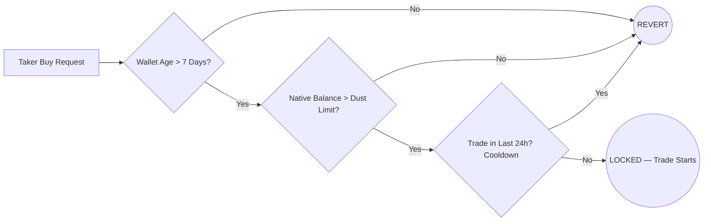
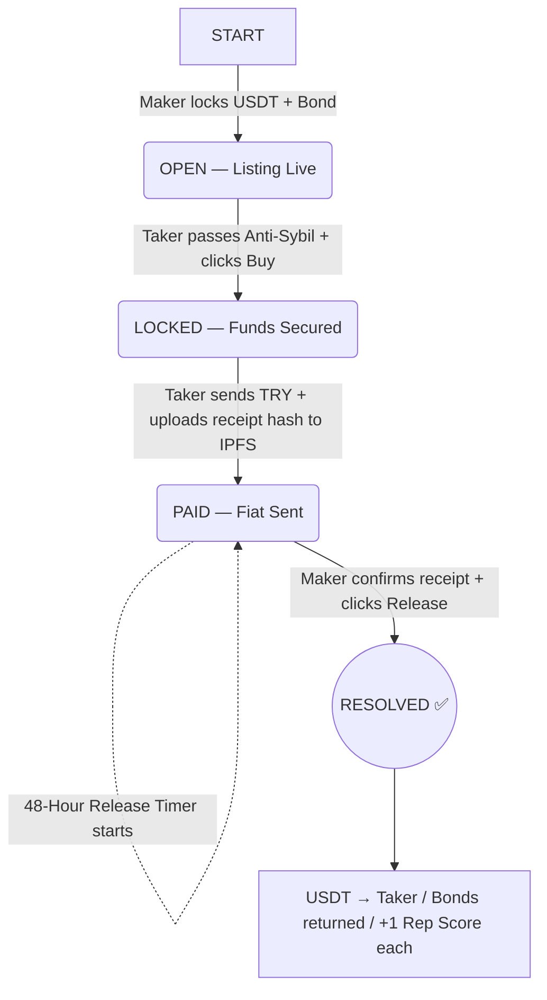

# 🌀 Araf Protocol — Canonical Architecture Document

> **Version:** 1.0 (Pre-Integration)
> **Status:** Architecture Finalized — Awaiting Smart Contract Implementation
> **Last Updated:** 2025

---

## 📌 Table of Contents

1. [Vision & Core Philosophy](#1-vision--core-philosophy)
2. [System Participants](#2-system-participants)
3. [Tier & Bond System](#3-tier--bond-system)
4. [Anti-Sybil Shield](#4-anti-sybil-shield)
5. [Standard Trade Flow (Happy Path)](#5-standard-trade-flow-happy-path)
6. [Dispute System — Bleeding Escrow](#6-dispute-system--bleeding-escrow)
7. [Reputation & Scoring](#7-reputation--scoring)
8. [Treasury Model](#8-treasury-model)
9. [Attack Vectors & Known Limitations](#9-attack-vectors--known-limitations)
10. [Open Design Decisions](#10-open-design-decisions)

---

## 1. Vision & Core Philosophy

Araf Protocol is a **non-custodial, humanless, oracle-free** peer-to-peer escrow system enabling trustless exchange between fiat currency (TRY) and crypto assets (USDT).

### Core Principles

| Principle | Description |
|---|---|
| **Non-Custodial** | The platform never holds user funds. Everything is locked in transparent on-chain smart contracts. |
| **Oracle-Free** | The system has no access to bank data, external APIs, or real-world payment verification. |
| **Humanless** | No moderators, arbitrators, or jury systems. All resolution is automated by code and timers. |
| **MAD-Based Security** | Security relies on Mutually Assured Destruction game theory — dishonest behavior always results in financial loss. |
| **Code is Law** | Operational cost is zero. No customer service. No dispute moderators. |

---

## 2. System Participants

| Role | Label | Description |
|---|---|---|
| **Maker** (Satıcı) | Seller | Opens the listing. Locks USDT + collateral bond into the contract. |
| **Taker** (Alıcı) | Buyer | Sends fiat (TRY) off-chain. Triggers escrow release. |
| **Treasury** | Protocol | Receives burned/decayed funds from failed disputes. |

---

## 3. Tier & Bond System

New users enter with minimal friction, while high-volume actors carry proportional risk.

| Tier | Criteria | Trade Limit (TRY) | Maker Bond | Taker Bond | Min. Bond (USDT) |
|---|---|---|---|---|---|
| **Tier 1** | 0–3 Completed Trades | 250 – 2,500 ₺ | %18 | %15 | 10 USDT |
| **Tier 2** | 3+ Successful Trades | 2,501 – 25,000 ₺ | %15 | %12 | 30 USDT |
| **Tier 3** | High-Volume Traders | 25,001 ₺ + | %10 | %8 | 100 USDT |

### Bond Modifiers (Reputation-Based)

| Condition | Bond Adjustment |
|---|---|
| 0 failed disputes | **−3%** discount |
| 1+ failed disputes | **+5%** penalty |
| 2+ failed disputes | 30-day listing ban (taker-only mode) |

---

## 4. Anti-Sybil Shield

Three on-chain filters protect the system from bot networks and griefing attacks at zero cost.



| Filter | Rule | Purpose |
|---|---|---|
| **Wallet Age** | > 7 days old | Blocks freshly created sybil wallets |
| **Dust Limit** | Must hold ~$2 in native gas token | Blocks zero-balance throwaway wallets |
| **Cooldown** | Max 1 trade per 24h (Tier 1) | Limits bot-scale spam attacks |

---

## 5. Standard Trade Flow (Happy Path)



### State Definitions

| State | Triggered By | Description |
|---|---|---|
| `OPEN` | Maker | Listing is live. USDT + Maker bond locked. |
| `LOCKED` | Taker | Trade started. Taker bond locked. Anti-Sybil passed. |
| `PAID` | Taker | Fiat sent off-chain. IPFS receipt hash recorded on-chain. 48h timer starts. |
| `RESOLVED` | Maker or Contract | Successful close. Funds distributed. Reputation updated. |
| `CANCELED` | Mutual | Trade voided. USDT returns to Maker. Bonds fully refunded. |

---

## 6. Dispute System — Bleeding Escrow

This is the canonical dispute resolution model. It is **time-based, oracle-free, and psychologically coercive** by design.

### Philosophy

> The contract cannot see the bank. It cannot determine who is right.
> Instead of pretending to judge, it makes dishonesty and stubbornness **mathematically expensive** for both parties.

### Full State Machine

```
PAID
  │
  ├──[Maker clicks Release]──────────────────────────── RESOLVED ✅
  │
  └──[Maker clicks Challenge]
              │
          GRACE PERIOD (48h)
          ├── No financial penalty
          ├── Both parties negotiate off-chain
          │
          ├──[Mutual Release]──────────────────────────── RESOLVED ✅
          ├──[Mutual Cancel]───────────────────────────── CANCELED 🔄
          └──[No Agreement after 48h]
                      │
                  BLEEDING ⏳
                  ├── Asymmetric daily decay begins
                  ├── Challenge-opener's bond decays 2× faster
                  │
                  ├──[Maker clicks Release]──────────────── RESOLVED ✅ (remaining funds)
                  ├──[Mutual Cancel]─────────────────────── CANCELED 🔄 (remaining funds)
                  └──[10 Days pass — No agreement]
                              │
                          BURNED 💀
                          (All remaining funds → Treasury)
```

### Bleeding Decay Rates

| Asset | Challenge Opener | Other Party | Starts |
|---|---|---|---|
| **Bond** | **−20% / day** | −10% / day | Day 1 of Bleeding |
| **USDT** | −8% / day (shared) | −8% / day (shared) | **Day 3 of Bleeding** |

> **Why USDT starts on Day 3:** Grace period (48h) + 2 extra buffer days = ~5-day real pressure window before USDT begins decaying. This protects honest parties from immediate loss while still creating urgency.

### Numerical Example — 1,000 USDT Trade

> Scenario: Maker (Seller) opens challenge. Maker bond = 100 USDT. Taker bond = 80 USDT.

| Day | Maker Bond | Taker Bond | USDT | Treasury (Cumulative) |
|---|---|---|---|---|
| Grace (48h) | 100 | 80 | 1,000 | 0 |
| Day 1 | 80 | 72 | 1,000 | 28 |
| Day 2 | 60 | 64 | 1,000 | 56 |
| Day 3 | 40 | 56 | **920** | 144 |
| Day 4 | 20 | 48 | **840** | 232 |
| Day 5 | **0** | 40 | **760** | 320 |
| Day 7 | 0 | 24 | **600** | 456 |
| Day 10 | 0 | 0 | **360** | 820 |

**Game theory result:** Rational actors agree between Day 3–4. Both sides lose minimally. Stubbornness is maximally punished.

### Seller Griefing — How the System Responds

```
Scenario: Seller received TRY but opens challenge to delay/extract.

Day 1–2:  Seller waits. Bond already down 40 USDT.
Day 3:    USDT starts decaying. TRY is in hand, but USDT is evaporating.
Day 4:    Rational exit point. Seller releases. Saves remaining USDT + ~20 bond.
          Net loss: ~80 USDT bond lost (griefing cost).
          Victim (Taker) net loss: ~32 USDT bond lost.

→ Victim lost less than the griefer ✓
→ Griefing was expensive ✓
→ No oracle needed ✓
```

---

## 7. Reputation & Scoring

Simple, wallet-native reputation. No tokens, no accounts, no complex levels.

### Two Metrics Per Wallet

| Metric | Updated When |
|---|---|
| `successfulTrades` | +1 on every RESOLVED trade (both parties) |
| `failedDisputes` | +1 on every BURNED outcome (both parties) |

### Update Logic

| Outcome | Winning Party | Losing Party |
|---|---|---|
| Dispute-free close | +1 Successful | +1 Successful |
| Dispute → resolved | +1 Successful | +1 Failed |
| BURNED | +1 Failed | +1 Failed |

### UI Indicators

| Score | Display |
|---|---|
| 0 failed disputes | 🟢 Green — trusted |
| 1+ failed disputes | 🔴 Red warning shown on listing |
| First 3 trades | 🆕 "New User" badge — higher bond required |

---

## 8. Treasury Model

Funds enter the treasury from two sources:

| Source | Amount |
|---|---|
| Bleeding decay (bonds) | 10–20% per day from active bleeding escrows |
| Bleeding decay (USDT) | 8% per day from both parties (after Day 3) |
| BURNED outcomes | 100% of remaining funds |

> **Note:** Whether treasury funds are burned (destroyed) or accumulated as protocol revenue is an open design decision. See Section 10.

---

## 9. Attack Vectors & Known Limitations

| Attack | Risk | Mitigation | Status |
|---|---|---|---|
| **Fake receipt upload** | High | IPFS hash = proof of upload, not proof of payment. Challenge timer + bond risk discourages false claims. | ⚠️ Partial |
| **Seller griefing** | Medium | Asymmetric bond decay (2× faster for challenge opener) | ✅ Addressed |
| **Chargeback (bank reversal)** | Medium | Off-chain risk. Outside smart contract scope. Taker bears this risk. | ❌ Out of scope |
| **Sybil reputation farming** | Medium | Min. tx amount + cooldown slows coordination. Not fully preventable. | ⚠️ Partial |
| **Challenge timer spam (Tier 1)** | High | 24h cooldown + Dust filter + wallet age filter | ✅ Addressed |
| **Coordinated griefing at scale** | Low | High bond cost makes large-scale attacks expensive | ✅ Addressed |

### Fundamental Known Limitation

The system is **oracle-free by design**. This means:
- The contract cannot verify whether fiat was actually sent.
- "Resolution" is based on time-decay pressure, not factual determination.
- A sophisticated bad actor with patience can cause the victim partial loss even in Bleeding mode.

This is an **accepted tradeoff** for full decentralization. The bond asymmetry ensures the attacker always loses more than the victim.

---

## 10. Open Design Decisions

These items are **not yet finalized** and require further deliberation before smart contract implementation.

| # | Question | Options |
|---|---|---|
| 1 | **Treasury destination** | Burn permanently vs. accumulate as protocol revenue vs. DAO-controlled |
| 2 | **USDT decay split** | Equal 8%/8% vs. asymmetric (challenge-opener pays more) |
| 3 | **Grace period length** | 48h vs. 72h — longer grace = more honest-party protection |
| 4 | **Tier 1 taker bond** | %0 (original) vs. %15 (final) — cold start vs. griefing protection |
| 5 | **Blacklist mechanism** | On-chain permanent vs. time-limited (e.g., 30 days) |
| 6 | **Chain selection** | Polygon / BNB Chain / Arbitrum — gas cost vs. liquidity tradeoff |

---

## 📎 Related Documents

| Document | Description |
|---|---|
| `WORKFLOWS.md` | Visual Mermaid diagrams for all state transitions |
| `DISPUTE.md` | Detailed dispute system specification (pre-canonical) |
| `MASTER.md` | Original system vision and philosophy |

---

*Araf Protocol — "The system does not judge. It makes dishonesty expensive."*
